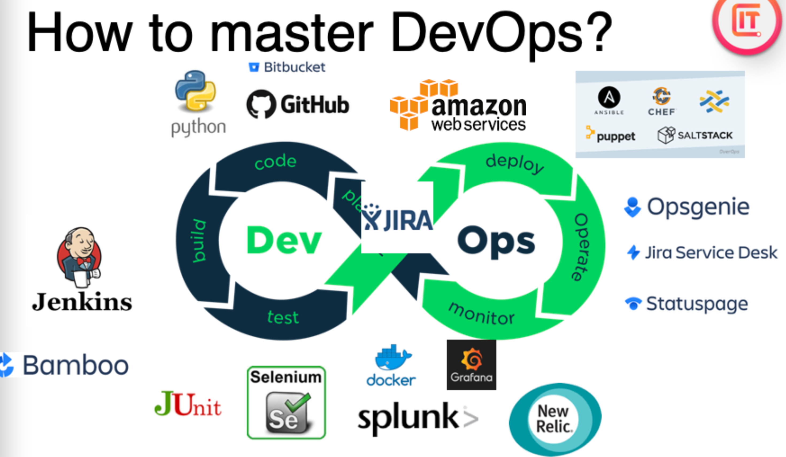
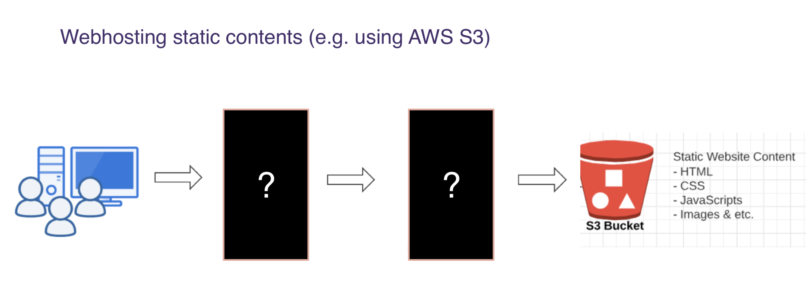
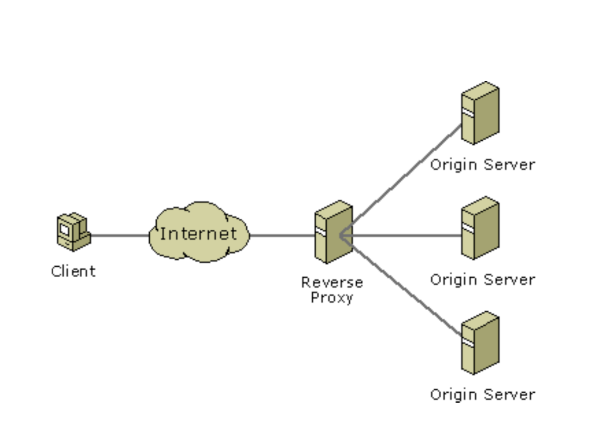
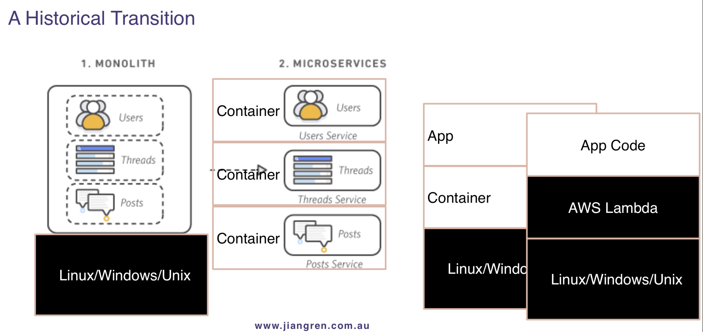
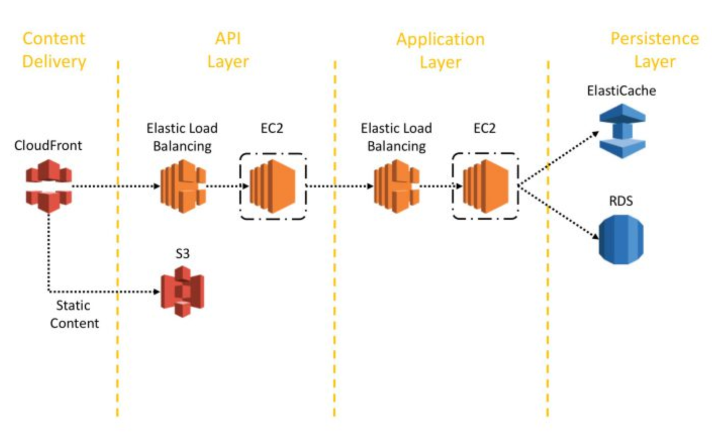
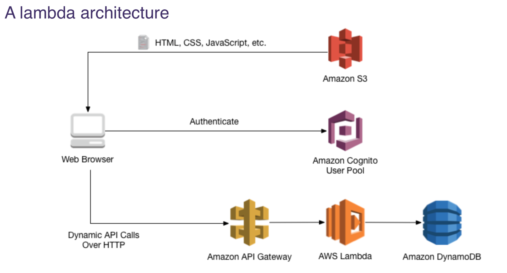
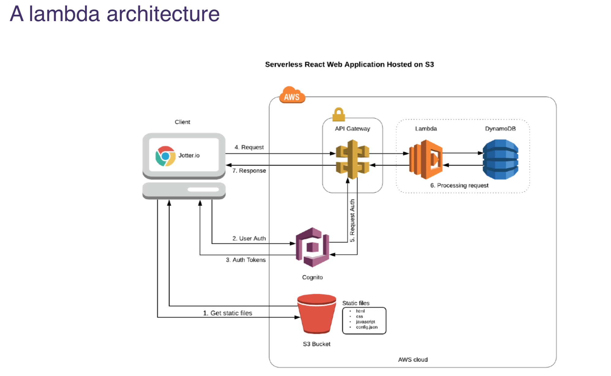
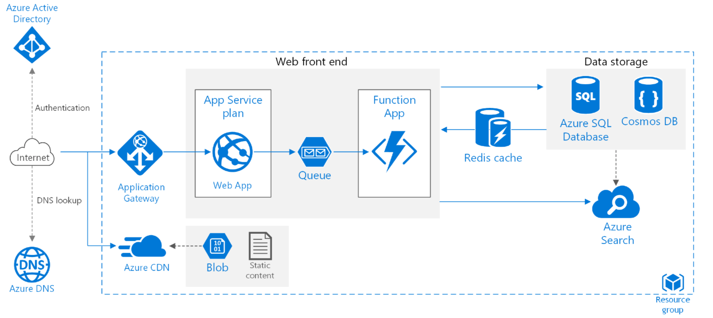
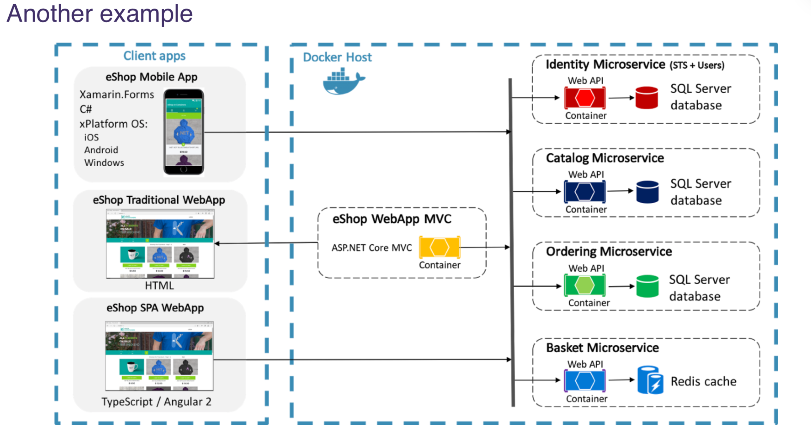
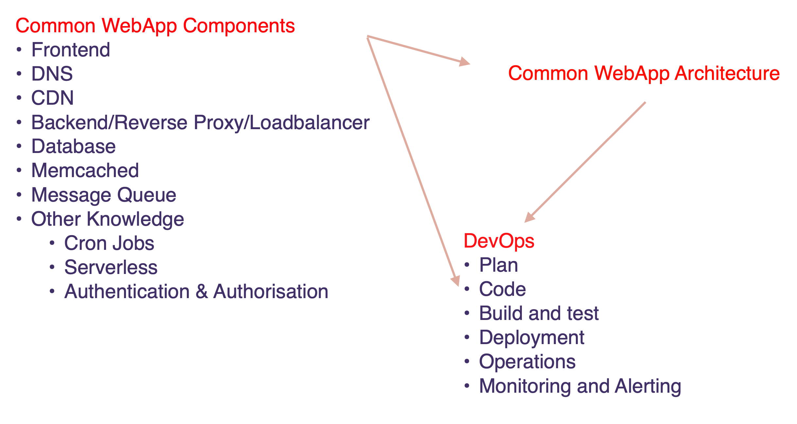

# Class-01 DevOps初讲
## 主要知识点
  - [1.DevOps介绍](#1devops介绍)
    - [Class Rules](#class-rules)
    - [DevOps是什么](#devops是什么)
    - [How to master DevOps](#how-to-master-devops)
    - [DevOps路线图](#devops路线图)
    - [DevOps的职业发展](#devops的职业发展)
    - [DevOps的职业晋升路线](#devops的职业晋升路线)
    - [DevOps需要处理的问题](#devops需要处理的问题)
      - [Cloud Eng](#cloud-eng)
      - [SRE](#sre)
      - [DevOps Eng](#devops-eng)
    - [Tooling and automation oriented vs algorithm oriented](#tooling-and-automation-oriented-vs-algorithm-oriented)
  - [2.WebApp Components](#2webapp-components)
    - [Frontend Components](#frontend-components)
      - [Web Hosting](#web-hosting)
      - [前端问题](#前端问题)
    - [Backend Components](#backend-components)
      - [后端架构](#后端架构)
      - [后端问题](#后端问题)
      - [后端的发展进程](#后端的发展进程)
      - [常见的后端架构](#常见的后端架构)
    - [Persistent Storage](#persistent-storage)
      - [The 4 main types of databases](#the-4-main-types-of-databases)
    - [In-memory data storage systems](#in-memory-data-storage-systems)
    - [Other components：](#other-components)
      - [Cron](#cron)
      - [Authorisation vs Authentication](#authorisation-vs-authentication)
  - [3.WebApp Architecture](#3webapp-architecture)
  - [4.DevOps Circle](#4devops-circle)
  - [5.Summary](#5summary)
  - [6.In-Class Lab](#6in-class-lab)
# 课堂笔记

## 1.DevOps介绍
### Class Rules
- 尽量打开摄像头多互动，多问问题
- 多思考，总结不同工具，多做hands-on，记录自己的排错方法
- 每节课我们提供概念，基本实现步骤和实现后的结果
- 排错是你的任务，多google，多思考，90%的答案都在google上
  
### DevOps是什么
DevOps是一组旨在保证高质量，高可用性的同时，减少软件迭代时间的开发， 测试与运维高度整合的实践。
- 历史上，开发(Dev)和运维(Ops)是分开的两个部分 。
- 就像Windows安装要等待很久，每次软件迭代也需要等待很久，导致用户很不开心；同样的云端的软件，我们在迭代的同时，也不能令系统宕机，怎么去完成这种更新，就需要我们的DevOps Process。
- 开发人员，就像造火车，对火车进行设计（开发）； DevOps等于造铁轨，同时监控火车有没有在铁轨上正常运行，上线过程中，需要CI/CD pipeline 测试，代码promotion，staging环境上的测试，以确保软件是否达到安全的级别，能不能很好的服务于用户；跑完测试，到部署环节，还需要对网站后续健康状况进行监控。
 
整个课程就是围绕devops circle来讲，会着重介绍最重要的工具

### How to master DevOps
 
首先要了解你们公司用的都是哪些工具  
然后去研究这些工具的手册，也需要跟其他的工具做compare
会做Trouble shooting，解决工具使用中遇到的问题    
会Coding
- Senior level的 DevOps已经可以有能力给公司做一些tech stack方面的决定
- Junior/mid leve的 DevOps要能够看懂手册，把自动化的环节连在一块儿
- DevOps的coding主要是automation，就是把很多手动要做的东西做成自动化

### DevOps路线图
[DevOps路线图](https://github.com/australiaitgroup/DevOps-WIKI/blob/1444e4c34e275638364c6647889e129944cea36c/DevOps%20RoadMap.docx)
总结了DevOps的学习方式，方法和方向。可以按照文档上的描述，来安排自己的学习内容，但是还是推荐尽量来参加课程。
课程按照devops circle的顺序来讲，同时配有大量的handson

### DevOps的职业发展
需求量非常大的职位。因为原本的data centre模式，运营的成本太高，不如迁移到cloud，当越多的公司有这个需要，devops的需求就越大。
需要我们在短期内，把devops的重点知识都master。 

### DevOps的职业晋升路线
1. Junior/Grad：毕业生阶段
2. Mid DevOps/SRE：在职人员 
 - 做SRE是一个提高个人branding的重要职位
3. Senior Devops/SRE：有过开发背景，有运维的相关知识和经验，职业天花板基本就到这儿了
4. Principal Devops/SRE
5. Architect

### DevOps需要处理的问题
What problems do you need to care as DevOps related engineers?   
DevOps下有三个Eng，我们的课程主要围绕SRE和DevOps Eng来讲
#### Cloud Eng 
- 更多去处理network setup, authentication/authorization，管理infrastructure，PaaS tooling and automation 
#### SRE
- Product Reliability Improvement Monitoring
- Logging and Alerts 
- Configuration Management 
- Tooling and Automation 
- Incident Process etc 
- 工作中，30-40%在维护，60%在做项目（automation的开发项目）
#### DevOps Eng 
- 主要考虑CI/CD，Build and Test ，Monitoring and Logging

### Tooling and automation oriented vs algorithm oriented
知道这些tool怎么用的，知道怎么做automation，而不是说只知道做算法；对算法和数据结构的要求，限于完成你写的automation

## 2.WebApp Components
DevOps服务于Web App, 那一个好的web有哪些component:

### Frontend Components
Frontend Components: HTML, CSS, JS, Images

#### Web Hosting
Webhosting static contents (e.g. using AWS S3),存储了包含HTML, CSS, JavaScript and Images...
用户通过什么样的步骤可以获取网站的资源：
 
中间的第一个问号为DNS(Domain Name Server)
- 用dig, ping都可以获得网站的ip地址
- Resolve DNS (e.g. using AWS Route 53) 
  
第二个问号为CDN(Content Delivery Networks)
- 将网站的静态资源，提前cache到距离用户最近的服务器，这样会使latency大幅降低
- 服务公司有Akamai，最近比较火的有Fastly
- 好处有Low Latency, better UX(user experience), Globally Availability 
- AWS中对应：Cloud Front

#### 前端问题
对于DevOps，会关注的前端问题：
- How do we deploy the frontend code without customer notice?
- How do we rollout features safely to our customers?
- How to version control/rollback changes?
- What are the key metrics for measuring the frontend performance and reliabilities? 
- What tools do you know to monitor/logging the frontend events? 
- What methods can you think of to monitor the frontend? 
- What type of tests or monitoring can we do? 

### Backend Components
#### 后端架构
一个简单的后端的架构：

用户的请求，会通过internet，route到后端的服务器，后端的reverse proxy会中止掉请求，再将请求包装好后，向后端服务器请求。同时reverse proxy还会跟Load Balancer整合在一起。

#### 后端问题	
对于DevOps，会关注的后端问题：
- How to handle requests from different users in parallel? 
  - 使用Reverse Proxy（让外界无法访问你的原始主要服务器）/ Load Balancer：e.g. Nginx; ELB
  - AutoScalable Stateless Servers /Lambda functions
  - Multi-region
- How to make users access to the core data more secure?  
  - Reverse Proxy/ Load Balancer - e.g. Nginx; ELB
  - HTTPS
  - AUTH(Authentication)
  - Vulnerability Scan
- How to be at better performance and lower cost?
  - Multi-region
  - Caching 
  - Server side rendering 
  - Bigger database etc... 
- How does App/Microservices talks to each other? 
  - Api通信:Rest API/GraphQL API
  - Message Queue: 主要实现异步通信

#### 后端的发展进程
- Monolith:前端后端等都写在一个项目里面，很难scale
- Microservices:很多功能可以提取出来，很多可以用docker来运行，前后端实现了分离，后端还可以根据逻辑的不同，分成不同的component，docker image
- Serverless:每一个lambda处理一个小的function，只有当对该function的请求进来的时候，component才会进行运算，lambda可以按使用次数收费

- Monolith:最早的applicaiton，都写在一个操作系统上
- Microservices:凌驾于操作系统，各种功能用container包装起来，每个container可能是一个docker image，docker的机制是帮助我们的container在不同的操作系统上运行
  - 我们仍然需要对container进行监控，也可以login to the instance
  - kubernetes的概念就是有一个服务可以orchestrate一堆container
- Serverless/lambda:只需要提供每个lambda function的一些简单代码, You only needs to focus on your function/app/code；但是lambda还是有一些monitor上的不足

#### 常见的后端架构

- 前端做好cloudfront，在拿完s3的static content后
- 来到elb(现在叫application load balancer)，后面每一个ec2可能run了一个container，每一个container里面可能运行了一个service 
- api layer: handle api request
- application layer: user servie, thread service...
- persistence layer: 我们数据真正存储的地方，AWS对应ElasticCache, RDS
- 数据跟服务器分开，stateless，是现在的主流架构
 
- 前端：s3
- 验证：cogonito user pool
- 简化版的lambda structure：api gateyway, lambda, dynamoDB
- lambda跟操作系统再无关系，也不用担心docker image的monitor，对于新的开发，更倾向于做这种架构
- 下图为lambda architecture的通信流程
 

### Persistent Storage
主要存储数据的地方：Database
#### The 4 main types of databases
- Text Database e.g. Excel; Google Sheets
- Relational Database Management Systems e.g. MySQL; PostgreSQL 
- NoSQL and object-oriented databases e.g. DynamoDB; MongoDB
- Time series databases(存储了像时间序列,这样数据的一类数据库，例如股市，在每一个时间点都有相应的价值，存储这类数据就可以用到Time series databases) e.g. Influx DB; TimescaleDB  

### In-memory data storage systems
即所谓的内存，cache
- 使数据的加载速度比数据库快8到10倍
- 在AWS中对应：
  - Memcached
  - Redis

### Other components：
#### Cron
A time-based job scheduler，帮助程序自动化执行
https://crontab.guru

#### Authorisation vs Authentication
Authentication: who you are?
Authorisation: what you are authorised to do? 
例如，访问网站
- Authentication：输入用户名和密码，服务器端会验证是否是一个合法的用户
- Authorization：服务器验证合法后，授予不同的权限

## 3.WebApp Architecture
 
首先，跟Active Directory Server对用户对身份进行验证；同时会去DNS找ip地址
然后，由CDN拿到网站前端的静态内容；同时由前端的js，可以访问application gateway，gateway 也能作为一个load balancer
最后，数据会保存在数据库里，其中常用的数据可以存在Redis cache，以便于提取回Function App  
Azure search，是一个额外的component，因为跟我们DevOps没有太大的联系

后端被分成了不同的MicroService，每一个micro service的container都可以做横向扩展

## 4.DevOps Circle
核心讨论的问题就是怎么让你的网站运行起来
 
Step 1. Plan
- Poject的plan和breakdown，可能用到Jira, Trello, Portfolio(RoadMap)  
  
Step 2. Code
- IDE: IJ, VS Code etc...
- Code Quality: Pair Programming, Code Review, ShellCheck, PEP8 etc...
- Version Control: Bitbucket, Git
  
Step 3/4. Build and Test  
Step 5/6. Release and Deploy
- 可以完成自动化build和部署，如Bitbucket pipeline
  
Step 7. Operate
- 上线后，要做到Incident Management
- 尽量避免IT Support Ticket发生，因为IT Support Ticket如果发生 ，证明customer 比你先发现了问题
- 也要做好incident early detection 
   
Step 8. Monitoring
- What to monitor? SLIs/SLO/SLA
- Golden Signals
  - Availability (Healthcheck) • Reliability (Errors)
  - Latency
  - Throughput
  - Saturation
- Important Dependent Services
- Synthetic Monitoring (Blackbox monitoring)
- What/how/who to alert?

## 5.Summary

有了左边的Components后，我们就可以build up 一个 architecture; 然后我们需要一个DevOps的流程，把这些都囊括起来；
DevOps要尽可能的做automation

## 6.In-Class Lab
Set up Nginx Load Balancer using docker  
Reference:  
https://levelup.gitconnected.com/nginx-load-balancing-and-using-with-docker-7e16c49f5d9