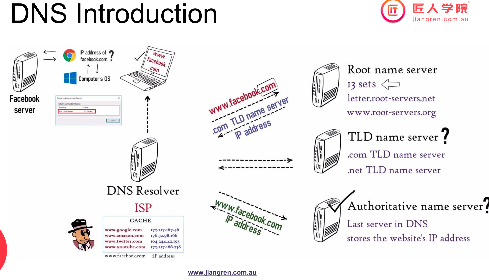
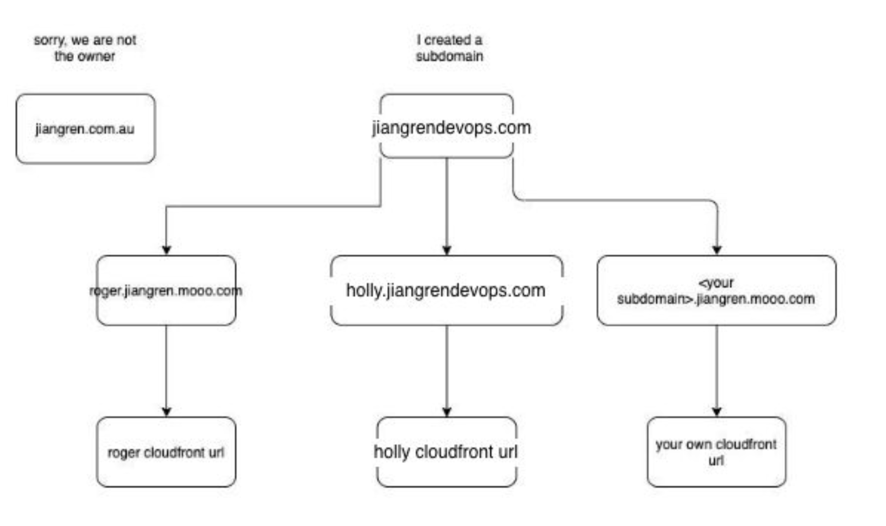
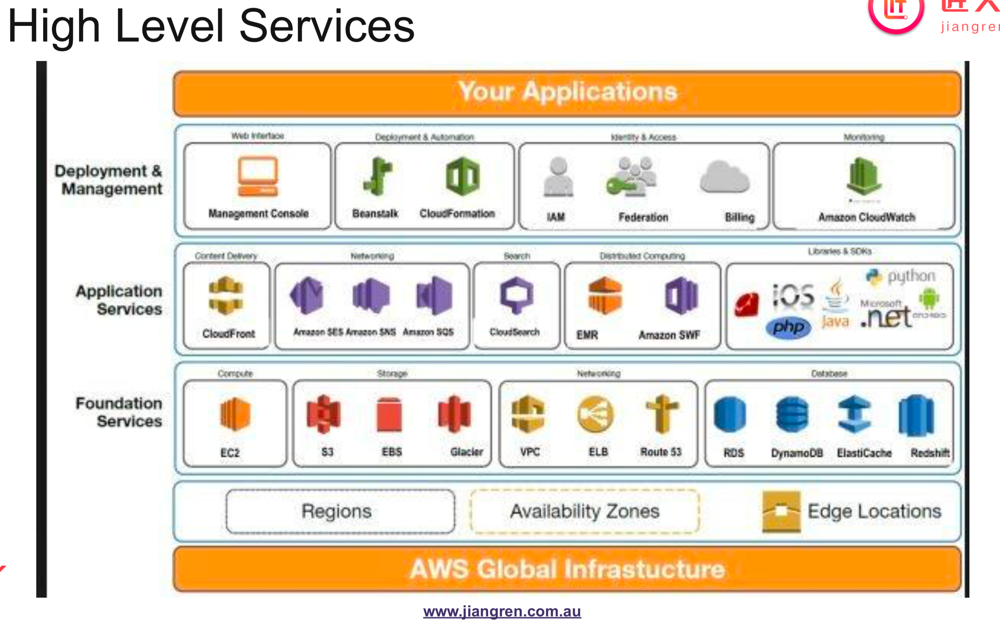

# Class-02 CDN/DNS
## 主要知识点
  - [1.自我介绍](#1自我介绍)
    - [Class Rules](#class-rules)
    - [DevOps怎么去学习](#devops怎么去学习)
  - [2.Case study: optimising jiangren.com.au](#2case-study-optimising-jiangrencomau)
    - [Scenario](#scenario)
    - [关键词提取](#关键词提取)
    - [分析问题](#分析问题)
      - [Latency](#latency)
        - [Latency/网站访问测速](#latency网站访问测速)
      - [测速结果分析](#测速结果分析)
      - [Availability](#availability)
        - [DNS/网站服务器数量测试](#dns网站服务器数量测试)
      - [DNS测试结果分析](#dns测试结果分析)
    - [解决方案](#解决方案)
      - [Content Delivery Network (CDN)](#content-delivery-network-cdn)
        - [What CDN can help you](#what-cdn-can-help-you)
        - [CDN on AWS: CloudFront(Handson)](#cdn-on-aws-cloudfronthandson)
        - [Summarise CDN](#summarise-cdn)
      - [Domain Name Server(DNS)](#domain-name-serverdns)
        - [DNS: AWS Route53(Handson)](#dns-aws-route53handson)
        - [DNS Records on Route53](#dns-records-on-route53)
  - [4.Homework](#4homework)
  - [5.AWS](#5aws)
  - [6.In Class Handson](#6in-class-handson)
    - [CloudFront(CDN) Setup:](#cloudfrontcdn-setup)
    - [AWS Route53 Setup:](#aws-route53-setup)
# 课堂笔记

## 1.自我介绍
Holly Liu:  DevOps Consultant at Versent  
有做过公开课，可以在jiangren youtube找(https://www.youtube.com/watch?v=sGlW0VSSg4o)

	之前工作Previously:  
	-DevOps Consultant at Deloitte  
	-Platform Engineer at Oracle  
	-Cloud Engineer at Aconex

	目前主要方向： Devops & Cloud computing 咨询方向
 
课程讲解以AWS亚马逊云平台为主
DevOps所需要的工具和配置，将在下次tutorial讲解

## <a id="agenda">2.agenda</a>
  
● Rules/How to study  
● DevOps initial setup  
● Case study: optimising jiangren.com.au  
○ CDN  
○ DNS  
● Homework

### Class Rules
- Turn on your camera
  - 可以开camera，让老师同学记住你
- Do the handson
  - 要hands on，无论上课演示的，还是课下的，都要自己做一遍，跟下来
  - - 一定！一定！ 要亲自做hands on，无论课上还是课下都要亲自完成hands on，老师会演示或者课下跟着文档做 
- You’ll do the troubleshooting
  - 首先，如果有问题，搞清楚你的error message/code
  - 然后看到error之后，你要想到自己的做法，你的trouble shooting step是什么
  - 大部分问题，是可以google解决的
  - Troubleshooting --工作和学习中无法避免的，有可能有一大半时间都是在做troubleshooting相关的工作， 需要了解如何 碰到问题和处理问题的过程，这是一个可以终生培养的技能
   ### 应对error message的几个步骤：
  1. 详细阅读一下error message，看报错的内容是什么，是否和自己操作的步骤有关，你是否能从报错的内容中找到出错位置，以及出错原因
  2. 如果自己无法理解错误信息，尝试提炼出error message中的关键语句，在google上搜索。这一步很重要。如果全盘复制error message，有可能会因为字符数太多而无法详细匹配到你要找的答案。所以如何精炼错误信息的同时又精准的找到网上的答案，也是锻炼搜索能力的重要一步 
  3. 尝试从google的搜索结果当中，逐一比较，是否和你的错误信息相关。如果是，可以尝试google提出的解决方案。通常情况下你找到的第一个不一定是能解决你问题的那个一个。有可能需要尝试五六个/六七个不同的方案，才最终能找到你想要的内容 
  4. 求助：如果google上的内容也无法帮你解决问题，可以截图错误信息，注意截图中要包含完整的 明确的你所跑的命令和详细的错误信息，发到群里，大家帮你参考。（注意！ 不要转述，需要完整的明确的错误信息，才能更好的检查错误）
- Raise questions at any time
  - 随时提问，任何形式都欢迎

### DevOps怎么去学习
- 不断去学习，不断去迭代，不断去巩固自己的知识
- 做项目或者解决问题时候可以给自己一个时间设置，如果超过时间，还是卡壳，解决不了，可以寻求帮助
### 2.2 DevOps Initial Setup
- AWS-create your own AWS account/ cost control/install AWS CLI/
- Common tools installation-Git/Docker/Use Linux command line/Python local environment setup
- Refrence link: https://github.com/JiangRenDevOps/DevOpsNotes/blob/master/WK0_General/devops-initial-setup.md
- 备注： 大家选择一门编程语言，自己最擅长的： 如PYTHON, JAVA 等 ，平时训练到的水平： 比如LEETCODE EASY的题目可以不假思索写出来，比如面试时候让你写一个DATABASE API (write & read功能)，可以熟练流畅的写出来

## 2.Case study: optimising jiangren.com.au
### Scenario
Jiangren company has a website called “http://jiangren.com.au”. It’s intended for Australian customers. Since the company is expanding its global market, the CEO wants to improve its website with low latency and high availability to global customers. 
Your task is to find out what are the current problems, what solution and how to implement it. 

### 关键词提取
由上面的描述可取出关键词：
- Low latency---载入速度的指标
- High availability
  - 希望各地区用户都能正常的访问业务，既使在某一个区受到影响的情况下

### 分析问题
#### Latency
如果网页load速度慢10～20%，traffic会受到致命打击
##### Latency/网站访问测速
https://www.dotcom-tools.com/website-speed-test.asp
- 1. 打开以上链接在三个不同的tab里，测三次，取平均值
- 2. Location取aws在世界各地的data centre附近地区
  - Denver, N.Virginia, Frankfurt, Tokyo, Brisbane
  - 第二次可以选取不同地区的不同城市
- 3. 选择Global Perfermance
#### 测速结果分析
网站仅针对澳洲顾客服务，还没有对全球顾客进行优化，需要对Global Latency做优化  
As shown above, Jiangren.com.au loads as fast as 2.6 seconds in Brisbane. However, it takes a few times to load in other locations.

#### Availability
看一下这个网站有几个不同的server
##### DNS/网站服务器数量测试
- Online Tools
  - DNS Check
    - https://www.whatsmydns.net
    - 可以检测该网站在全球不同地区访问时，对应的ip address
    - 作为优化，一个网站如果在全球有edge location的话，可以帮忙缓存网站的内容；这样当用户访问，将首先到达最近的edge location，大幅提高访问速度
    - 在全世界不同地区访问 匠人网站， DNS的IP ADDRESS 是一样的，一个IP 地址代表一个SERVER,
    - 代表的含义：全世界任何地区的访问都会匠人网站，都会把你的请求发到同一个server上（布里斯班）
    - 如果布里斯班的server突然不能用了， 可用性就很差了，客户访问不了。
    - 作为优化，一个网站如果在全球有edge location的话，可以帮忙缓存网站的内容；这样当用户访问，将首先到达最近的edge location，大幅提高访问速度
  - IP Check
- Cmds
  - mac/linux: dig
  - windows: nslookup 
   
#### DNS测试结果分析
网站没有对全球访问做优化，仅有一个ip/server来应对全球访问
- 这个架构我们叫做Single Point Failure   
  
There is only one EC2 node for the jiangren.com.au website. If there is the EC2 node is failed, then the website will be inaccessible.
If there is a spamming user sends a significant amount of request or use DDoS to attack the server, then the server will be overloaded and out of service.
- DDoS Attack
  - 黑客可以控制大量全球不同的服务器，来同时访问你的网站，超过网站的负载量，来阻断其它/真实用户的访问
  - 比如匠人网站 假如 平时负载是 最高支持每秒500个访问， 比如全世界3个server 每个server 每秒发200个访问 共600个， 匠人网站就超负荷，不能给正常的真实用户提供服务。
 
 

### 解决方案
#### Content Delivery Network (CDN)
帮助你把文件储存在全球不同的地区，在不同大陆设置不同的edge server，以便于用户访问时，直接到达该地区的edge server，拿到网站的缓存，以达到快速访问
- Akamai: CDN的一个品牌，帮你设置多个edge server
- 用户访问时，如果离该地最近的edge/cache server挂掉，那么用户会访问到其它的edge/cache server，或直接访问origin server
- 
- content： 可以是图像，网页，音频等。帮助你把文件储存在全球不同的地区，在不同大陆设置不同的edge server，以便于用户访问时，直接到达该地区的edge server，拿到网站的缓存，以达到快速访问

- 根节点（origin server）把全世界 所有的edge server连接起来
- edge server通过DATA SHARING  or CONTENT SHARING 拿到origin server的内容
- 用户访问时，如果离该地最近的edge/cache server挂掉，那么用户会访问到其它的edge/cache server，或直接访问origin server 
- 
- without CDN： 穿过大陆，穿过光缆，穿过不同的HOP 到达匠人的server
- with CDN: 用户可以直接访问离的最近的edge server,速度快
 

##### What CDN can help you 
- Improve page load speed
- Handle high traffic loads
  - 通过分摊对主服务器的访问给edge server，来缓解主服务器的压力
- Reduce bandwidth consumption
- Load balance between multiple servers
- Protect your website from DDoS attacks
- Secure your application
- And more

##### CDN on AWS: CloudFront(Handson)
- Setup: https://github.com/JiangRenDevOps/DevOpsLectureNotesV4/blob/main/WK1-CDN-DNS/CDN.md
- 对应课程视频1:12:30 ~ 1:38:10
  
##### CDN on AWS: CloudFront(Handson #1)
- Setup: https://github.com/JiangRenDevOps/DevOpsLectureNotesV4/blob/main/WK1-CDN-DNS/CDN.md
AWS Cloudfront： 用途广泛，把底下的业务逻辑封装起来，方便使用
##### Summarise CDN
并没有改变任何jiangren.com.au的设置和部署，只是新建了一个global distribution，来提升jiangren的各项指标  
CDN works well with static resources. We didn’t cover cache settings for backend REST API calls. You can exclude backend calls so they won’t be cached by CDN.  

Pros
- High Speed: Reduce web page load time
- High Availability: Reduce requests from original server and prevent DDoS attack
 
Cons
- Additional сosts
  - https://aws.amazon.com/cloudfront/pricing/
  - CloudFront里，`Edit Distribution`- `Distributon Settings`里可以设置`Price Class`来限制CDN部署的区域
- Application needs to cdnify via file versioning. Otherwise, files takes time
to update.
  - cache server可能没有拿到网站的最新版本，同步还没有进行到

#### Domain Name Server(DNS) 

- 在敲入网址后，系统会在浏览器的缓存里，寻找有没有储存相关的IP address
- 在没有找到相对应的ip后，会继续访问ISP（e.g. Telstra, Optus）, 找到对应ip
- 如果没还有找到，可能会去询问更高层的domain name server，例如root/TLD/authoritative name server
  - TLD name server，包含了所有的以.com或者.net结尾的网站对应ip信息
- If you search “Domain name registration”, you will find a lot of providers. My favourite ones are:
  - godaddy.com
  - onlydomains.com 
  - namecheap.com 
  - freedns.afraid.org（免费的）
- For DNS hosting, we use Route53 in AWS. In this course, we are going to use AWS Route53 to demo the DNS setup for our CDN
- DNS Introduction
	-域名管理系统
	-类似电话簿
	-把人可以记住的HOST NAME 对应到 IP 地址上

- 名词：URL
- 名词：  IP address
- 名词： NAME SERVER
- 域名逐级解析图和案例需要理解其流程

##### DNS: AWS Route53(Handson #2)

并不会直接使用jiangren.com.au，而是使用了一个subdomain  
想进入route 53，可以在AWS console页面，search栏搜索route 53
- Setup: https://github.com/JiangRenDevOps/DevOpsLectureNotesV4/blob/main/WK1-CDN-DNS/DNS.md
- 对应课程视频2:03:20 ~ 2:26:00
- (AWS) CNAME:将现有record的名字，map到另一个域名（例如cloudfront里产生的新域名）或者subdomain
- 有方法将cloudfront.net从客户端禁用：https://stackoverflow.com/questions/45589416/how-to-disable-access-to-cloudfront-via-the-cloudfront-net-url
- 子域名必须要与主域名有关系（例如已经保存在了aws hosted zone里），才能使我们的网站得到最终的访问。因为一般在访问子域名时，会向上追溯到主域名，在主域名dns处询问是否有相应的子域名，如果得到了否定回答，则子域名依然无法访问

- 主要：设置自己的一个域名关联到自己设置的CDN上面
每个同学设置的域名为： xxx.jiangrendevops.com (xxx 为自己的名字 ，如：  aaron.jiangrendevops.com)
用AWS route53设置时候的几个注意点：
	1. domain name 符合格式， 如 kevin.jiangrendevops.com
	2. create record: 创建Alias record -----> alias 到我们的第一步创建的CLOUD DISTRIBUTION
	3. 老师帮助set up DNS delegation----->建立了信任机制
	4. request public certificate---->status 如果是 success代表成功了， 如果是pending valiation 可以点击create record in route53 一直到 cert 变成 issued状态

##### DNS Records on Route53
每次我们创建一个hosted zone时，都会自带两个records(并不需要我们去更改)：
- NS: Name Server
- SOA: Start of Authority

##### DNS interview question（11期DEVOPS班）
	what happens when you enter www.google.com into your browser?

	备注：可以多方面的来回答这个问题，考察对问题的理解的深度和广度，可以讨论：DNS,TCP/UDP ,网页渲染，前端，协议等

ref: https://aws.amazon.com/blogs/mobile/what-happens-when-you-type-a-url-into-your-browser/

## 4.Homework
https://github.com/JiangRenDevOps/DevOpsLectureNotesV4/blob/main/WK1-CDN-DNS /homework.md

### 2.4 Homework（11期DEVOPS班）

<https://github.com/JiangRenDevOps/DevOpsNotes/blob/master/WK1_CDN_DNS/homework.md>

Extended reading material  
<https://github.com/JiangRenDevOps/DevOpsNotes/blob/master/WK1_CDN_DNS/reading.md>

## 5.AWS
## <a id="aws">3.AWS</a>
- 市场龙头地位---市场份额：50%-65%
- AWS 业务种类非常多，常用的4大类，后续会接触到
- 关于考证：
  - 适合入门，找第一份工作人群
  - 换career path的人群，考证书来证明自己
 
- 市场龙头地位
- 这学期我们会贯穿学习有关AWS的各类知识
- 历史：
  - 早期是amazon的内部工具
  - 发展至今，已经形成了一个很大的版图：

- 开始接触最多的是EC2(虚拟机业务)
- 这个图汇聚了我们最常用的
- 关于考证：
  - 非常鼓励大家去考取
  - DevOps 就业领域也有很大的缺口，同时对Junior也有很友好的培养
  - 注册：https://www.aws.training/SignIn?returnUrl=%2FDetails%2FeLearning%3Fid%3D20686
  - Michael老师的备考笔记：https://github.com/michaelsu2014/aws-solution-architect-associate-notes

## <a id="handson">4.Handson-11期DEVOPS班</a>
### CloudFront(CDN) Setup:
https://github.com/JiangRenDevOps/DevOpsNotes/blob/master/WK1_CDN_DNS/CDN.md

### AWS Route53 Setup:
https://github.com/JiangRenDevOps/DevOpsNotes/blob/master/WK1_CDN_DNS/DNS.md
## 6.In Class Handson
### CloudFront(CDN) Setup:
https://github.com/JiangRenDevOps/DevOpsLectureNotesV4/blob/main/WK1-CDN-DNS/CDN.md

### AWS Route53 Setup:
https://github.com/JiangRenDevOps/DevOpsLectureNotesV4/blob/main/WK1-CDN-DNS/DNS.md
