- [课堂笔记](#课堂笔记)
  - [GOAL of this class](#goal-of-this-class)
  - [1 CI / CD](#1-ci--cd)
    - [1.1 Continuous Integration(CI)](#11-continuous-integrationci)
    - [1.2 Continuous Delivery (CD)](#12-continuous-delivery-cd)
  - [2 Benefits of CI/CD](#2-benefits-of-cicd)
  - [3 CI/CD Tools](#3-cicd-tools)
  - [4 Jenkins History](#4-jenkins-history)
  - [5 Jenkins Core Concept](#5-jenkins-core-concept)
  - [6 Jenkins Pipeline](#6-jenkins-pipeline)
  - [7 Jenkins Configuration Management](#7-jenkins-configuration-management)
  - [8 Install a Jenkins Server](#8-install-a-jenkins-server)
  - [9.Homework and Project Works](#9homework-and-project-works)
 
# 课堂笔记
## GOAL of this class
 Setup Jenkins CI pipeline
## 1 CI / CD
### 1.1 Continuous Integration(CI)
Continuous Integration is a practice where development teams frequently commit
application code changes to a shared repository. These changes automatically
trigger new builds which are then validated by automated testing to ensure that
they do not break any functionality
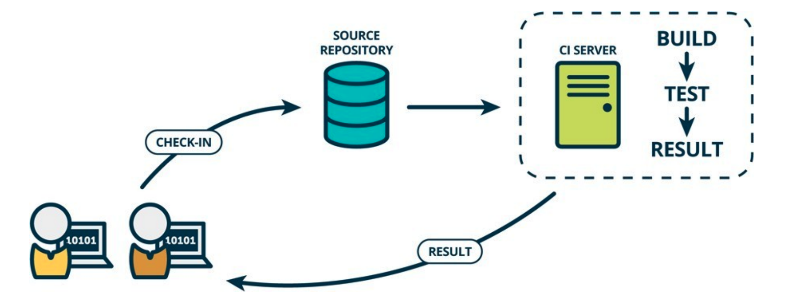
- Software build tools
  
  https://www.plutora.com/ci-cd-tools/software-build-tools

- Traditional way of testing
  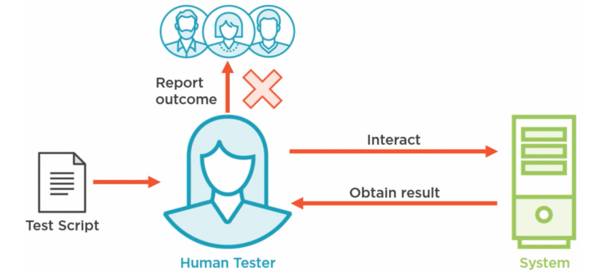

- Automated testing
  

- benefits of automated testing
  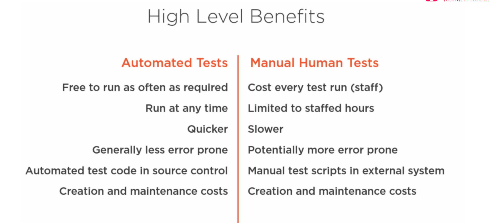

- relative cost of fixing defects in different stage of software developement
  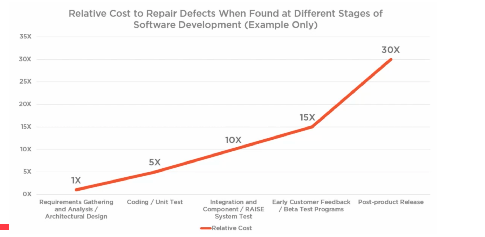

- Testing Pyramid
  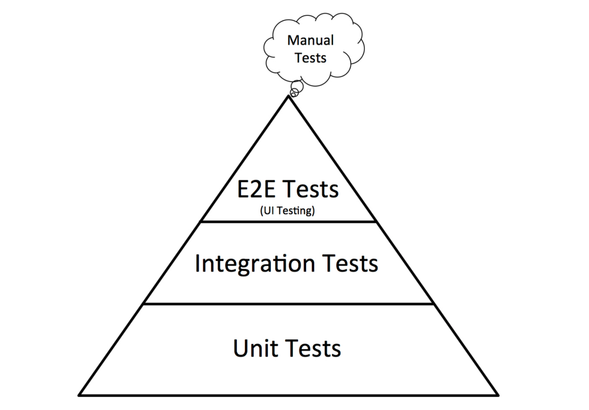

- Testing process
  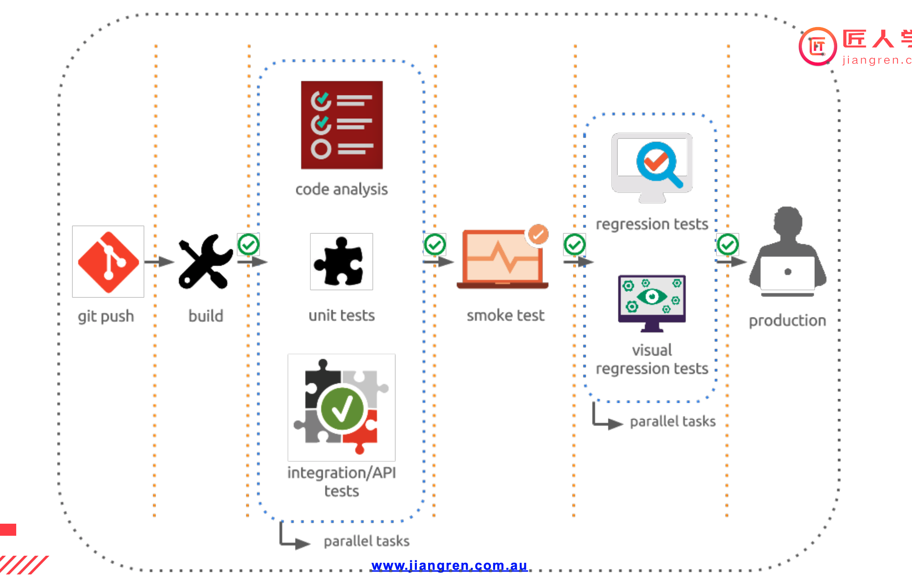

### 1.2 Continuous Delivery (CD)
CD is also used to describe Continuous Deployment which focuses on the
automation process to release what is now a fully functional build into production.
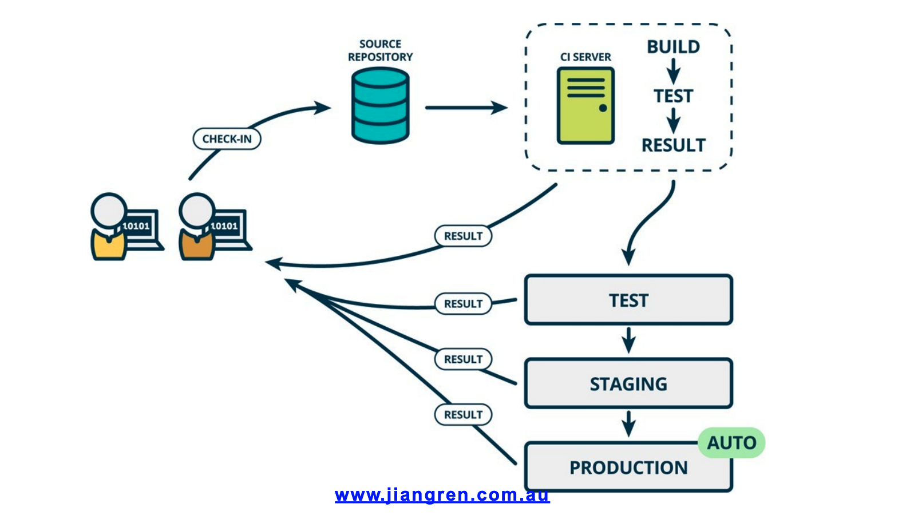
- Deployment
  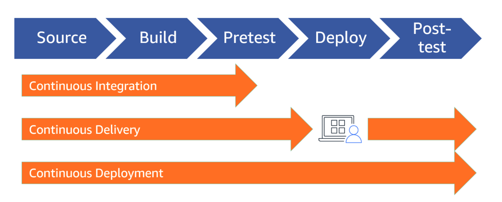
- Deployment environments
  
## 2 Benefits of CI/CD
1. Smaller Code Changes
2. FaultIsolations
3. Faster Mean TimeToResolution (MTTR)
4. MoreTestReliability
5. FasterRelease Rate
6. Smaller Backlog
7. CustomerSatisfaction
8. IncreaseTeamTransparency andAccountability
9. Reduce Costs
10. Easy Maintenance andUpdates

    Ref: https://www.katalon.com/resources-center/blog/benefits-continuous-integration-delivery
## 3 CI/CD Tools

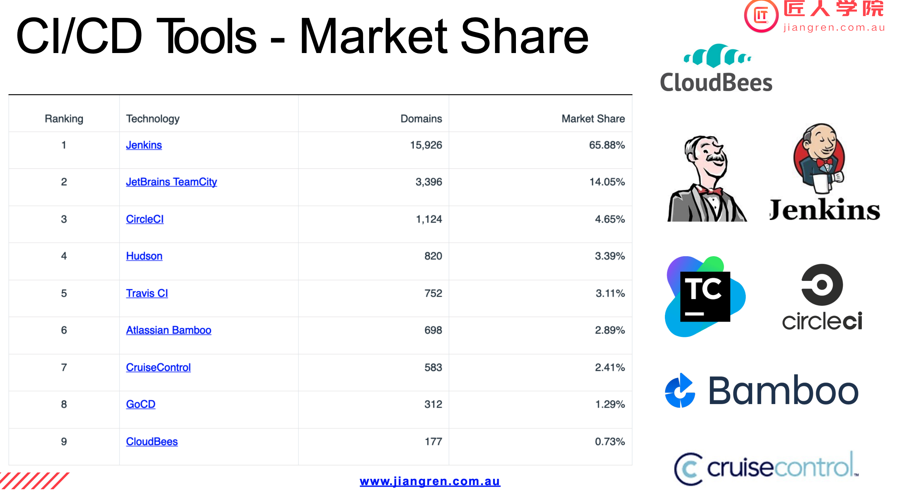

Some big companys build their own tools for internal use.

## 4 Jenkins History
  The leading open source automation server, Jenkins provides hundreds of plugins to support building, deploying and automating any project.
- 2004 - Kohsuke Kawaguchi created Hudson in
  Sun Microsystem
- 2005 - Hudson is released
- 2011 - Hudson renamed to Jenkins after Oracle
  purchased Sun Microsystem
- 2010 - CloudBees is created
- 2014 - CloudBees shifts focus to Enterprise
  Jenkins and provide commercial support to Jenkins.
- 2014 - Kawaguchi becomes CTO of CloudBees
## 5 Jenkins Core Concept
  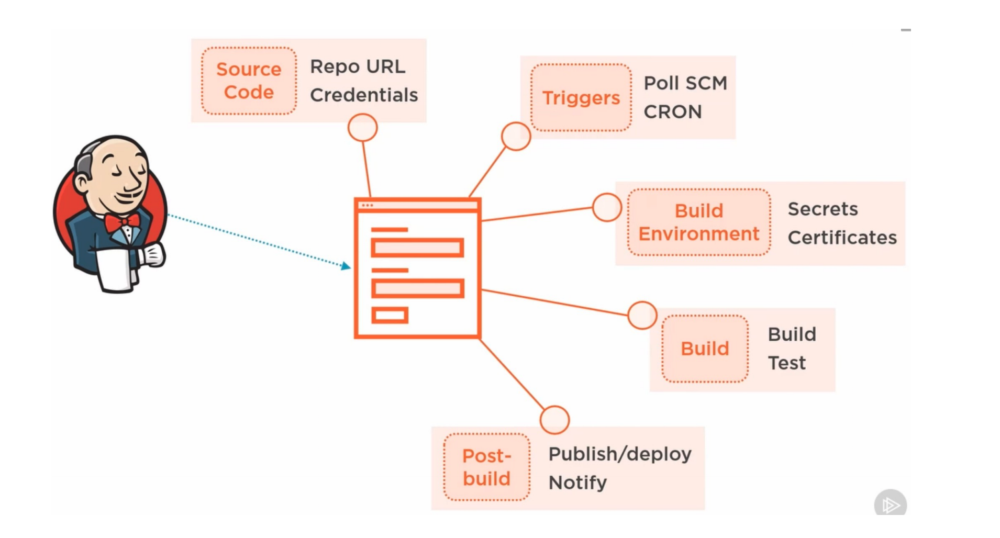

    Jenkins Job
    Jenkins Build
    Jenkins Plugin
    Jenkins View (Dashboard View)
    Jenkins Node: Master/Agent
    Jenkins Credential
    Jenkins Configuration
    Jenkins Logs
    Jenkins SSO and Global Security
    Jenkins Pipeline

## 6 Jenkins Pipeline
What is Jenkins Pipeline?

Jenkins Pipeline is a combination of plugins that supports integration and implementation of continuous delivery pipelines. It has an extensible automation server to create simple and complex delivery pipelines as code via pipeline DSL. A Pipeline is a group of events interlinked with each other in a sequence.

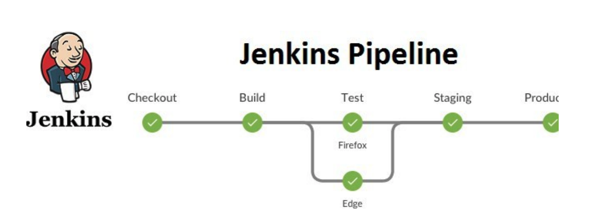
- Jenkins 有两类config.xml
  
  在Jenkins home之下的config.xml是Jenkins server的配置文件。
  另外在每个job或project自己的目录下，还有一个config.xml。它包含了是这个job的配置信息。
  

- Jekinsfile

  Jenkins pipelines can be defined using a text file called JenkinsFile. You can implement pipeline as code using JenkinsFile, and this can be defined by using a domain specific language (DSL). With JenkinsFile, you can write the steps needed for running a Jenkins pipeline.
  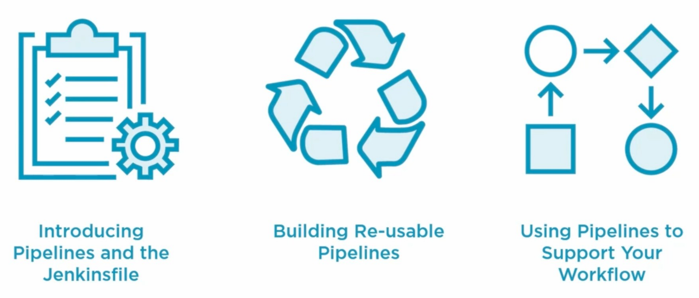
  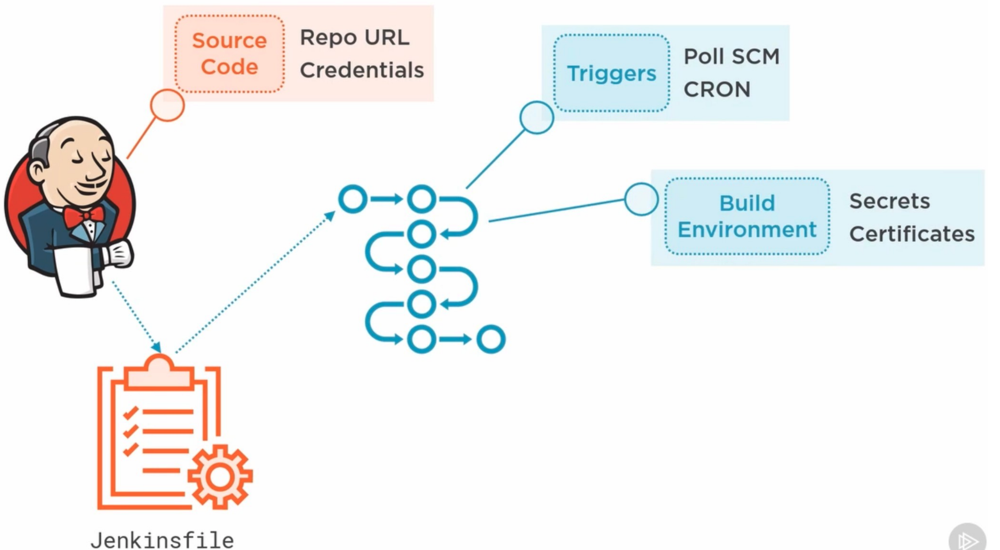
  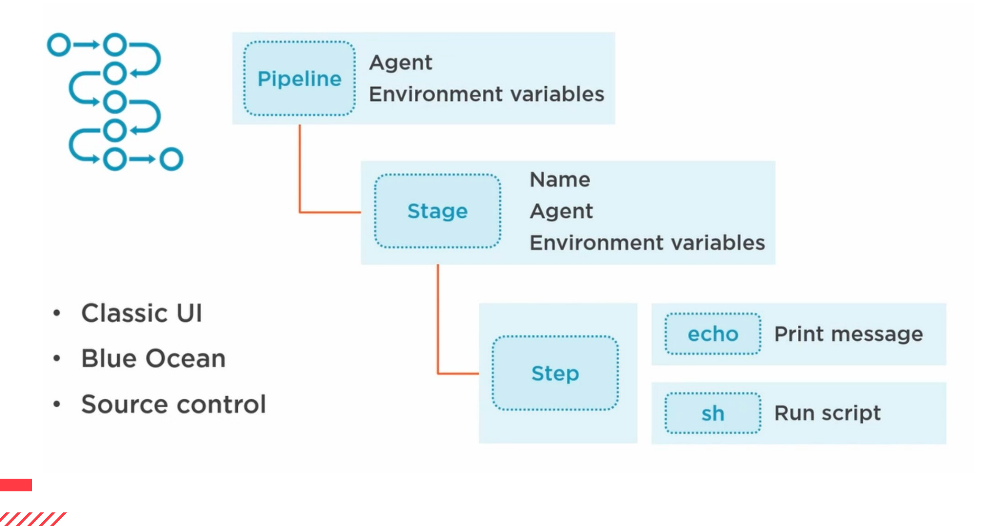
  
  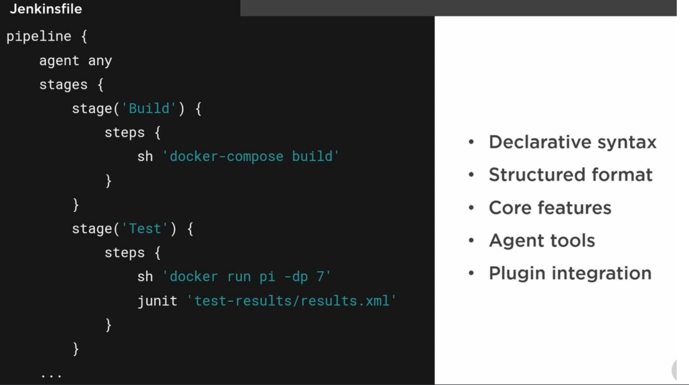

- Jenkins Pipeline - in real world
  
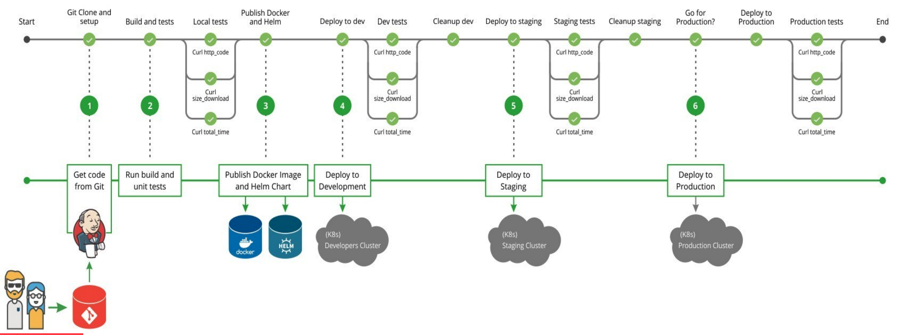

## 7 Jenkins Configuration Management
We configured Github Pipeline and Plugins manually in Jenkins. This should be
automated.
There are a few ways to automate this.
1. Dockerise Jenkins and add the configuration into Dockerfile - https://github.com/
jenkinsci/docker/blob/master/README.md
2. Use configuration management tool to configure Jenkins
Jenkins doesn’t use any database and uses plain file system. We should backup
Jenkins configuration files and logs as well.
There are also a few ways.
1. Use backup plugins to backup
2. Backup file system regularly
## 8 Install a Jenkins Server
- Common options to install Jenkins
  1. Official - https://jenkins.io - java -jar jenkins.war
  2. Docker - https://hub.docker.com/r/jenkins/jenkins/
  3. Kubernetes: for large scale paralell tasks
      - Kubernetes application
      - helm
        
        helm install --name jenkins stable/jenkins --set rbac.install=true \
        --set Persistence.Enabled=true \
        --set Persistence.StorageClass=jenkins-pv
  4. Configuration Management Tool: Chef, Puppet,Ansible or Saltstack
  5. Use Jenkins in the Cloud: CloudBees, bitnami

- Hands-on:install Jenkins in docker locally

  repo:  https://github.com/sean4wsome/jrcms
  - Handson 1 - Jenkins installation: 
    https://github.com/JiangRenDevOps/DevOpsLectureNotesV4/tree/main/WK3_CI-CD-Jekins/1.Install-Jenkins-Docker
  - Handson 2 - integrate Jenkins with a Github Orgnisation:
    https://github.com/JiangRenDevOps/DevOpsLectureNotesV4/tree/main/WK3_CI-CD-Jekins/3.Integrate-with-Github
  - Handson 3 - exposing Jekins to internet:
    https://github.com/JiangRenDevOps/DevOpsLectureNotesV4/tree/main/WK3_CI-CD-Jekins/2.Expose-Jenkins-to-Public-Internet
  - Handson 4 - build Jenkins pipeline using Blue Ocean interface：
    https://github.com/JiangRenDevOps/DevOpsLectureNotesV4/tree/main/WK3_CI-CD-Jekins/5.Jenkins-BlueOcean-Pipeline

  - Handson for next lesson - Install-Jenkins-Kubernetes
    https://github.com/JiangRenDevOps/DevOpsLectureNotesV4/tree/main/WK3_CI-CD-Jekins/4.Install-Jenkins-Kubernetes

- more reference for jenkins pipeline 
  Jenkins pipeline uses Groovy language. (similarly in Teamcity and Bamboo) 
  https://jenkins.io/doc/book/pipeline/
  https://jenkins.io/doc/book/pipeline/pipeline-best-practices/
  https://github.com/davisliu11/jenkins-pipeline-examples

## 9.Homework and Project Works
To get the most out of this course,
please do take some efforts to complete the homework and project works. Try to do more practice with the examples from the reference links.
It will help you to understand the content better and
some tasks may be a prerequisite of the following contents.
 