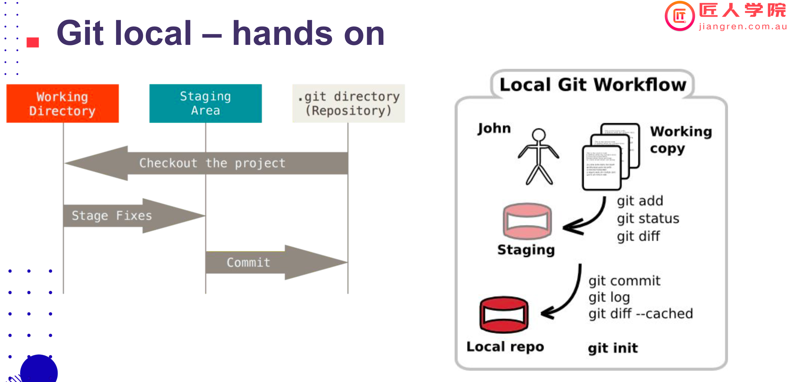
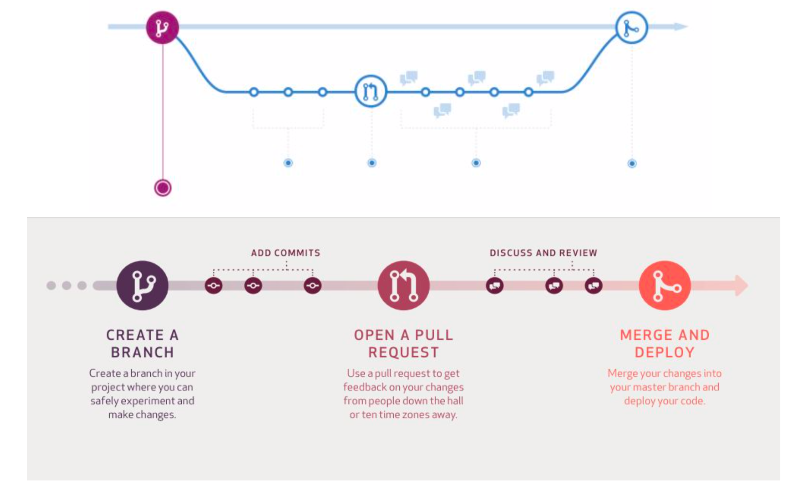
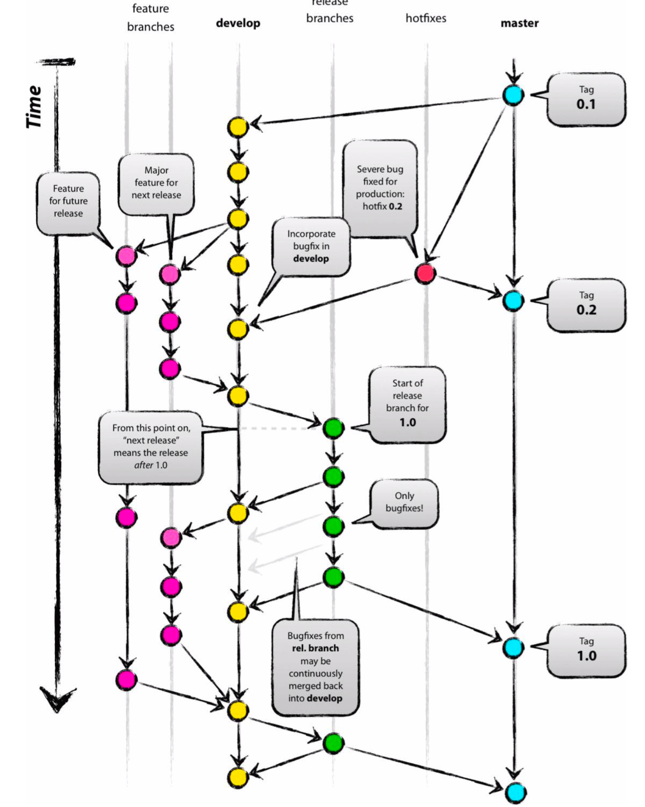

# Class-06 Git
## 主要知识点
  - [1.背景介绍](#1背景介绍)
    - [自我介绍](#自我介绍)
  - [2.Background](#2background)
    - [2.1 What is a Version Control system?](#21-what-is-a-version-control-system)
      - [2.1.1 Version Control中的常见概念](#211-version-control中的常见概念)
    - [2.2 Types of Version Control system](#22-types-of-version-control-system)
    - [2.3 Why Use Git?](#23-why-use-git)
    - [2.4 Which Git to use?](#24-which-git-to-use)
  - [3.Step by step git hands-on](#3step-by-step-git-hands-on)
    - [3.1 Git - Configuration](#31-git---configuration)
    - [3.2 Git - init](#32-git---init)
    - [3.3 Git - add](#33-git---add)
      - [3.3.1 Show command line manual](#331-show-command-line-manual)
    - [3.4 Stage a change](#34-stage-a-change)
    - [3.5 Check staging status](#35-check-staging-status)
    - [3.6 Add aliase](#36-add-aliase)
    - [3.7 Check "help"](#37-check-help)
    - [3.8 Git commit](#38-git-commit)
    - [3.9 Ignoring Files](#39-ignoring-files)
    - [3.10 Git log](#310-git-log)
    - [3.11 Git restore](#311-git-restore)
    - [3.12 Git reset/revert/rm/clean](#312-git-resetrevertrmclean)
    - [3.13 Git stash](#313-git-stash)
    - [3.14 课间练习：](#314-课间练习)
    - [3.15 Git Cloud Repository：](#315-git-cloud-repository)
    - [3.15 Git Clone：](#315-git-clone)
      - [3.15.1 How to create personal access token：](#3151-how-to-create-personal-access-token)
      - [3.15.2 Or use SSH：](#3152-or-use-ssh)
    - [3.16 Bitbucket Handson：](#316-bitbucket-handson)
    - [3.17 Git with branching：](#317-git-with-branching)
    - [3.18 Pull Request：](#318-pull-request)
  - [4.Visualisation](#4visualisation)
  - [5.Summary](#5summary)
 
# 课堂笔记

# Git Basics with Practices

Lecturer: Ray Ma

今天我将学到
• 为什么要使用 Git？
• 如何设置 Git？
• Git 的基本使用方法
• 使用 Git branch 进行日常协作
• 使用 merge 和 rebase 合并分支
• 使用 GitHub 进行团队协作


## What is a Version Control System?

## Software release life cycle

## Why are we using version control？


## Version Control Glossary

• Repository: Your project.
I created a new repository (repo) for my school project so we can collaborate more easily.
• Diff: The delta (additions and deletions) between two states of a project.
• Commit: A snapshot of your project’s state at a point in history. Records
the difference between two points in history with a diff.
• Branch: Modifications to a project (main branch = trunk) made in parallel
with the main branch, but not affecting the main branch
• Merge: Introducing changes from one branch into another.
• Clone: Downloading a local copy of a project.
• Fork: Your own version of somebody else’s project where you take the
original code-base and make modifications. May include many changes or
just a few bug-fixes. Sometimes you end up merging those changes back upstream


## Centralized & Distributed

## What is Git?
Git is a distributed version-control system for tracking changes in
source code during software development.
It is designed for coordinating work among programmers, but it
can be used to track changes in any set of files. Its goals include
speed, data integrity, and support for distributed, non-linear
workflows

## Git workflow


## Git branch

## Git and GitHub

## GitHub PR(pull request)

# Step 0: 一个点的历史 – Git Setup

## Git Global Setup  

```
git config --global user.name "your name"
git config --global user.email "your email add"
git config --global core.editor "code --wait"
```
Note: we use VSCode as our editor, with global it affects your whole computer setting, without global it only affects current repo

# Git local – hands on

## git init initializes a brand new Git repository and begins tracking
an existing directory. It adds a hidden subfolder within the
existing directory that houses the internal data structure required
for version control.
```
mkdir learngit
cd learngit
pwd
/Users/jonny/learngit
git init
```
or we use git clone
```
git clone

```

Let’s change README.md file and practice commands again


## Ignoring Files
• Often, you’ll have a class of files that you don’t want Git
to automatically add or even show you as being
untracked. These are generally automatically generated
files such as log files or files produced by your build
system. In such cases, you can create a file listing
patterns to match them named .gitignore


A collection of .gitignore templates:
<https://github.com/github/gitignore>


## Undoing things
• Undoing the last commit/comment: git commit --amend
• git rm test.txt
• git clean Remove untracked files from the working tree
• git stash Stash the changes in a dirty working directory away
• git stash
• git stash list
• git stash apply
• git stash pop stash@{0}

## Git Cloud Repository


Git remote – hands on
"Create a "repository
https://github.com/new
NOTE: you must have a github account


# Step 1: 一条线的历史 – commit

Git工作原理：两步 commit
Commit changes
Commit message 要有意义
Git undo changes
- git checkout
- git clean
- git revert (用一个新的commit对历史记录进行回滚)
- git reset （从历史记录中删除commit）

## Git status and history

commands we use:

```
git status
git diff
git log

```

# Step 2: 两条线的历史 – branch & merge

Git with branching
• Create a branch (git branch)
• Checkout a branch (git checkout)
• Merge a branch (git merge)
• Rebase a branch (git rebase)
• Create a branch (git branch)
• Checkout a branch (git checkout)
git branch crazy-experiment

Note that this only creates the new branch. To start adding commits to it, you need to select
it with git checkout, and then use the standard git add and git commit commands.
git checkout –b crazy-experiment

branching commands:
```
git branch
git branch -d
git checkout -b

```

## Semantic branch names

<type>/<ticket-number>-<title>
e.g. feat/JR-101-create-header-for-home-page


• feature
• fix/bugfix/hotfix
• chore
https://www.conventionalcommits.org/en/v1.0.0-beta.4/


• Merge a branch (git merge)
Git merge lets you take the independent lines of development created by git branch and integrate
them into a single branch. Git merge will combine multiple sequences of commits into one unified
history. In the most frequent use cases, git merge is used to combine two branches.

• Merge a branch (git merge)
# Start a new feature
git checkout -b new-feature
# Edit some files
git add <file>
git commit -m "Start a feature"
# Edit some files
git add <file>
git commit -m "Finish a feature"
# Merge in the new-feature branch
git checkout main
git merge new-feature
git branch -d new-feature

## Merge conflicts!!!

如果不想解决冲突：
git merge <branch name> --abort
git merge <branch name> --overwrite-ignore
git merge <branch name> --no-overwrite-ignore

## 两种workflow: merge 和 rebase

Merging vs. Rebasing
Rebase a branch (git rebase)

## graph ---use git history plugin in VSCode ----you can get better visualazaiton 
## useful visualazaiton link:  <http://git-school.github.io/visualizing-git/>

# Step 3: 多条线的历史 – 远程协作
- Connect to remote repo
```
git clone
git remote add <name> <url>
git remote rm <name>
git remote rename <old-name> <new-name>
```

Set up tracking branch
```
git branch -u <name>/<branch>
```


Update local from remote
```
git fetch   (check if codes in both ends are the same)
git pull
```

```
#Update remote from local
git push <name> <branch>
git push <name> <local_branch>:<remote_branch>

#Delete a remote branch
git push -d <name> <branch>
git push <name> :<branch>


```
## Pull Request (PR)

Pull requests let you tell others about changes you've pushed to a
GitHub repository. Once a pull request is sent, interested parties can
review the set of changes, discuss potential modifications, and even push follow-up commits if necessary

Note: PR--->加入一个人工的REVIEW， 一般实际生产环境 MAIN是受到保护的，需要权限。  in github ---> click "compare & pull request" button

Benefits:
• Peer Review
• Sufficient testing and better stability
• Reducing conflicts Continuous Delivery
• Clearer responsibility

When you push your branch, got the github repo

Before you create Pull Request, please check:
• Follow coding standard (code style, naming convention, etc. )
• Have tests
• No conflict
• DO NOT leave comment blank – add summary of this PR

Code Review：
• Two ways to show diff
• Single comment vs.multiple

Comments for Code
Review:
• LGTM – look good to me
• :+1
• Markdown

The reviewer should identify errors that will cause an issue in production.
• The reviewer should verify that the stated goal of the code change aligns with the changes
being made.
• The reviewer should verify that any changes align with the team’s coding standards.
• The reviewer should look for anything they personally disagree with

Pull Request (PR) merge strategy – github flow:
```
create a branch--> ADD commits -->open a pull request--> discuss & review--> Merge and Deploy

```
# Ask git to ignore files

- 各种文件 不属于 CODE， 如 MP3，MP4，JPEG，.exe 音频视频文件等
- 二进制文件（BINARY FILES）
- 路径 path and directory
- 需要添加 COMMIT进去 .gitignore 这个文件进去 （hidden file）
- GIT 只处理 文本格式 和 SOURCE CODE 文件


# Takeaways

• Never forget .gitignore
• Fix conflicts before PR
• Try to put all code for one function/subfunction/one bug fix in one git
commit, which also means the commit should be small enough
• Try to make sure every commit will not break the build pipeline, which
means it should pass code style check and unit tests


# Homework / Challenges

<https://github.com/JiangRenDevOps/DevOpsLectureNotesV6/blob/master/WK2_Git/git_exercise_1.md>
<https://github.com/JiangRenDevOps/DevOpsLectureNotesV6/blob/master/WK2_Git/git_exercise_2.md>
<https://learngitbranching.js.org/>


------------------------------------------------------------------------------------------------------------------------------
## 1.背景介绍
### 自我介绍
Sean，Atlassian 的software developer，更多工作任务在于pipeline的维护  
从测试做起，转到developer，后面工作更偏运维  
> 现在趋势是：作为开发，你要懂运维；作为运维，你要懂开发；更强调全能型人才

Git Goal 本节课学习重点：  
- Git在本地怎么工作的
- 在云端和远端存储，要用到的远端代码库/Github
- 解决文件版本控制中的conflict
- 创建自己的云端项目，并学会pull request


## 2.Background
### 2.1 What is a Version Control system? 
网站或者代码从开始，到产品上线，要经历不同的stage

到Candidate阶段，就已经接近或者可以ready for production了  
因此我们需要一个软件版本管理系统，可以来track这些不同的stage

A version control system, or VCS, is how one tracks changes, modifications, and updates to source files over time. Creating a history of changes for a project over time.

Used for:  
- Documentation 
- Code
- Configuration
- Collaboration

#### 2.1.1 Version Control中的常见概念
- Repository（代码库）: 等于Your project.
  - “I created a new repository (repo) for my school project so we can collaborate more easily.”
- Diff（两个文件间的差别）: The delta (additions and deletions) between two states of
a project.
- Commit: A snapshot of your project’s state at a point in
history. Records the difference between two points in history
with a diff.
- Branch: Modifications to a project (main branch = trunk) made
in parallel with the a main branch, but not affecting the main branch.
- Merge: Introducing changes from one branch into another.
- Clone: Downloading a local copy of a project.
- Fork（自动将代码库完全copy了一份，然后在copy的版本跟原版已经完全分离，例如app做andriod和ios双版本）: Your own version of somebody else’s project where you
take the original code-base and make modifications. May include many changes or just a few bug-fixes. Sometimes you end up merging those changes back upstream.
 
### 2.2 Types of Version Control system
- Centralised version control systems
  - 仍然有部分保密系数比较高的项目，考虑到代码的安全性，会选用这种系统
- Distributed version control systems

### 2.3 Why Use Git?
- Centralised cloud storage of your code. 
- Version Control.
- Working in teams. Code Review
- Get involved / Open Source.

### 2.4 Which Git to use? 
- Github vs Bitbucket
  - Bitbucket integrate well with Trello, Confluence and other DevOps software
  - Github has the largest market share.
    - 个人在Github可以多参加开源项目，增加经验
- 国内可以选码云https://gitee.com/
 

## 3.Step by step git hands-on
### 3.1 Git - Configuration 
```
    git config --list
    git config --global user.name "My Name"
    git config --global user.email "myself@gmail.com" 
    git config --global core.editor "nano"
```
### 3.2 Git - init
initializes a brand new Git repository and begins tracking an existing directory
```
    git init
```
### 3.3 Git - add
git本地端的流程一般如下

#### 3.3.1 Show command line manual
terminal下，使用`man`加命令，可以显示该命令的使用manual，如
```
    man touch
```
### 3.4 Stage a change
使用`git add`命令，来track 文件，如
```
    git add readme.md
```
### 3.5 Check staging status
使用`git status`来检查当前repo下，文件变更的信息
```
    git status
```
### 3.6 Add aliase
通过创建aliase来简化命令的输入，比如建立`status`的aliase为`st`
```
    git config --global alias.st status
```
### 3.7 Check "help"
在git任何命令后面跟`-h`，可以查到该命令的帮助，如
```
    git config -h
```
### 3.8 Git commit
saves the snapshot to the project history and completes the change-tracking process. In short, a commit functions like taking a photo.. Anything that’s been staged with git add will become a part of the snapshot with git commit
```
    git commit -m "wrote a readme file"
```
可以使用`-a`来commit所有变更的文件，如
```
    git commit -am "updated readme file"
```
如果需要更改最近一次commit的信息，可以使用`--amend`，如
```
    git commit --amend
```

### 3.9 Ignoring Files
Often, you’ll have a class of files that you don’t want Git to automatically add or even show you as being untracked. These are generally automatically generated files such as log files or files produced by your build system. In such cases, you can create a file listing patterns to match them named .gitignore
- A collection of .gitignore templates:
https://github.com/github/gitignore
 
### 3.10 Git log
查看commit history, 想要优化输出的结果，可以使用：
```
    git log --pretty=oneline
    git log --pretty=format:"%h %s" --graph
```
### 3.11 Git restore
将在working directory中的文件还原到未变更前，可以使用：
```
    git restore <file>
```
首先，文件变更指的是文件有改动，并且已经保存，`restore`无法还原任何未保存的变动，同时restore的情况基本发生在，该文件并未stage时（git add），一旦该文件被stage了，`restore`也无法还原变更。
  
### 3.12 Git reset/revert/rm/clean
reset:完全删掉某个commit之后的所有commit  
revert:回滚到某个历史（commit）版本  
rm:将文件从stage/tracking中移除  
clean:将没有被tracking（没有commit到repository）的文件全部删除  
详细使用命令也可参考：https://github.com/australiaitgroup/full-stack-bootcamp-wiki/blob/main/Class-05%20Git.md

### 3.13 Git stash
对尚未被stage/git add的文件，进行暂存操作：  
`git stash`: 将文件暂存  
`git stash list`: 查看stash里存在的文件  
`git stash pop`或者`git stash apply [--index]`: 将stash里的文件，取出

### 3.14 课间练习：
https://github.com/JiangRenDevOps/DevOpsLectureNotesV4/blob/main/WK2-Git-Basics/git_basics.md

### 3.15 Git Cloud Repository：
将local连入云端，需要使用 git remote add, 例如
`git remote add origin https://github.com/australiaitgroup/DevOps-WIKI.git`
然后，就可以使用`git pull`与`git push`，同云端同步更新 

`commit` locally first, `push` later
`git push` updates the remote repository with any commits made locally to a branch.

### 3.15 Git Clone：
将云端的项目copy到本地，如
`git clone https://github.com/username/new_repo`

#### 3.15.1 How to create personal access token：
https://docs.github.com/en/free-pro-team@latest/github/authenticating-to-github/creating-a-personal-access-token

#### 3.15.2 Or use SSH：
https://docs.github.com/en/github/authenticating-to-github/connecting-to-github-with-ssh

### 3.16 Bitbucket Handson：
https://github.com/JiangRenDevOps/DevOpsLectureNotesV4/blob/main/WK2-Git-Basics/bb_basics.md

### 3.17 Git with branching：
- Create a branch (git branch)
  - 新branch的格式，可以是`feature/addFile`这样，前面声明是feature/bugfix或者其它
  - 使用`git checkout -b <branch name>`来创建一个新的branch
  - 对于本地新建的branch，更新到remote时，需要加入完整的参数，告之云端原本的branch为origin，例如  
   ```git push --set-upstream origin feat1```
- Checkout a branch (git checkout) 
  - 使用`git checkout <branch name>`来切换某个branch
- Merge a branch (git merge)
  - 使用`git merge`来合并分支，详细操作（包含conflict处理）可以 参阅：https://github.com/australiaitgroup/full-stack-bootcamp-wiki/blob/main/Class-05%20Git.md 
- Rebase a branch (git rebase)
  - merge等同于创建一个新的commit，然后将branch合并过来，而rebase就像嫁接，等于把新的branch直接接过来 
 
### 3.18 Pull Request：
Benefits:
- Peer Review
- Sufficient testing and better stability
- Reducing conflicts Continuous Delivery 
- Clearer responsibility
  
Before you create Pull Request, please check:
- Follow coding standard (code style, naming convention, etc. )
- Have tests
- No conflict
- DO NOT leave comment blank – add summary of this PR

Comments for Code Review:
- LGTM – look good to me 
- :+1
- Markdown  
 
一般一个pull request circle 如下


## 4.Visualisation


## 5.Summary
- Never forget .gitignore
- Fix conflicts before PR
- （尽量功能整合再push）Try to put all code for one function/subfunction/one bug fix in one git commit, which also means the commit should be small enough
- （确保自己的push没有任何小错误）Try to make sure every commit will not break the build pipeline, which means it should pass code style check and unit tests.


------------------------------------------------------------------------------------------------------------------------------------------------------------

# What’s a version control system?

A version control system, or VCS, tracks the history of changes as people and teams collaborate on projects together. As the project evolves, teams can run tests, fix bugs, and contribute new code with the confidence that any version can be recovered at any time. Developers can review project history to find out:

* Which changes were made?
* Who made the changes?
* When were the changes made?
* Why were changes needed?

## What’s a distributed version control system?

Git is an example of a __distributed version control system (DVCS)__ commonly used for open source and commercial software development. DVCSs allow full access to every file, branch, and iteration of a project, and allows every user access to a full and self-contained history of all changes. Unlike once popular centralized version control systems, DVCSs like Git don’t need a constant connection to a central repository. Developers can work anywhere and collaborate asynchronously from any time zone.

Without version control, team members are subject to redundant tasks, slower timelines, and multiple copies of a single project. To eliminate unnecessary work, Git and other VCSs give each contributor a unified and consistent view of a project, surfacing work that’s already in progress. Seeing a transparent history of changes, who made them, and how they contribute to the development of a project helps team members stay aligned while working independently.

## What’s a repository?

A repository, or Git project, encompasses the entire collection of files and folders associated with a project, along with each file’s revision history. The file history appears as snapshots in time called commits, and the commits exist as a linked-list relationship, and can be organized into multiple lines of development called branches. Because Git is a DVCS, repositories are self-contained units and anyone who owns a copy of the repository can access the entire codebase and its history. Using the command line or other ease-of-use interfaces, a git repository also allows for: interaction with the history, cloning, creating branches, committing, merging, comparing changes across versions of code, and more.

Working in repositories keeps development projects organized and protected. Developers are encouraged to fix bugs, or create fresh features, without fear of derailing mainline development efforts. Git facilitates this through the use of topic branches: lightweight pointers to commits in history that can be easily created and deprecated when no longer needed.

Through platforms like GitHub, Git also provides more opportunities for project transparency and collaboration. Public repositories help teams work together to build the best possible final product.

## What are the most popular cloud git repositories?

https://github.com/

https://bitbucket.org/

## Basic Git commands

To use Git, developers use specific commands to copy, create, change, and combine code. These commands can be executed directly from the command line or by using an application like GitHub Desktop or Git Kraken. Here are some common commands for using Git:

* `git init` initializes a brand new Git repository and begins tracking an existing directory. It adds a hidden subfolder within the existing directory that houses the internal data structure required for version control.

* `git clone` creates a local copy of a project that already exists remotely. The clone includes all the project’s files, history, and branches.

* `git add` stages a change. Git tracks changes to a developer’s codebase, but it’s necessary to stage and take a snapshot of the changes to include them in the project’s history. This command performs staging, the first part of that two-step process. Any changes that are staged will become a part of the next snapshot and a part of the project’s history. Staging and committing separately gives developers complete control over the history of their project without changing how they code and work.

* `git commit` saves the snapshot to the project history and completes the change-tracking process. In short, a commit functions like taking a photo. Anything that’s been staged with git add will become a part of the snapshot with git commit.

* `git status` shows the status of changes as untracked, modified, or staged.

* `git branch` shows the branches being worked on locally.

* `git merge` merges lines of development together. This command is typically used to combine changes made on two distinct branches. For example, a developer would merge when they want to combine changes from a feature branch into the master branch for deployment.

* `git pull` updates the local line of development with updates from its remote counterpart. Developers use this command if a teammate has made commits to a branch on a remote, and they would like to reflect those changes in their local environment.

* `git push` updates the remote repository with any commits made locally to a branch.

# Typical Dev Procedure

## Branch out and commit your changes

i) Let us suppose master is our main branch (we also have staging branch and prod branch) and we would like to make some changes on the master branch.

```bash
# check current status of the git folder
git status

# check current branch
git branch

# (optional) stash any uncommited changes
git stash

# pull the latest updates from remote
git pull
```

iia) If you have created the branch via Jira ticket, checkout to that branch

```bash
# branch should be named under the following naming convention 
# issue/<jira_ticket_shorthand>-<title> or 
# bugfix/<jira_ticket_shorthand>-<title> or 
# feature/<jira_ticket_shorthand>-<title>
git checkout <branch_name> 
```

iib) Or simply create a new one with `-b` on your local git and checkout to that branch

```bash
git checkout -b <branch_name>
```

iii) Now, code, CRUD files

iv) Commit to your local git client

```bash
# check current status of the git folder
git status

# add all the files
git add -A

# (Alternative) only add the files that already exist in the remote server  
git add -u 

# (Alternative) if you need to remove a code
git rm <file_name>

# add the commit message
git commit -m "<jira_ticket_shorthand> <a concise summary>"

# push the local change to the remote server
git push

# push to remote
git push origin <branch_name>

# A pull request link will pop up
```

## Check History and diff

```bash
# use this command to checkout the author, date and summary of others commit
git log

# use this command to see what has been changed against the master branch
git diff
```

## Resovle conflicts

Pull the most recent version of the repository from Bitbucket.

```bash
$ git pull
```

Checkout the source branch.

```bash
$ git checkout <feature_branch>
```

Pull the destination branch into the source branch. At this point, pulling the destination will try to merge it with the source and reveal all the conflicts.

```bash
$ git pull origin <destination_branch>
```

For example, if your destination branch is master, the result will look something like this:

```bash
computer:my-repository emmap$ git pull origin master
 * branch            master     -> FETCH_HEAD
Auto-merging team_contact_info.txt
CONFLICT (content): Merge conflict in team_contact_info.txt
Automatic merge failed; fix conflicts and then commit the result.
```


* A. The beginning of the change in the HEAD branch. In this case, HEAD represents the active branch into which you're merging.
* B. The end of the change in the active branch and the beginning of the change in the non-active branch.
* C. The end of the change in the non-active branch.

Fix the file, add and commit the change.

```bash
$ git add <filename>
$ git commit -m'commit message'
```

Push the change to the remote.

```bash
git push origin <feature_branch>
```

## Visualisation

<http://git-school.github.io/visualizing-git/>

## Manage multiple git accounts on your local machine

Under each git repo, you can set the local git account by

```bash
git config user.name <User Name>
git config user.email <User Email>
```

# Interview Questions

## Difference between git fetch and git pull?

* `git fetch` is the command that tells your local git to retrieve the latest meta-data info from the original (yet doesn't do any file transfering. It's more like just checking to see if there are any changes available).
* `git pull` on the other hand does that AND brings (copy) those changes from the remote repository.

------------------------------------------------------------------------------------------------------------------------------------

# Description

This runbook shows you the basic about how to create a repo, add file and raise a PR via github

## Pre-requisite

* Github Account

## Create Repo Steps

1. Once login to <https://github.com/>, click __New__

2. You will see the following page and please fill in the repo name __MyTestRepo__ and __Initialize this repo with a Readme__ and then click __Create repository__


3. Now you will see a page like this


4. Congrats! __MyTestRepo__ repo has been created

## Add a file and raise a PR Steps

1. Click __Create new file__ in __MyTestRepo__ repo


2. Fill in the title and text

3. Scroll down to the bottom; Put the name for this commit and select
__create a new branch for this commit and start a pull request (PR)__


4. Click __Propose new file__

5. Now it jumps to the page for reviewing the PR.


 
