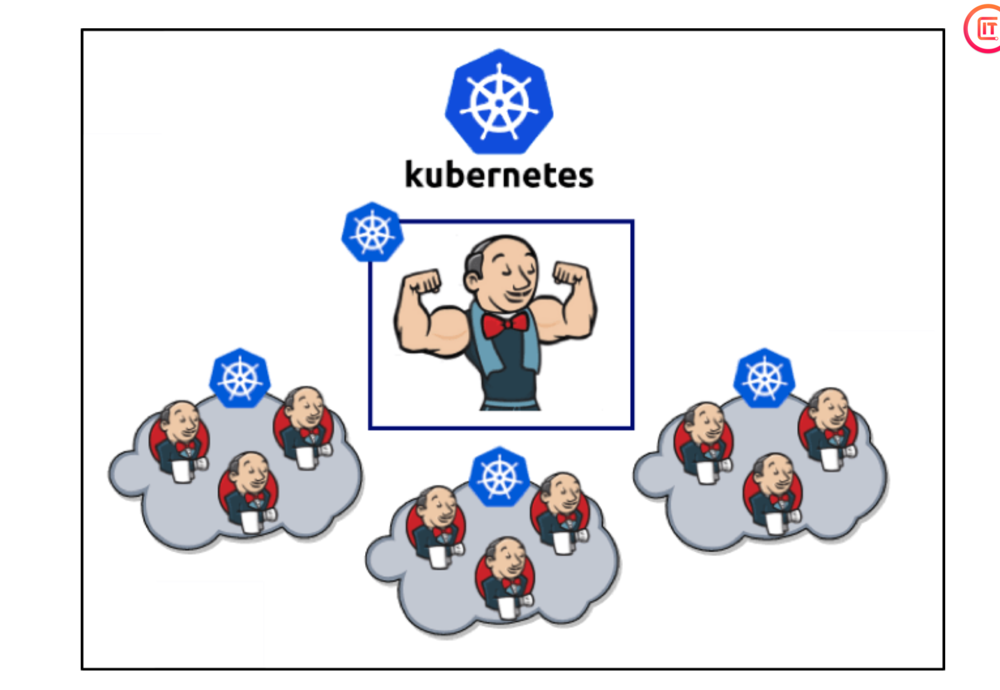
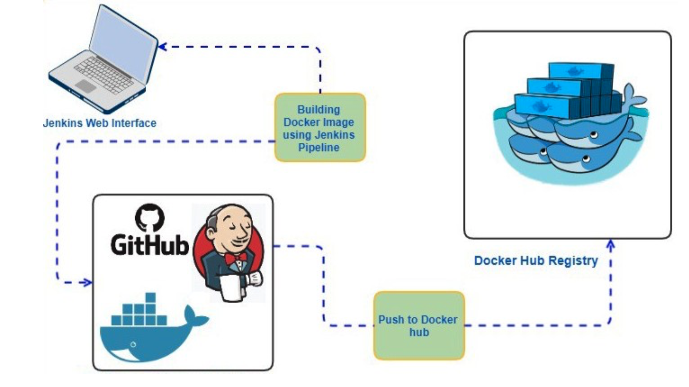
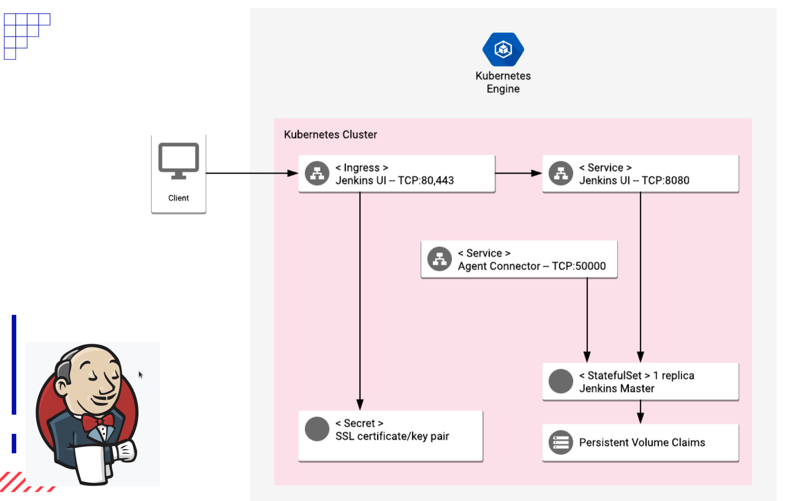
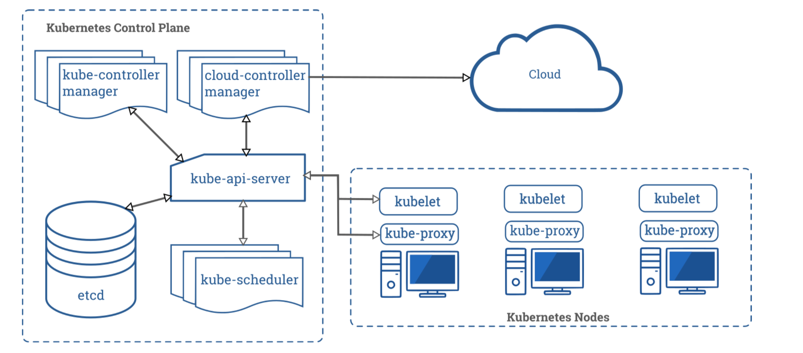
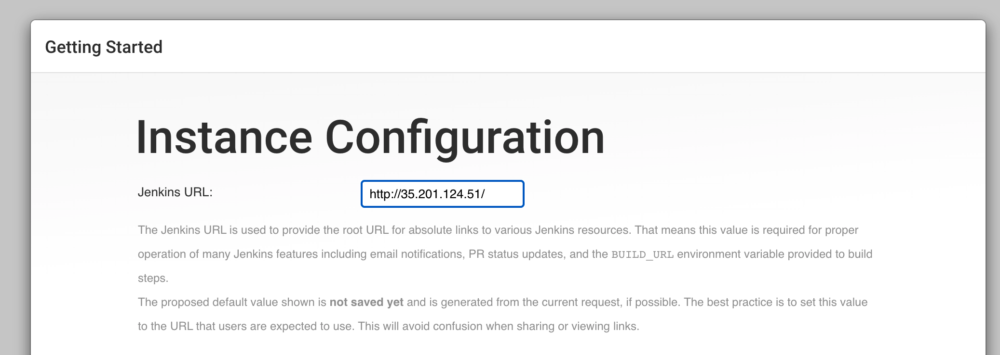
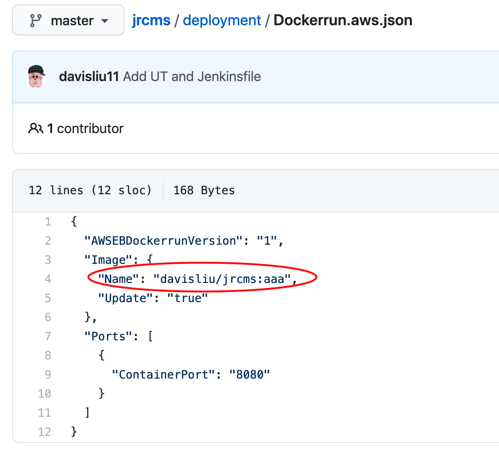

- [课堂笔记](#课堂笔记)
  - [1 Recap](#1-recap)
  - [2 CI/CD - practical example](#2-cicd---practical-example)
    - [2.1 Jenkins + Docker](#21-jenkins--docker)
    - [2.2 Jenkins based on Kubernetes cluster](#22-jenkins-based-on-kubernetes-cluster)
    - [2.3 Kubernetes Components](#23-kubernetes-components)
      - [2.3.1 Control Plane Components](#231-control-plane-components)
      - [2.3.2 Node Components](#232-node-components)
    - [2.4 Elastic Beanstalk in AWS](#24-elastic-beanstalk-in-aws)
  - [3 Handson - setting up CI/CD for our CMS project](#3-handson---setting-up-cicd-for-our-cms-project)
    - [3.1 Pre-requisite](#31-pre-requisite)
    - [3.2 handson steps:](#32-handson-steps)
  
# 课堂笔记

Goal: setting up CI/CD for our CMS project

## 1 Recap
- Continuous Integration(CI)
  Continuous Integration is a practice where development teams frequently commit application code changes to a shared repository. These changes automatically trigger new builds which are then validated by automated testing to ensure that they do not break any functionality
  
- Continuous Delivery (CD)
  CD is also used to describe Continuous Deployment which focuses on the automation process to release what is now a fully functional build into production.
  
- Jenkins - scalability based on Kubernetes
  

## 2 CI/CD - practical example

1. Run a Jenkins in Kubernetes Cluster
2. Install Kubernetes plugin and configure Kubernetes in Jenkins
3. Configure Credentials for Jenkins pipeline 
4. Create Elastic Beanstalk environments in AWS 
5. Setup Github integration

### 2.1 Jenkins + Docker
  

### 2.2 Jenkins based on Kubernetes cluster
  
  

### 2.3 Kubernetes Components
    
    A Kubernetes cluster consists of a set of worker machines, called nodes, that run containerized applications. Every cluster has at least one worker node.
    
  
#### 2.3.1 Control Plane Components
  kube-apiserver: The API server is a component of the Kubernetes control plane that exposes the Kubernetes API. The API server is the front end for the Kubernetes control plane.
  
  etcd: Consistent and highly-available key value store used as Kubernetes' backing store for all cluster data.

  kube-scheduler: Control plane component that watches for newly created Pods with no assigned node, and selects a node for them to run on.

  kube-controller-manager: Control Plane component that runs controller processes. Logically, each controller is a separate process, but to reduce complexity, they are all compiled into a single binary and run in a single process.

  cloud-controller-manager: A Kubernetes control plane component that embeds cloud-specific control logic. The cloud controller manager lets you link your cluster into your cloud provider's API, and separates out the components that interact with that cloud platform from components that just interact with your cluster.
#### 2.3.2 Node Components
  kubelet: An agent that runs on each node in the cluster. It makes sure that containers are running in a Pod.
  
  kube-proxy: kube-proxy is a network proxy that runs on each node in your cluster, implementing part of the Kubernetes Service concept.

### 2.4 Elastic Beanstalk in AWS
  AWS Elastic Beanstalk is a compute service which makes it easier for the developers to quickly deploy and manage applications which you upload to the AWS cloud.

  Developers simply upload their application to the AWS cloud, and then let the AWS Beanstalk provision and handle the configuration for you.

  Your application will be provided with capacity provisioning, load balancing, auto- scaling, and health monitoring.

## 3 Handson - setting up CI/CD for our CMS project
### 3.1 Pre-requisite

  1 Google Cloud Platform account

  2 Run a Jenkins in Kubernetes Cluster
    
  Install-Jenkins-Kubernetes:
    https://github.com/JiangRenDevOps/DevOpsLectureNotesV4/tree/main/WK3_CI-CD-Jekins/4.Install-Jenkins-Kubernetes

### 3.2 handson steps: 
  1 Config and install plugins for Jenkins and setup AWS environment for CMS project
  https://github.com/JiangRenDevOps/DevOpsLectureNotesV4/tree/main/WK3_CI-CD-CMS

  2 Jenkins configuration about dockerhub
  https://github.com/JiangRenDevOps/DevOpsLectureNotesV4/blob/main/WK3_CI-CD-CMS/DockerHub.md

  3 tips for this handson
- change 'https' to 'http' for Jenkins url when first login to your Jenkins
  

-  change the image name to your own docker image name when you deploy jrcms project to AWS
  

