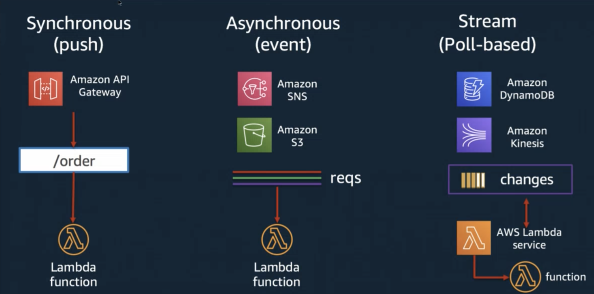
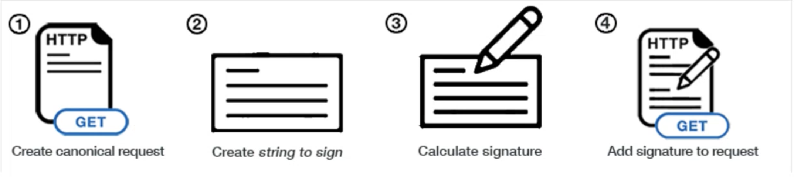

# Lesson 09 Serverless and AWS SDK

# Lecturer:Holly Liu

## Agenda
- Serverless
  - ○ Overview
  - ○ AWS Lambda: run your code on cloud
  - ○ Build a Serverless Hello World API
  - ○ Use Lambda with other AWS services
- AWS SDK
  - ○ AWS CLI
  - ○ AWS SDK for Node.js

## Develop Serverless project using AWS SAM
ref link:<https://docs.aws.amazon.com/serverless-application-model/latest/developerguide/serverless-getting-started-hello-world.html>

## AWS SDK for Node.js

Use Javascript to create, configure and manage AWS
resources.
Installation, configure and authentication: refer to
<https://docs.aws.amazon.com/sdk-for-javascript/v2/developer-guide/getting-started-nodejs.html>

## Homework

<https://github.com/JiangRenDevOps/DevOpsNotes/blob/master/WK6_Serverless_AWS_SDK/homework.md>

# Class 06 - Serverless and AWS SDK
## 主要知识点
  - [1.Serverless](#1serverless)
    - [1.1 Overview](#11-overview)
    - [1.2 AWS Lambda: run your code on cloud](#12-aws-lambda-run-your-code-on-cloud)
    - [1.3 Build a Serverless “Hello, World!”](#13-build-a-serverless-hello-world)
    - [1.4 Use Lambda with other AWS services](#14-use-lambda-with-other-aws-services)
    - [1.5 Lambda Permissions](#15-lambda-permissions)
  - [2.AWS SDK](#21-aws-cli)
    - [2.1 AWS CLI](#21-aws-cli)
    - [2.2 AWS SDK](#22-aws-sdk)
    - [2.3 AWS SDK for Python](#23-aws-sdk-for-python)
  - [3.Homework](#3homework)

 
# 课堂笔记
## 1.Serverless
### 1.1 Overview
Serverless Architecture Overview
- Build and run applications without having to manage its infrastructure

Traditional Infrastructure
- Team purchase servers to build and run applications
- Managing servers take time and resources 
  - server hardware cost 
  - software and security patching 
  - create backups in case of failure

Serverless Pros&Cons
- Pros
  - Low cost: charge per invocation, no cost for unused server 
  - Scalability 
  - Productivity
- Cons
  - Loss of control 
  - Security: cloud provider might run several customer’s code on the same server at the same time 
  - Performance Impact 
  - Testing 
  - Vendor lock-in

Serverless: Function as a Service
Developers write application code as a set of discrete functions that has following attributes:
- Invocation: a single function execution
- Duration: time it takes to execute this function. 执行该函数所需的时间
- Cold start: latency that occurs when a function is triggered for the first time, or after a period of inactivity. 当一个功能第一次被触发时，或在一段时间的不活动之后，发生的延迟
- Concurrency limit 并发限制: number of function instances that can run simultaneously in one region. 一个区域内可以同时运行的函数实例数
- Timeout: amount of time that cloud provider allows a function to run before terminating it. 云提供商允许一个函数在终止之前运行的时间

Serverless Use Cases
- Trigger-based tasks 
  - any activity that triggers an event or a series of events 
  - e.g. user sign up on website, might trigger a database change, which in turn triggers a welcome email
- Building RESTful APIs
- Asynchronous processing 
  - behind-the scenes application tasks 
  - e.g. render product info, transcoding videos after upload
  - 同步：系统在最大程度上保证发出的request能最快程度的被系统处理
  - 异步：请求可能没法第一时间处理，但也没有关系，不需要第一时间处理
- Security checks
- CI/CD: e.g. code commit trigger a function to build and run automate test

Serverless on Cloud

### 1.2 AWS Lambda: run your code on cloud
- Write and upload code as a .zip file or container
- Automatically respond to request at any scale, up to 10k/s
  > https://docs.aws.amazon.com/lambda/latest/dg/gettingstarted-limits.html
- Pay only the compute time you use, per-milisecond
- Respond in milliseconds with provisioned concurrency
 

### 1.3 Build a Serverless “Hello, World!”
> https://github.com/JiangRenDevOps/DevOpsLectureNotesV6/blob/master/WK6_Serverless_AWS_SDK/serverless_hello_world.md

### 1.4 Use Lambda with other AWS services
Invoke your Lambda function on schedule
> https://github.com/JiangRenDevOps/DevOpsLectureNotesV6/blob/master/WK6_Serverless_AWS_SDK/lambda_with_scheduled_events.md
Invoke your Lambda function when object is uploaded to a S3
> https://github.com/JiangRenDevOps/DevOpsLectureNotesV6/blob/master/WK6_Serverless_AWS_SDK/lambda_with_s3.md
Invoke your Lambda function for incoming HTTP request
> https://github.com/JiangRenDevOps/DevOpsLectureNotesV6/blob/master/WK6_Serverless_AWS_SDK/lambda_with_api_gw.md

### 1.5 Lambda Permissions
Use Lambda execution role (IAM policy) to manage Lambda permissions
> https://docs.aws.amazon.com/lambda/latest/dg/lambda-intro-execution-role.html
Develop AWS Lambda using Serverless Framework
> https://www.serverless.com/framework/docs/getting-started
Python example:
> https://github.com/serverless/examples/blob/master/aws-python/serverless.yml

## 2.AWS SDK
### 2.1 AWS CLI
AWS Command Line Interface (AWS CLI) is an open source tool that enables you to interact with AWS services using commands in your command-line shell.

Installation, configure and authentication: refer to
> https://github.com/JiangRenDevOps/DevOpsLectureNotesV6/blob/master/WK0_General/devops-initial-setup.md
> https://docs.aws.amazon.com/cli/latest/userguide/cli-configure-quickstart.html

- QuickStart
  - EC2: Launch, list and terminate Amazon EC2 instances
  > https://github.com/JiangRenDevOps/DevOpsLectureNotesV6/blob/master/WK6_Serverless_AWS_SDK/cli_ec2.md
  - S3: Create, list and delete S3 buckets
  > https://github.com/JiangRenDevOps/DevOpsLectureNotesV6/blob/master/WK6_Serverless_AWS_SDK/cli_s3.md

### 2.2 AWS SDK
- Tools for developing and managing applications on AWS
> https://aws.amazon.com/tools/
- SDK: Software Development Kit. A collection of software development tools in one installable package.
- SDK - Software Development Kit, 是用来帮助devloper更快捷来开发应用的. 从这个层面上说, sdk, framework都是工具, 不同语言的sdk是不同的工具.

- in a world without SDK…
Each action on AWS is implemented via API calls. Without SDK, you need to sign your API request by generating signatures.
AWS上的每个操作都是通过API调用实现的。在没有SDK的情况下，您需要通过生成签名来为API请求签名

> https://docs.aws.amazon.com/general/latest/gr/signing_aws_api_requests.html

### 2.3 AWS SDK for Python
Use Python(Boto3) to create, configure and manage AWS resources.

Installation, configure and authentication: refer to
> https://github.com/JiangRenDevOps/DevOpsLectureNotesV6/blob/master/WK0_General/devops-initial-setup.md
> https://boto3.amazonaws.com/v1/documentation/api/latest/guide/quickstart.html#configuration

- QuickStart
  - Use Boto3 with AWS SQS
  > https://github.com/JiangRenDevOps/DevOpsLectureNotesV6/blob/master/WK6_Serverless_AWS_SDK/boto3_sqs.md
  - Use Boto3 with AWS DynamoDB
  > https://github.com/JiangRenDevOps/DevOpsLectureNotesV6/blob/master/WK6_Serverless_AWS_SDK/boto3_dynamo.md

## 3.Homework
> https://github.com/JiangRenDevOps/DevOpsLectureNotesV6/blob/master/WK6_Serverless_AWS_SDK/homework.md
