# Class-10  4.1 CI/CD 2
## 主要知识点
  - [1.Devops overview](#1devops-overview)
  - [2.What is CI/ CD](#2what-is-ci-cd)
    - [2.1 continuous integration](#21-continuous-integration)
    - [2.2 continuous delivery](#22-continuous-delivery)
    - [2.3 continuous deployment](#23-Continuous-deployment)
  - [3.travis cd hands-on](#3travis-cd-hands-on)
    - [3.1 Goal](#31-goal)
    - [3.2 Prerequisite](#32-prerequisite)
    - [3.3 Hands-on steps](#33-hands-on-steps)
      - [3.3.1 Create and Run a web-app](#331-Create-and-Run-a-web-app)
      - [3.3.2 Dockerise your web-app](#332-Dockerise-your-web-app)
      - [3.3.3 Add the repo to Github](#333-Add-the-repo-to-Github)
      - [3.3.4 Integrate with TravisCI](#334-integrate-with-travisci)
      - [3.3.5 Create AWS Elastic Beanstalk](#335-create-aws-elastic-beanstalk)
      - [3.3.6 Set up IAM user](#336-dockerise-your-web-app)
      - [3.3.7 Add a S3 folder for ElasticBeanstalk app](#337-add-a-s3-folder-for-elasticbeanstalk-app) 
      - [3.3.8 Add the deploy code to travis yml](#338-add-the-deploy-code-to-travis-yml)
      - [3.3.9 Setup Secrets in Travis](#339-setup-secrets-in-travis)
      - [3.3.10 Commit code, create pull request, push to repo and trigger cd pipeline](#331-10.commit-code-create-pull-request-push-to-repo-and-trigger-CD-pipeline)
      - [3.3.11 Trigger the build](#3311-trigger-the-build)
  - [4.Discussion](#4Discussion)
  - [5.Extension](#5Extension)
  - [6.Homework practice](#6Homework-practice)

# 课堂笔记
## 1.Devops overview
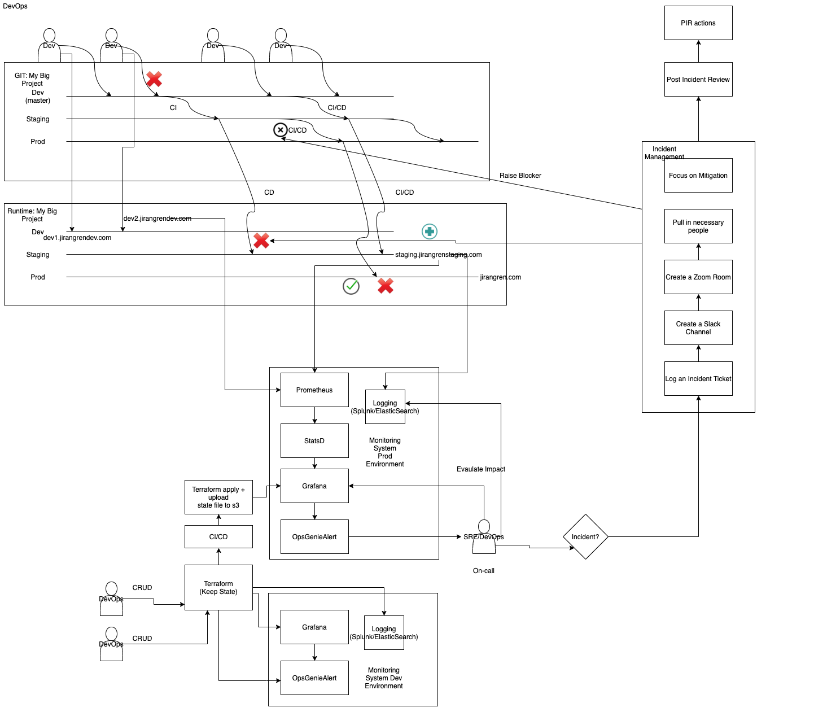
Ref: https://github.com/JiangRenDevOps/DevOpsLectureNotesV4/blob/main/WK4_Travis_CI_CD/dev_process_review.md
## 2.What is CI/ CD 
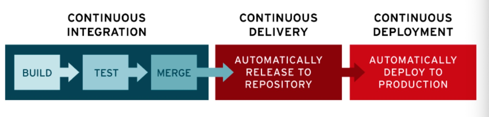
### 2.1 Continuous Integration 
Successful Continuous Integration means code changes to a web-app are regularly built, tested, and merged to a shared repository automatically via integration tools like TravisCI, Bitbucket pipeline. It’s a solution to the problem of

1. having too many developers writing code changes to a web-app that might conflict with each other.
2. code testing and validation before merging.

### 2.2 Continuous delivery
Continuous delivery usually means a developer’s changes to an application are automatically bug tested and uploaded to a repository (like GitHub or a container registry), where they can then be deployed to a live production environment by the operations team. It’s an answer to the problem of poor visibility and communication between dev and business teams. To that end, the purpose of continuous delivery is to ensure that it takes minimal effort to deploy new code. 

### 2.3 Continuous deployment
Continuous deployment (the other possible “CD”) can refer to automatically releasing a developer’s changes from the repository to production, where it is usable by customers. It addresses the problem of overloading operations teams with manual processes that slow down app delivery. It builds on the benefits of continuous delivery by automating the next stage in the pipeline.

## 3.Travis CD hands on
### 3.1 Goal 
Goal: Build, Test and Deploy a web-app to AWS Elastic Beanstalk from scratch

`You will experience a step-by-step guidance for CD and will be able to set up a simple CD via Travis pipeline and deploy a react app on AWS (Note this tutorial is simply for illustration purpose; do not use in production)`

ref: https://medium.com/paul-zhao-projects/building-a-ci-cd-pipeline-with-travis-ci-docker-and-aws-in-9-steps-4f51f5be921a

### 3.2 Prerequisite
- Installed Docker
- Register a docker account in docker.com
- Installed Npm `https://docs.npmjs.com/downloading-and-installing-node-js-and-npm`
- AWS account

### 3.3 Hands-on steps 

#### 3.3.1 Create and Run a web-app
Create a sample web-app skeleton with npx
```
$ npx create-react-app my-app
npx: installed 98 in 6.337s

Creating a new React app in /Users/paulzhao/my-app.

Installing packages. This might take a couple of minutes.
Installing react, react-dom, and react-scripts with cra-template...

.
.
.
```

Run the web-app
```
$ cd my-app
$ npm start
```

You should see this on localhost:3000:
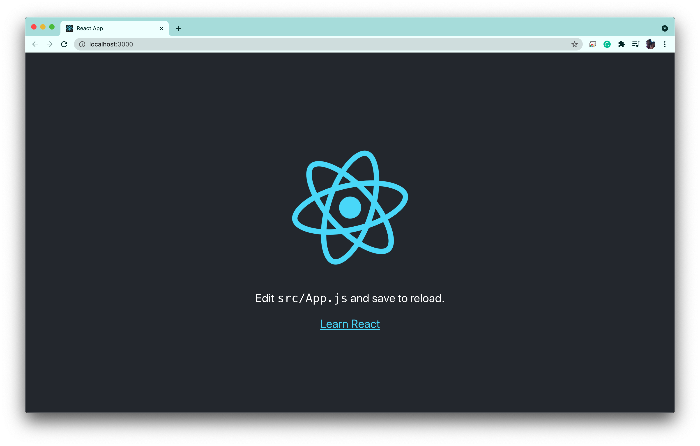

#### 3.3.2 Dockerise your web-app
Add Two files to my-app folder
Dockerfile — Used for building the image that contains the optimized version of this application
```
FROM node:latest AS builder
# Above, we set the base image for this first stage as a light weigh node

WORKDIR './app'
# Above we set the build environment as a folder called /app in the docker container to prevent clashes

COPY package*.json ./
# To prevent repeated npm installs anytime we make any change, we'd copy over the package.json and install things first

RUN npm install
# Install dependencies

COPY ./ ./
# Copy the rest of the project over to the /app folder in the container

RUN npm run build
# Build the production version of our app in the container

FROM nginx
# The image needs nginx to run on aws

EXPOSE 80
#Nginx runs on port 80, so elastic beanstalk uses the expose command to expose this port

COPY --from=builder /app/build /usr/share/nginx/html
# Copy the content of the builder step, move the contents of build folder into the html folder in this nginx container
# That's where our app would run from in aws

# No need to specify a command to start nginx as it gets started by default when a container with the image starts
```
Dockerfile.dev — Used for building the image that contains the development version which would be used to run tests

```
FROM node:latest
# Above, we set the base image as a light weight node image called alpine

WORKDIR '/app'
# Above we set the build environment as a folder called /app in the docker container to prevent clashes

COPY package.json .
# To prevent repeated npm installs anytime we make any change, we'd copy over the package.json and install things first

RUN npm i

COPY . .
# Copy the rest of the project over to the /app folder in the container

CMD ["npm", "start"]
# Here we are setting the default command when a container is built and started up from this our image
```
Your folder structure should now looks like this (without .travis.yml file):
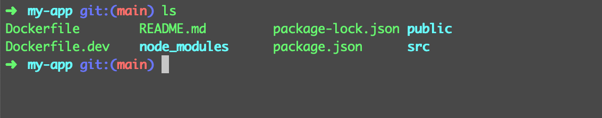

#### 3.3.3 Add the repo to Github
Create a repo in your github
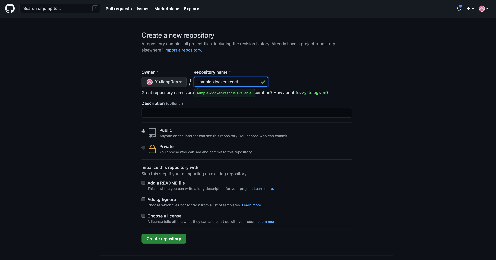

Follow the steps in the second section to push existing repo from the command line
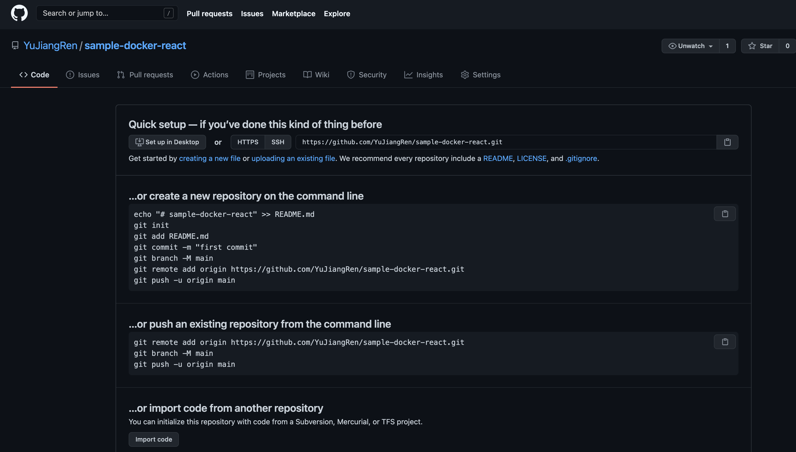

#### 3.3.4 Integrate with TravisCI
Go to travis-ci.com and login with your Github account
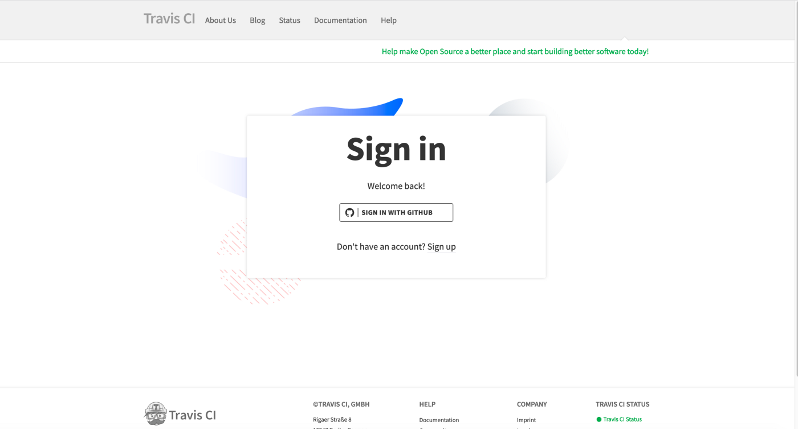

Add the Repo to Travis (The Repo should show up when you click add repo) 

This tells travis-ci to start monitoring the repository, but for this we need a `YAML` file called `.travis.yml` to be 
added to the application as this would contain the instructions on what you want travis-ci to do with your code when
a build is triggered.

Let us create a `.travis.yml` in the repo and add the following code:
```
sudo: required 
language: node_js
node_js:
    - "stable"
    
services: 
    - docker
before_install: 
    - docker build -t yuwangjr/sample-app -f Dockerfile.dev .
script:     
    - docker run -e CI=true yuwangjr/sample-app npm run test -- --coverage --watchAll=false
```
Please replace `yuwangjr` to your docker account. 


##### Explanations

sudo: required- Travis ci requires the user to be with elevated permission

language: node_js- A way to specify the language that should be used in building the app

services- Used to tell travis-ci that we need an instance of docker running for this build

before_install- An array of things to do with your code before running tests or deploying your code(The instruction
here builds the docker image using our Dockerfile.dev file and tags it with the name yuwangjr/sample-app)

scripts: An array of scripts to run before deploying your code.(Tests typically go here (The instruction here runs
the our test by running image named yuwangjr/sample-app and overriding the command specified in the Dockerfile.dev)

(Optional) Of course, if you are interested, try to run the docker commands above yourself


(Optional) Of course, you can also run docker locally by
```
# Build an image with the tag sample app; this command will search for Dockerfile in your local folder
docker build -t sample-app . 

# Run the app at port 80
docker run -p 80:80 sample-app 

# now you should be able to access the react UI via localhost
```

#### 3.3.5 Create AWS Elastic Beanstalk 
AWS Elastic Beanstalk is an easy-to-use service for deploying and scaling web applications and services developed with 
Java,. NET, PHP, Node. js, Python, Ruby, Go, and Docker on familiar servers such as Apache, Nginx, Passenger, and IIS.

Now let us configure AWS manually via AWS UI to help you understand what needs to be done as a bare minimum.

We need to signin to AWS, hover on services and select Elastic Beanstalk then select `Create New Application`.

Let us name it `sample-docker-react`:


and fill in the platform info:


click configure more options and click Network -> Edit, we need to config VPC:


choose a VPC, click Public IP address and us-east-1a -> Save:


now, create the app, and you will see something like this:


But you could also see:

Don't worry about it for now, we will come back later. 

#### 3.3.6 Set up IAM user
We need an IAM user with proper permissions so that travis can deploy the app on your behalf:


add a user and click programmatic access


on next page let us attach the following policy to this user
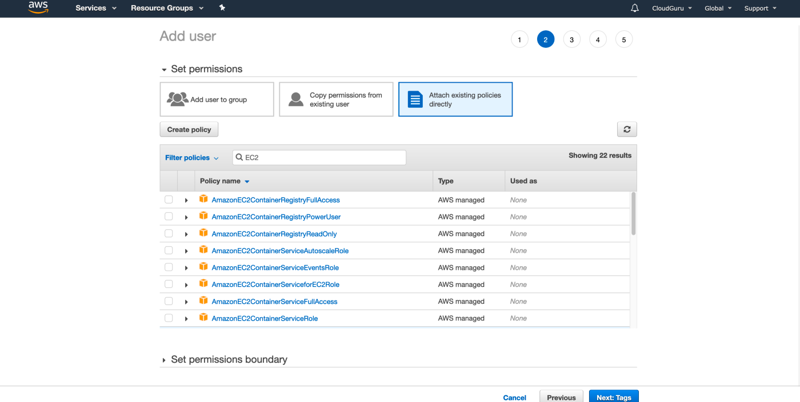
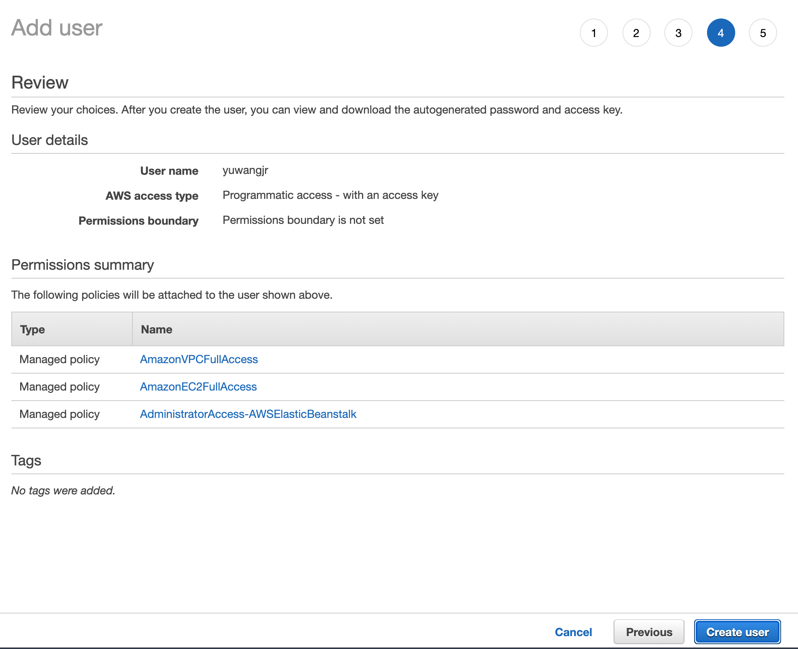
Once created the user, `download the csv immediately`, otherwise, you won't be able to see the secrets anymore
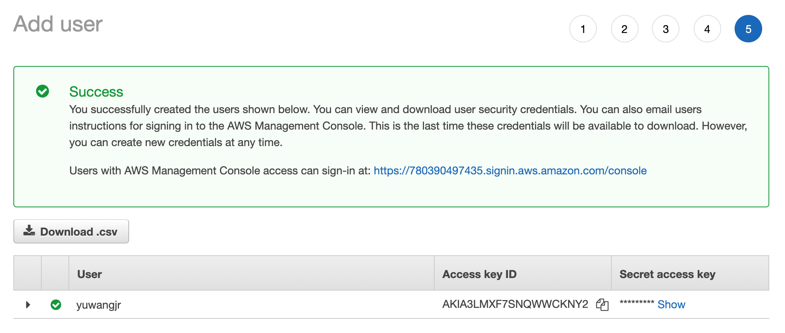

#### 3.3.7 Add a S3 folder for ElasticBeanstalk app
Amazon S3 or Amazon Simple Storage Service is a service offered by Amazon Web Services (AWS) that provides object 
storage through a web service interface.

Also, while creating an elastic beanstalk environment, AWS selects a server location closest to you for hosting it
(You can select a different location too).

Also, after the environment is created, an S3 bucket is also created bearing a name that’s contains an identifier of
this server location (e.g us-east-1, us-west-1) and it is used to store applications that you deployed in environments
existing in this same server location.

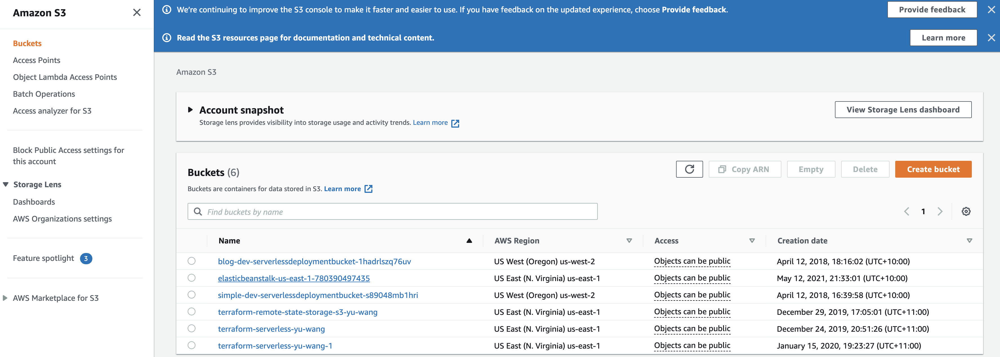

Okay, you will probably see a s3 bucket called elasticbeanstalk-us-east-1-xxx,
let us create a folder called "EBApptest" as illustrated below. 

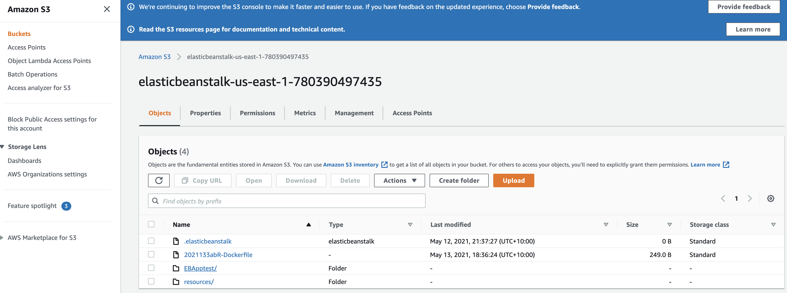

#### 3.3.8 Add the deploy code to travis yml

Come back to the `.travis.yml` add the following code at the bottom and replace bucket name and bucket path with yours:
```
deploy:
  provider: elasticbeanstalk
  region: "us-east-1" ### AWS region of your choice
  app: "sample-docker-react" ### Your EB App name
  env: "Sampledockerreact-env" ### Your EB App environment name
  bucket_name: "elasticbeanstalk-us-east-1-780390497435" ### S3 bucket name
  bucket_path: "EBApptest" ### S3 folder name under S3 bucket above
  on:
    branch: main
  access_key_id: "$AWS_ACCESS_KEY"
  secret_access_key: "$AWS_SECRET_KEY"
```
* deploy: Tells Travis-ci how to deploy your app
* provider: Platform to be used
* region: Where the server of your elastic beanstalk app environment exists(Update the file with yours)
* app: Then name you gave your application
* bucket_name: The s3 bucket generated for the server location used for your environment
* bucket_path: The folder we created on aws to receive the app sent from travis-ci
* on: Tells travis-ci which github branch update should trigger a build
* access_key_id: IAM access key generated in AWS but stored in travis ci
* secret_access_key: IAM secret key generated in IAM of AWS but stored in travis ci

See this for reference: https://github.com/YuJiangRen/sample-docker-react/blob/main/.travis.yml

Docs that you should read: https://docs.travis-ci.com/user/deployment/elasticbeanstalk/

Note: Never store any creds in a repo. Use Environment Variable or KMS instead
#### 3.3.9 Setup Secrets in Travis
We need to add two environment variables in the travis repo setup `AWS_ACCESS_KEY` and `AWS_SECRET_KEY`. The values are
in the csv that you downloaded. In your Travis UI, under `sample-docker-react` repo settings, you can add these 
variables here:
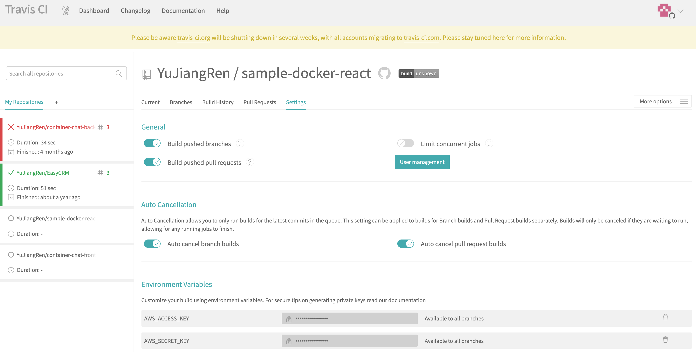


#### 3.3.10 ## 10. Commit code, create pull request, push to repo and trigger CD pipeline
Now, commit the code and push to your repo
```
# To create a new branch and switch to it at the same time
git checkout -b add_travis_yaml_file_and_dockerfile 

# Check status
git status

# Add all the files that you added (e.g. yml file, docker file)
git add .

# Commit
git commit -m "issue/add_travis_yaml_file_and_dockerfile"

# Push to the remote repo
git push 

# You should see a link to create a pull request and feel free to merge it (In reality, there will be peer reviews)

```
#### 3.3.11 Trigger the build
Since we’ve added a .travis.yml file, travis-ci would pick up the update in few seconds and trigger a build.

After a successful build, Go to your application on AWS and you should see it get updated with the new code from 
travis, build the docker image, and start up the application which can be access when you click the link provided.

In Travis, sample-docker-react CI/ CD is built up automatically after git push from our local environment to Github

If everything goes well, you will see 
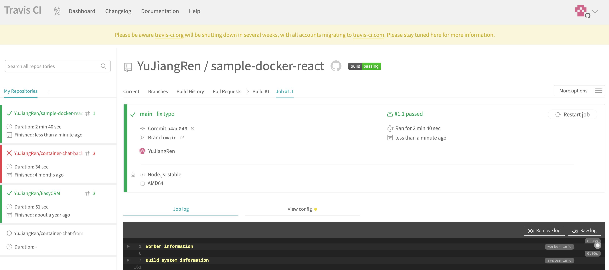

On the AWS console, you will see


and open the link that is shown on your AWS Elasticbeanstalk -> applications window:


## 4.Discussion
What are the key benefits of this approach?

What are the problems that you observe from this approach? 

## 5.Extension
Can you set up a proper URL for your service?

Can you set up a staging environment and a prod environment? 
* The prod environment should not have auto-triggered deploy; Instead, it should have scheduled deployment

How would you revert the change if some buggy code is deployed? 
## 6.Homework practice
有时间和精力的同学可以下载并用docker setup这个project: https://github.com/JiangRenDevOps/EasyCRM 然后跑一下 https://github.com/JiangRenDevOps/DevOpsLectureNotesV4/tree/main/WK4_Travis_CI_CD/hands_on 里面的测试，加深对测试的理解

更advance的同学可以给这个project https://github.com/JiangRenDevOps/EasyCRM加个travis部署