# Class 11 - Terraform
## 主要知识点
  - [1.Infrastructure as Code and Tools](#1infrastructure-as-code-and-tools)
    - [1.1 What is Infrastructure as Code](#11-what-is-infrastructure-as-code)
    - [1.2 What “Infrastructure”?](#12-what-infrastructure)
    - [1.3 Infrastructure in AWS](#13-infrastructure-in-aws)
    - [1.4 The problems IaC can solve](#14-the-problems-iac-can-solve)
  - [2.Terraform Overview](#2terraform-overview)
    - [2.1 What is Terraform](#21-what-is-terraform)
    - [2.2 Terraform CLI](#22-terraform-cli)
  - [3.Terraform Basic Concepts](#3terraform-basic-concepts)
    - [3.1 The Language (HCL)](#31-the-language-hcl)
    - [3.2 Planning & Applying](#32-planning--applying)
    - [3.3 State](#33-state)
    - [3.4 Dependency Resolution](#34-dependency-resolution)
    - [3.5 File Structure](#35-file-structure)
    - [3.6 Providers](#36-providers)
    - [3.7 Variables](#37-variables)
    - [3.8 Output](#38-output)
  - [4.Terraform Hands-on](#4terraform-hands-on)
  - [5.Homework](#5homework)

 
# 课堂笔记
## 1.Infrastructure as Code and Tools
### 1.1 What is Infrastructure as Code
- Write code to represent your infrastructure requirements
- Use an IaC tool to apply those changes to your cloud/on-prem environment.
用代码去管理架构：静态描述, 动态管理
可以进行版本控制，可以追溯架构在某一时刻符合什么状态
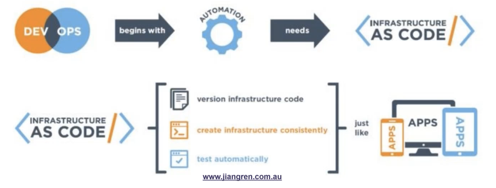

### 1.2 What “Infrastructure”?
非云端架构：laptop
云端架构：AWS
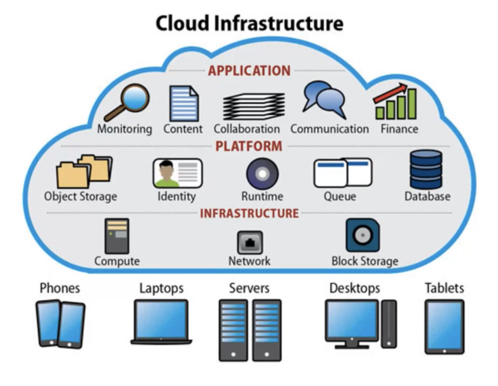

### 1.3 Infrastructure in AWS
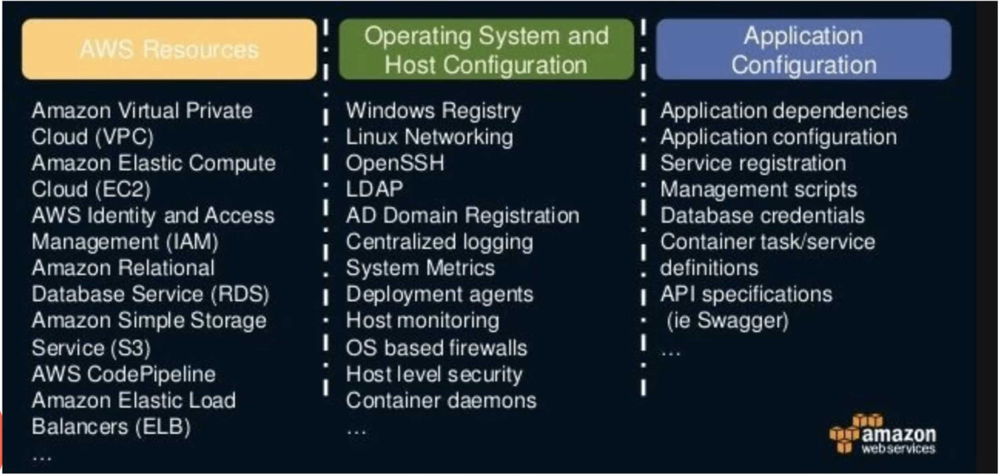

### 1.4 The problems IaC can solve
怎样管理架构，怎么描述架构（给非技术人员看）
- Create/change/destroy infrastructure resources. 创建/更新/删除架构上的资源，eg，database，storage
- Deploy/update applications on top of the infrastructure. 管理架构上的业务，架构上资源的应用，eg，创建一个博客，还要安装和调试，才能使用应用.
- Manage the configurations used by the applications. 管理架构上应用的配置，eg，博客的域名，博客的管理团队，用的皮肤，一些更加细分的配置. 家用应用不太需要这个，但企业级应用就需要，比如几十万个博客管理，就需要用代码来管理，人为管理耗时耗力还容易出错，但代码管理可以实现automation，避免出错.
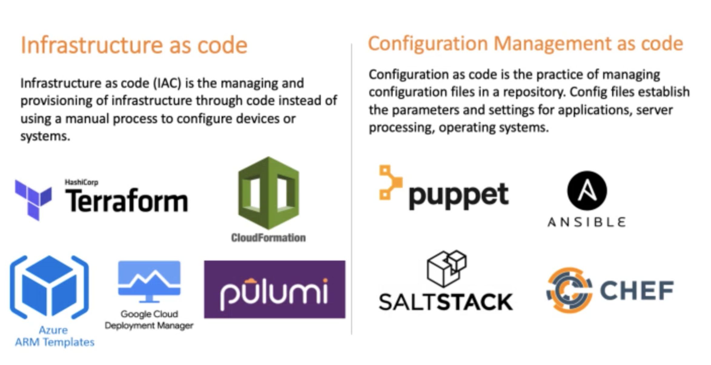

## 2.Terraform Overview
### 2.1 What is Terraform
Terraform is a Infrastructure as Code(IaC) tool that allows you to script the creation, updating and deleting of (mainly) cloud resources.
用脚本/代码形式创建更新删除主流云端资源.
Hashicorp also owns Vagrant, Packer, Consul, Vault etc. See https://www.hashicorp.com/
### 2.2 Terraform CLI
- Client Based standalone
- Vendor Agnostic
- Declarative Configuration
- Written in Golang
- Open source
- Use own syntax -HCL (Hashicorp Configuration Language). 有自己的语言，自己脚本的逻辑，HCL，支持多个云
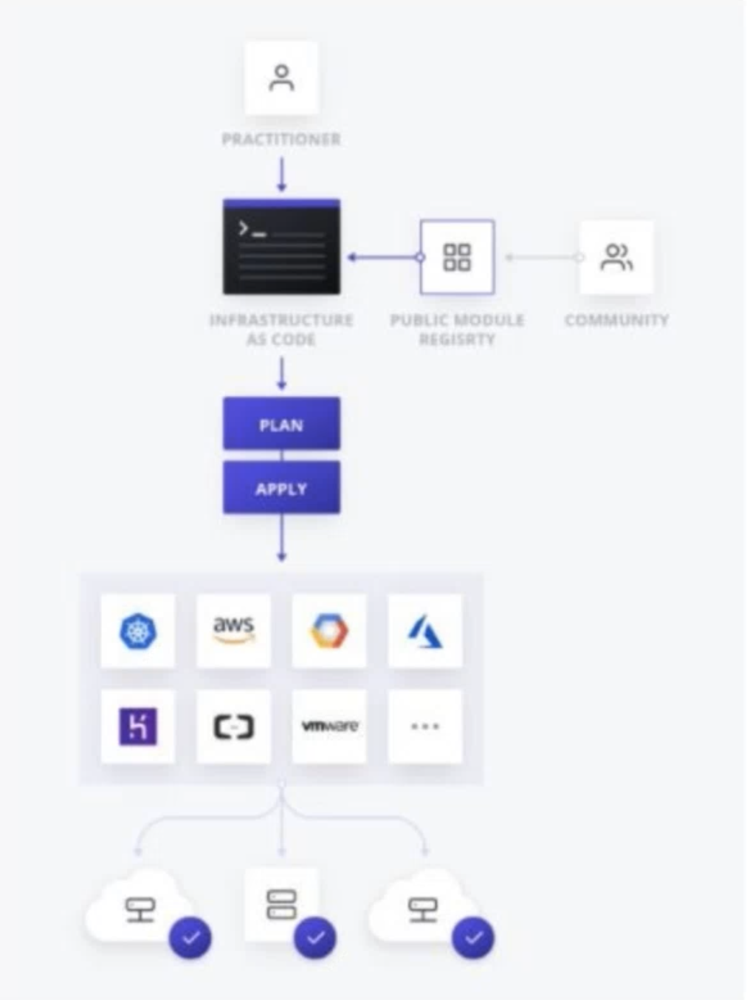

#### Tiny Terraform Example
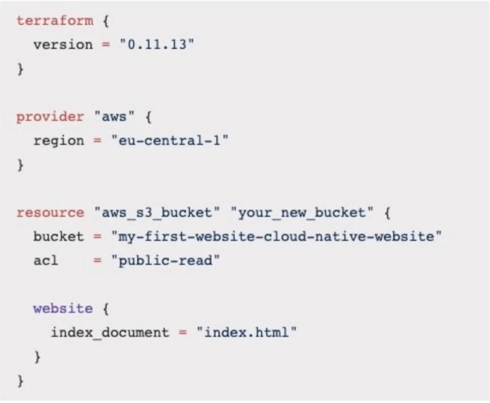

## 3.Terraform Basic Concepts
- The language -HCL
- Planning & Applying. 管理架构时有不同步骤和不同阶段，这两个是不同阶段，planing就是如果你要这样做你的架构会发生什么，applying是去修改架构.
- State. 状态，每当对架构更改，状态文件会更改.
- Dependency Resolution. 如何解决代码里描述的资源与资源相互依赖的关系.
- File Structure. 文件结构，怎样放置文件.
- Providers. 所能管理的云平台，eg, aws.
- Variables. 变量
### 3.1 The Language (HCL)
Hashicorp Configuration Language(HCL) 
https://github.com/hashicorp/hcl
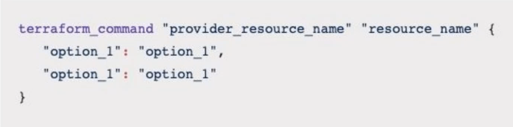

#### Resource Reference Syntax

### 3.2 Planning & Applying
terraform init 
terraform plan 
terraform apply
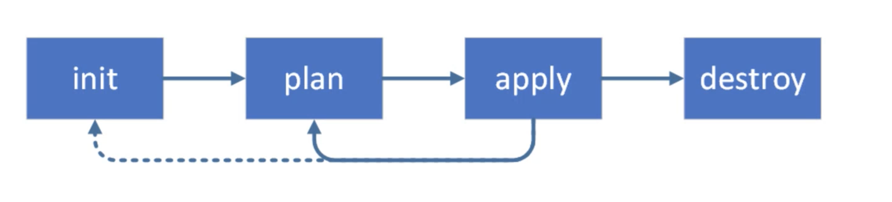
plan和apply可以一直循环. 用terraform管理的资源是希望一直能跑的，一直能更新.

### 3.3 State
How does Terraform track what resources it creates.
Terraform怎样知道目前项目有什么资源?
每次用terraform跑完架构会生成状态文件, 下次再用terraform管理架构，会看状态文件来得知两次架构是否完全一致，可以得知接下来terraform要进行什么操作.
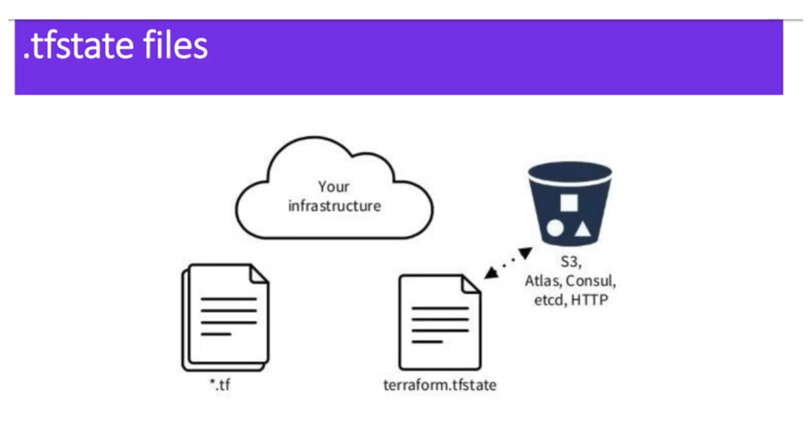

### 3.4 Dependency Resolution
Generate a visual representation of the config plan with
> https://graphviz.org/download/
   
可以看架构里资源有怎样的依赖关系:
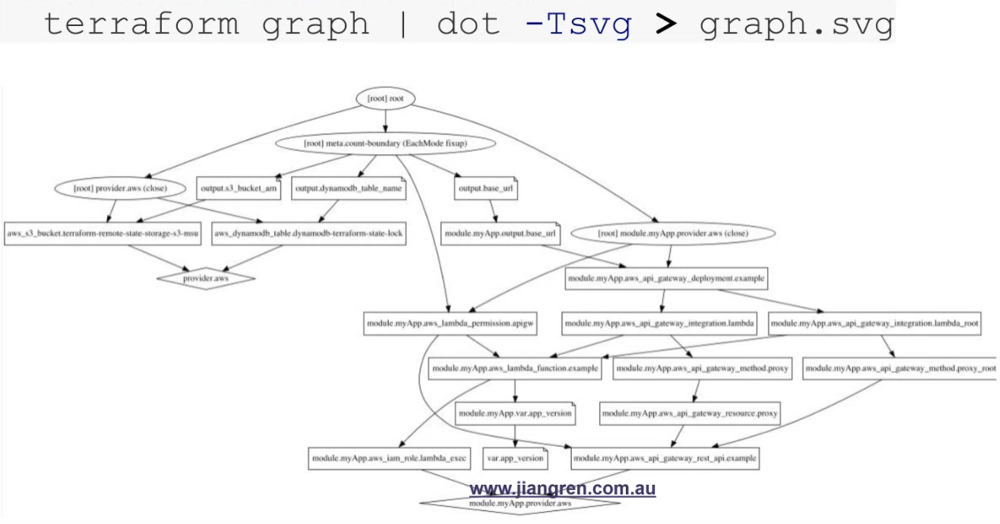
Find out error beforehand, e.g Cyclic Dependencies
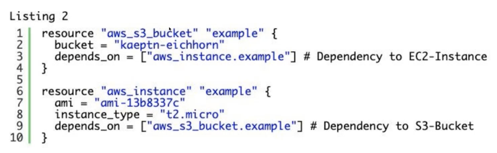

### 3.5 File Structure
- Terraform magically import all tf files in the current directory.
- Common convention is to have a main.tf as an entry point.
- What if you want subdirectories?

### 3.6 Providers
- Usually specified in the main.tf file
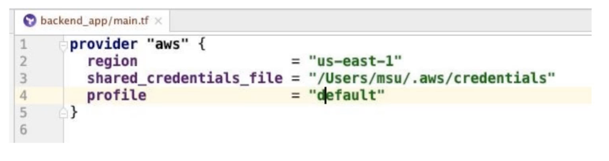
- https://www.terraform.io/docs/providers/
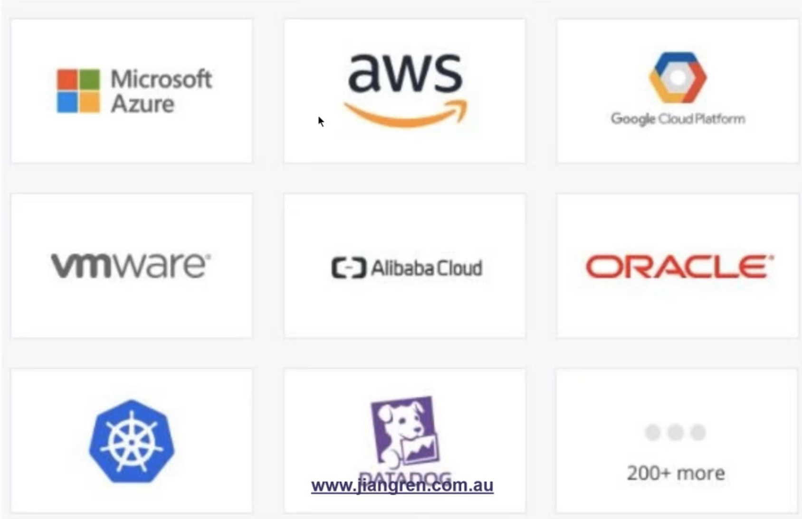

### 3.7 Variables
- Define any variable and later refer to it.
- A good use case is to define variables for multiple environments.
  - env=dev or env= prod.
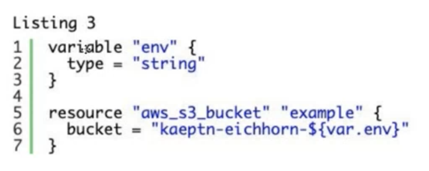

### 3.8 Output
Usually define the output to show the link of the resource. 
产出：每次跑完terraform，告诉你需不需要打印一些内容.
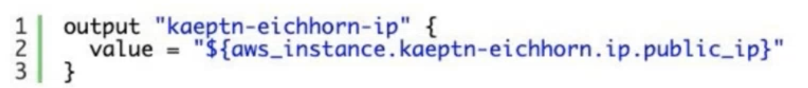

## 4.Terraform Hands-on
- S3_lambda_gateway_api
- modules and variables
- the collaboration problem
> https://github.com/JiangRenDevOps/DevOpsLectureNotesV6/tree/master/WK6_Terraform/hands_on

## 5.Homework
> https://github.com/JiangRenDevOps/DevOpsLectureNotesV6/blob/master/WK6_Terraform/hands_on/4%20-%20Homework.md
