# Class 12 Ansible

## handson
# handson 出现的问题：
## build AMI provisioned by ansible - 2.bake-ec2-to-image-ansible-provisioner

error message:fatal: [default]: UNREACHABLE! => {"changed": false, "msg": "Failed to connect to the host via ssh: command-line line 0: keyword hostkeyalgorithms extra arguments at end of line", "unreachable": true}

我初步判断可能出现的问题：大方向应该是SSH COMMUNICATION 里面的问题 （SSH 文件配置问题，ANSIBLE & AWS PLUGIN版本问题，或 SSH-RSA ALGORITHM默认被DISABLE SSH2-RSA 等问题都有可能）

```
jiangren-packer-demo-1.amazon-ebs.aws: Provisioning with Ansible...
    jiangren-packer-demo-1.amazon-ebs.aws: Setting up proxy adapter for Ansible....
==> jiangren-packer-demo-1.amazon-ebs.aws: Executing Ansible: ansible-playbook -e packer_build_name="aws" -e packer_builder_type=amazon-ebs --ssh-extra-args '-o IdentitiesOnly=yes' -e ansible_ssh_private_key_file=/tmp/ansible-key3087164875 -i /tmp/packer-provisioner-ansible3237864418 /home/aaron/jrnotes/DevOpsNotes/WK7_CM_Ansible_Packer/packer/2.bake-ec2-to-image-ansible-provisioner/playbook.yml                                                                                                                                                                         
    jiangren-packer-demo-1.amazon-ebs.aws:  ______________________________
    jiangren-packer-demo-1.amazon-ebs.aws: < PLAY [Jiangren Packer demo2] >
    jiangren-packer-demo-1.amazon-ebs.aws:  ------------------------------
    jiangren-packer-demo-1.amazon-ebs.aws:         \   ^__^
    jiangren-packer-demo-1.amazon-ebs.aws:          \  (oo)\_______
    jiangren-packer-demo-1.amazon-ebs.aws:             (__)\       )\/\
    jiangren-packer-demo-1.amazon-ebs.aws:                 ||----w |
    jiangren-packer-demo-1.amazon-ebs.aws:                 ||     ||
    jiangren-packer-demo-1.amazon-ebs.aws:
    jiangren-packer-demo-1.amazon-ebs.aws:  ________________________
    jiangren-packer-demo-1.amazon-ebs.aws: < TASK [Gathering Facts] >
    jiangren-packer-demo-1.amazon-ebs.aws:  ------------------------
    jiangren-packer-demo-1.amazon-ebs.aws:         \   ^__^
    jiangren-packer-demo-1.amazon-ebs.aws:          \  (oo)\_______
    jiangren-packer-demo-1.amazon-ebs.aws:             (__)\       )\/\
    jiangren-packer-demo-1.amazon-ebs.aws:                 ||----w |
    jiangren-packer-demo-1.amazon-ebs.aws:                 ||     ||
    jiangren-packer-demo-1.amazon-ebs.aws:
    jiangren-packer-demo-1.amazon-ebs.aws: fatal: [default]: UNREACHABLE! => {"changed": false, "msg": "Failed to connect to the host via ssh: command-line line 0: keyword hostkeyalgorithms extra arguments at end of line", "unreachable": true}                                                                                                                                       
    jiangren-packer-demo-1.amazon-ebs.aws:  ____________
    jiangren-packer-demo-1.amazon-ebs.aws: < PLAY RECAP >
    jiangren-packer-demo-1.amazon-ebs.aws:  ------------
    jiangren-packer-demo-1.amazon-ebs.aws:         \   ^__^
    jiangren-packer-demo-1.amazon-ebs.aws:          \  (oo)\_______
    jiangren-packer-demo-1.amazon-ebs.aws:             (__)\       )\/\
    jiangren-packer-demo-1.amazon-ebs.aws:                 ||----w |
    jiangren-packer-demo-1.amazon-ebs.aws:                 ||     ||
    jiangren-packer-demo-1.amazon-ebs.aws:
    jiangren-packer-demo-1.amazon-ebs.aws: default                    : ok=0    changed=0    unreachable=1    failed=0    skipped=0    rescued=0    ignored=0
    jiangren-packer-demo-1.amazon-ebs.aws:
==> jiangren-packer-demo-1.amazon-ebs.aws: Provisioning step had errors: Running the cleanup provisioner, if present...
==> jiangren-packer-demo-1.amazon-ebs.aws: Terminating the source AWS instance...


Build 'jiangren-packer-demo-1.amazon-ebs.aws' errored after 1 minute 15 seconds: Error executing Ansible: Non-zero exit status: exit status 4
```

## Method 1:（排除干扰项，只为了跑成功代码） 
直接设置 GLOBAL SSH CONFIGURATION in the '~/.ssh/config' file, add the followinglines to the file
```
Host *
  HostKeyAlgorithms +ssh-rsa
  PubkeyAcceptedKeyTypes ssh-rsa
```
然后注释掉 文件：aws-ansible.pkr.hcl里面 "ANSIBLE_SSH_ARGS='-oHostKeyAlgorithms=+ssh-rsa -oPubkeyAcceptedKeyTypes=ssh-rsa'",

packer build aws-ansible.pkr.hcl

Method 1 跑成功！

## Method 2: 看到相关文章：The ssh-rsa signature scheme has been deprecated ,SSH2-RSA is more secured，


STEP 1: 决定不用AWS RSA ,改用 AWS--KEY PAIR--CREATE NEW KEY PAIR--CHOOSE ED25519 这个选项 生成 PEM文件
STEP 2: 把文件 aws-ansible.pkr.hcl 里面的 plugins version 0.0.2 改成 >1,
```
packer {
  required_plugins {
    amazon = {
      version = ">= 0.0.2"
      source  = "github.com/hashicorp/amazon"
    }
```

STEP 3: 注释掉
```
ansible_env_vars = [
      "ANSIBLE_SSH_ARGS='-oHostKeyAlgorithms=+ssh-rsa -oPubkeyAcceptedKeyTypes=ssh-rsa'",
      "ANSIBLE_HOST_KEY_CHECKING=False"
```
packer build aws-ansible.pkr.hcl

Method 2 跑成功！


## 主要知识点
- [Class 7 Ansible](#class-7-ansible)
	- [主要知识点](#主要知识点)
	- [1. Configuration Management Overview](#1-configuration-management-overview)
		- [1.1 Manual Config 手动配置](#11-manual-config-手动配置)
		- [1.2 Evolution: Script](#12-evolution-script)
		- [1.3 Idempotence 幂等性](#13-idempotence-幂等性)
		- [1.4 Evolution](#14-evolution)
	- [2. CM Big 4](#2-cm-big-4)
		- [2.1 CM Big 4 in short](#21-cm-big-4-in-short)
		- [2.2 CM + IA Tools Statistics](#22-cm--ia-tools-statistics)
	- [3. Ansible Overview](#3-ansible-overview)
		- [3.1 What is Ansible?](#31-what-is-ansible)
		- [3.2 Why Ansible](#32-why-ansible)
		- [3.3 Ansible Idempotency](#33-ansible-idempotency)
		- [3.4 How does Ansible works?](#34-how-does-ansible-works)
		- [3.5 Ansible Roles](#35-ansible-roles)
		- [3.6 Ansible Galaxy](#36-ansible-galaxy)
		- [3.7 Ansible Frequently used commands](#37-ansible-frequently-used-commands)
		- [3.8 Ansible in DevOps](#38-ansible-in-devops)
		- [3.9 Software Delivery Focus Evolution](#39-software-delivery-focus-evolution)
		- [3.10 Which tools for Which?](#310-which-tools-for-which)
	- [4. Ansible Hands-on](#4-ansible-hands-on)


## 1. Configuration Management Overview

In DevOps area, Configuration Management is the automated process to manage all the configurations of the environments that the software application hosted upon.

In simple words，

- Infrastructure Management: Provision a fresh Linux/Windows Server
- Configuration Management: Install application like docker/tomcat. 装软件
- CI/CD: Build/Test application and use CM to deploy application All of them are coded and stored be in git repositories. 所有的配置都像代码一样，可以pr，可以merge，运行这些代码对服务器进行操作. 用管理产品的cicd的方法管理配置

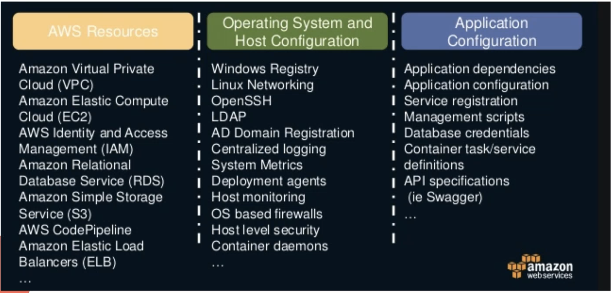

一般来说，configuration management包括右边两列。

### 1.1 Manual Config 手动配置

- ssh and configure manually
- Unreliable. 当配置变复杂，手动改很难
- No records. 操作没有记录
- No review process. 没有好的方法去review

### 1.2 Evolution: Script

- from document to code
- bash, perl, ruby, python

### 1.3 Idempotence 幂等性

- Multiple operations
- Same result

For example：

```jsx
echo “hello world” > /tmp/file 
echo “hello world” >> /tmp/file
```

两行命令结果一样，但上面是覆盖，下面是append到file，会变复杂。

How to make sure “/etc/aconfig” has one line of

- “encryption: on”

```jsx
echo “encryption: on” > /etc/aconfig # overwrite other lines 
echo “encryption: on” >> /etc/aconfig # multiple lines
```

What if we have “encryption: off”

```jsx
If /etc/aconfig does not exist: 
	Create /etc/aconfig

If /etc/aconfig does not contain encryption config: 
	Add “encryption: on” 
Elif /etc/aconfig contains “encryption: on” 
	Do nothing 
Else:
	Change to “encryption: on”
```

如果每次都要写这么多，会变得越来越复杂，因此需要配置管理的架构。

### 1.4 Evolution

Configuration Management Framework

- Config what to do instead of how to do
- DSL, YAML
- Configure large amount of servers
- Immutable servers & containers

配置管理的主要作用：

1. 降低配置复杂性
2. 管理多台服务器

## 2. CM Big 4

### 2.1 CM Big 4 in short

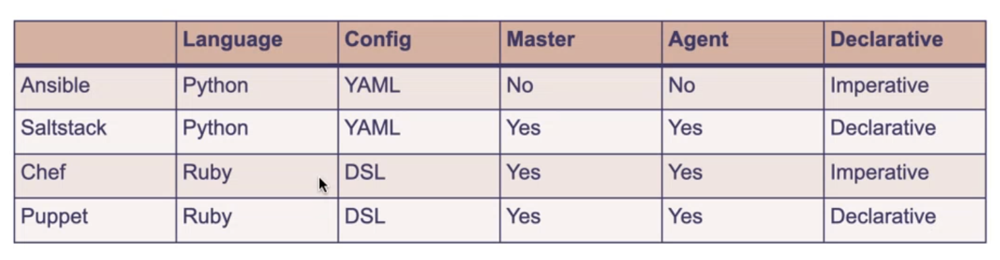

- Declarative声明what to do。保证idempotence幂等性，不管原来什么状态，配置文件不管跑几次都会一摸一样。但比较难实现。
- Imperative指定how to do。如果跑在不同机器，如果原来状态不一样，不一定会有一样的结果，配置文件也不一定能跑几次。如果有两个配置文件，顺序不一样也可能会导致状态不一样。

**Chef** and **Puppet** are pull based. They’re very stable and heavy. They suit to enterprise customers. AWS OpsWorks supports Chef only. Chef uses ruby language to define configuration.

Both **Ansible** and **Saltstack** are push based. They build upon Python and suit to Linux users more.

Ansible is very popular and lightweight. It’s agentless and we only need to configure IP address and SSH key.

### 2.2 CM + IA Tools Statistics

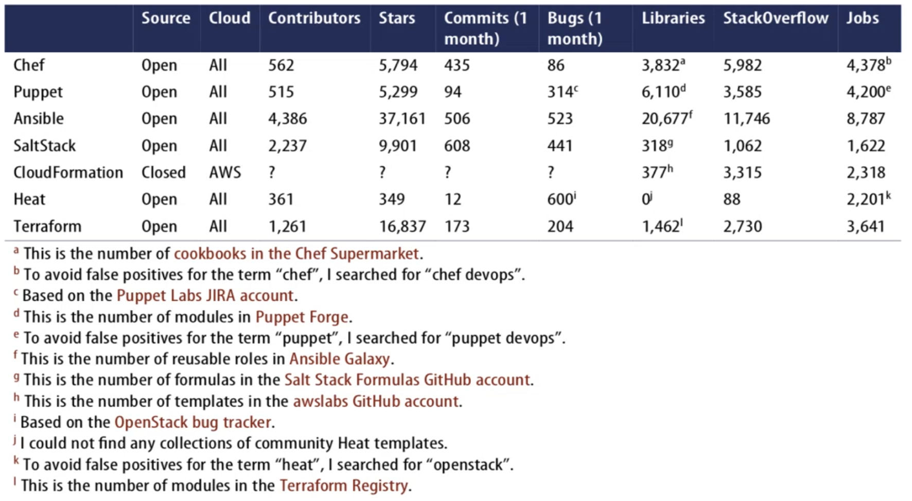

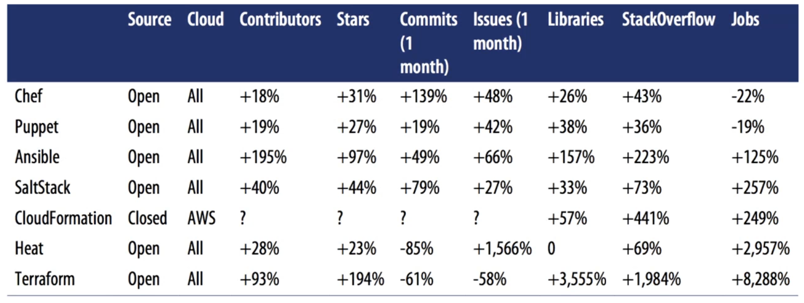

## 3. Ansible Overview

### 3.1 What is Ansible?

Ansible is a Open Source Configuration Management, Deployment & Orchestration tools from RedHat.

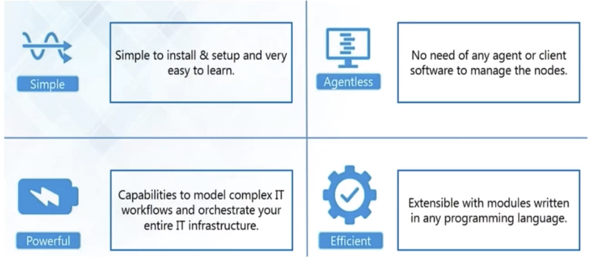

### 3.2 Why Ansible

Pros

- Easy to use/learn
- Low infra maintenance (no master, agent)

Cons

- Configuration file cannot decide the final status
- Base status of system affects the results
- Order of execution affects the status

### 3.3 Ansible Idempotency

- [https://medium.com/opsops/forces-idempotency-in-ansibledc7ce366a276](https://medium.com/opsops/forces-idempotency-in-ansibledc7ce366a276)
- [https://anand-yyhs.medium.com/how-to-make-a-non-idempotenttask-an-idempotent-task-in-ansible-dbe4b175ae8](https://anand-yyhs.medium.com/how-to-make-a-non-idempotenttask-an-idempotent-task-in-ansible-dbe4b175ae8)

### 3.4 How does Ansible works?

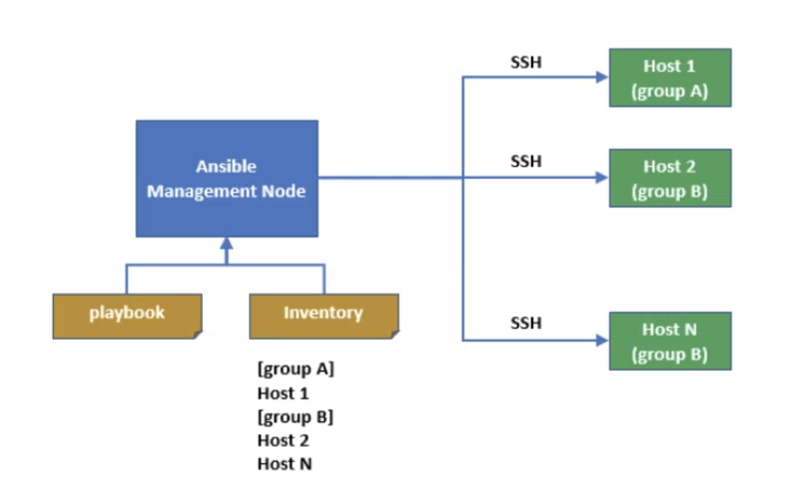

Inventory lists managed nodes which will be configured. SSH has to be pre-configured so that Management Node or control node can control managed nodes.

playbook: 配置文件

inventory：所有ansible管的服务器的地址都在这里

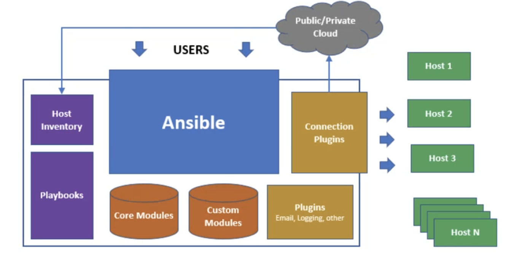

**Plugin** runs on the control node to extend Ansible automation engine. 扩展一些功能

**Modules** runs on the managed node to configure managed node. 功能的分组

**Playbook** defines workflow of execution in YAML format.

### 3.5 Ansible Roles

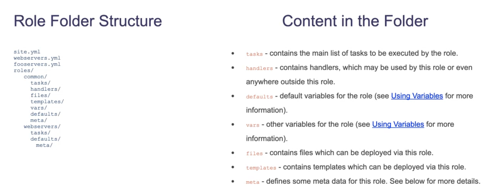

### 3.6 Ansible Galaxy

Ansible Galaxy is a shared repository of Ansible roles which usually install and configure a software.

Home of Ansible Galaxy: [https://galaxy.ansible.com/](https://galaxy.ansible.com/)

Example: [https://galaxy.ansible.com/geerlingguy/docker](https://galaxy.ansible.com/geerlingguy/docker) [https://galaxy.ansible.com/geerlingguy/java](https://galaxy.ansible.com/geerlingguy/java) [https://galaxy.ansible.com/geerlingguy/nginx](https://galaxy.ansible.com/geerlingguy/nginx)

Usage: [https://docs.ansible.com/ansible/latest/cli/ansible-galaxy.html](https://docs.ansible.com/ansible/latest/cli/ansible-galaxy.html)

### 3.7 Ansible Frequently used commands

```jsx
1. Adhoc execution 
ansible <group> -m <module> -a <arguments> 
e.g. ansible all -m ping 
e.g. ansible web -m reboot 
e.g. ansible db -m setup

2. Run a playbook 
ansible-playbook playbook.yml

3. Install roles from Ansible Galaxy 
ansible-galaxy install romoterole

4. Install roles from Git 
ansible-galaxy install git+https://github.com/ geerlingguy/ansible-role-apache.git

5. Create a role 
ansible-galaxy init myrole

6. List installed roles 
ansible-galaxy list
```

### 3.8 Ansible in DevOps

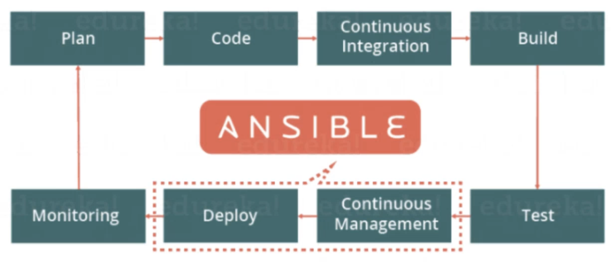

### 3.9 Software Delivery Focus Evolution


**3.9.1 No Configuration Management**

最传统的方法，没有配置管理

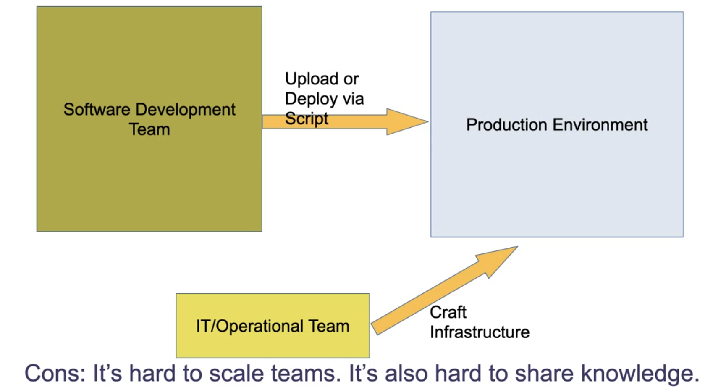

**3.9.2** **Mutable Infrastructure**

可变的基础设施

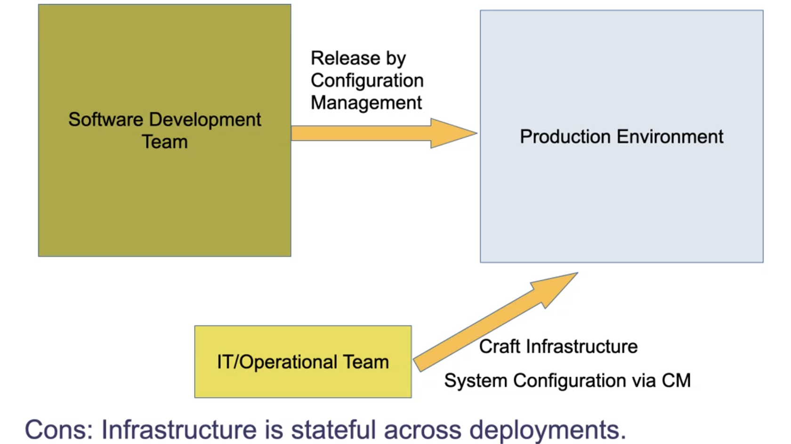

配置漂移：某些文件在部署到服务器之后发生了一些变化，可能会导致应用程序不稳定，是系统的一大致命隐患。

**3.9.3 Immutable Infrastructure**

不可变的基础设施

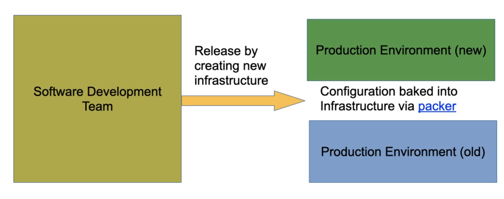

Switch from blue to green environment by switching DNS alias or via a mutable load balancer.

Cons: It’s relatively slow to release. Also infrastructure needs to be warmed up.

**3.9.4 Immutable Container/Pod**

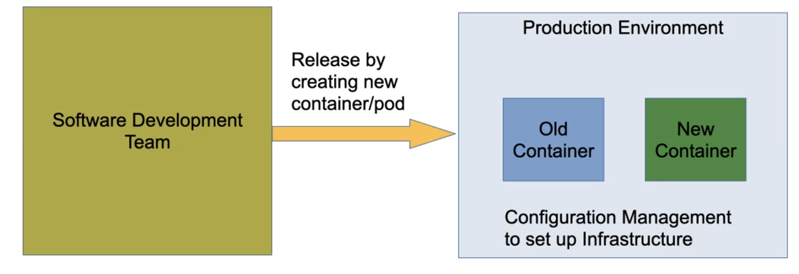

Use container orchestration tool to create new container/pod. Configuration Management is used to configure production environment.

**Do we still need Configuration Management?**

Yes，容器技术是很好用，但不是所有人都会用，有些公司可能不需要用到容器就已经够用了，这样还是需要ansible等配置管理工具。

### 3.10 Which tools for Which?

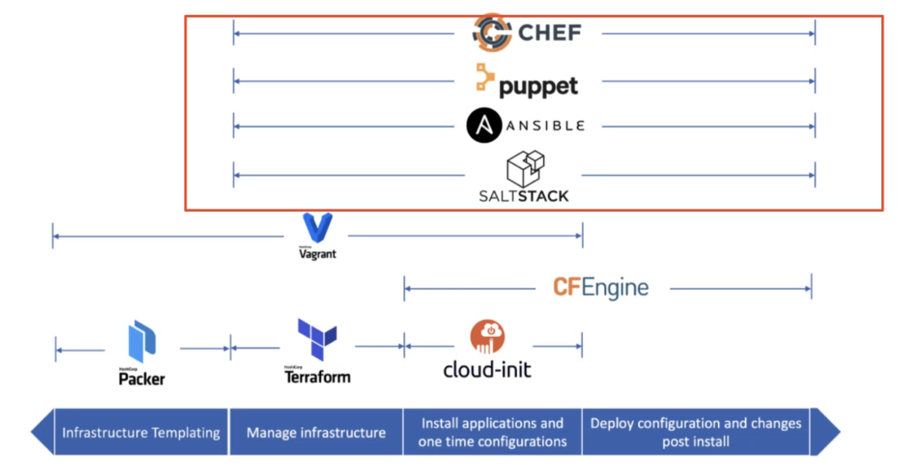

## 4. Ansible Hands-on

[https://github.com/JiangRenDevOps/DevOpsLectureNotesV6/tree/master/WK7_CM_Ansible_Packer](https://github.com/JiangRenDevOps/DevOpsLectureNotesV6/tree/master/WK7_CM_Ansible_Packer)
