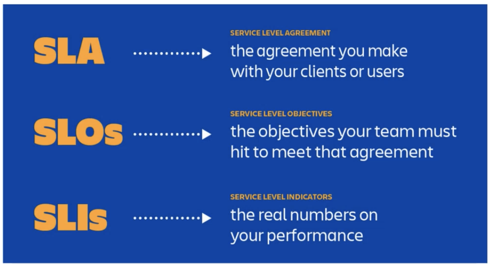

# Class 12 Incident Management

# Introduction to Incident

## What is an incident?

Incident is an event that causes or is going to cause disruption to or a reduction in the quality of service, which requires an emergency response. 

预期之外的事件，一般需要人为干预解决

## Is it an Incident?

1. Free disk space of a web server drops from 10GB to 10MB within 5 minutes. 可能server收到非常大量的请求（不属于incident），可能被非法入侵（属于incident）
2. Autoscaling function of a production cluster is broken. 可能被人为造成，属于incident；为了减少费用，不属于incident
3. Jenkins CI/CD pipeline is broken. 属于incident。从business角度，公司利益可能在短时间不受影响，公司利益短时间并不收到影响，这样还不算很严重；CICD目的是更快迭代，更快发布更新，短时间无法发布更新，就无法解决任何问题，就会很严重
4. Weird UI issues after a release. release过程中有没有经过所有流程，要具体分析。
5. One customer reports that he cannot rename one of his projects. 如果是大客户给公司带来损失，就是很严重；如果普通客户不会用，就不属于incident。

## SLI, SLO and SLA

代表提供业务质量等级

### SLI：

有哪些指标可以衡量所提供的业务

what are the common indicators you can think of?

- Latency
- Error rate
- System throughput
- Availability
- Durability

### SLO：

希望提供怎样的业务

target or lower bound ≤ SLO ≤ upper bound

### SLA：

承诺能够达成怎样的内容

SRE doesn’t typically get involved in constructing SLAs, because SLAs are closely tied to business and product decisions.

SRE does, however, get involved in helping to avoid triggering the consequences of missed SLOs.

They can also help to define the SLIs: there obviously needs to be an objective way to measure the SLOs in the agreement, or disagreements will arise.

# Incident Stages

## 1. Incident Detect

怎样得知/检测到incident发生.

Incident can be detected by

- customers (Jira Service Desk, Service Now(比较常用), Zendesk)
- employees （属于proactive的一部分）
- monitoring system (从monitoring到customer是从proactive到reactive的过程）
    - Metrics Monitoring.
        
        Common metrics solutions are
        
        - datadog
        - SignalFx
        - prometheus & grafana
        - elasticsearch
        - cloudwatch
    - Error & Exception Monitoring.
        
        Common solutions are
        
        - sentry
        - OverOps
        - Bugsnag - rollbar
    - Application Performance Monitoring
        
        Common solutions are
        
        - New Relic
        - Dynatrace
        - AppDynamics
    - Uptime & Synthetic Monitoring
        
        Common solutions are
        
        - Pingdom
        - Uptime
        - UptimeRobot

We want to know before customers do.

Metrics Monitoring

## 2. Incident Respond

Things break; that’s life. 出现问题时不要慌。

- Acknowledge the alert (within 15 minutes) 告诉对方我们已经在看了，把自己名字和ticket信息反馈回去
- Gather missing information, fill in the gap. 收集没有提供的消息
- Validate the incident (is this an actual incident?)

### Gather information

1. What is the incident behaviour?
2. What time did it occur? is it a new behaviour?
3. Error message or screenshot?
4. What environment? How many customers affected?
5. Is it a internal system? Any vendor involved?
6. Twitter or any other public discussion

### Bug or Low priority Incident?

Bug usually doesn’t require urgent mitigation. It usually fixes in a sprint as a high priority task.

Lowpriority incident usually requires urgent mitigation in the working hours. It cannot be planned into a Sprint.

### HOT incident management

- Jira Service Desk
- ServiceNow
- Zendesk

### Incident comms

- Internal comms:
    - E-mail
    - Slack
    - ServiceNow thread
- External Comms:
    - Status Page

## 3. Incident Recover

### Troubleshooting

### Triage

During the incident, don’t try to find root cause. Mitigate the impact to our customers first.

Novice pilots are taught that their first responsibility in an emergency is to fly the airplane; troubleshooting is secondary to getting the plane and everyone on it safely onto the ground.

要先尽量减少对客户的impact，不要先研究造成的原因

### Examine

Monitoring, Logging, Tracing

DynaTrace Real-time Tracing

Common tools for investigation:

- Logging system: Splunk, Sumologic and ELK
- Tracing system: Lightstep, Opentracing, Dynatrace, AWS X-Ray

### Diagnose

- Simply and reduce
- Ask “what”, “where” and “why
- Who touched it last?

### ASK “WHAT,” “WHERE,” AND “WHY”

UNPACKING THE CAUSES OF A SYMPTOM

**Symptom**: A Spanner cluster has high latency and RPCs to its servers are timing out.

**Why**? The Spanner server tasks are using all their CPU time and can’t make progress on all the requests the clients send. 

**Where** in the server is the CPU time being used? Profiling the server shows it’s sorting entries in logs checkpointed to disk. 

**Where** in the log-sorting code is it being used? When evaluating a regular expression against paths to log files.

**Solutions**: Rewrite the regular expression to avoid backtracking. Look in the codebase for similar patterns. Consider using RE2,

which does not backtrack and guarantees linear runtime growth with input size.

### Test and Treat

- Mutually exclusive test
- Consider the obvious first
- Test may provide misleading result
- Test may impact system and change future test result
- Test may be hard to carry out

### Cure

How to prove your test? test in production?

## 4. Incident Analysis

### Post Incident Investigation

A post incident review (PIR) owner is usually assigned after the incident.

The PIR owner needs to investigate the incident to know the root cause of the incident. Usually the PIR owner prepares a confluence page to document his findings.

This is similar to air crash investigations to some degree.

[https://www.youtube.com/watch?v=MvFOD9UarEw](https://www.youtube.com/watch?v=MvFOD9UarEw)

### 5-Why example

1. Why did the user complain he couldn’t use the “Send email” feature of our application?

Because there was a bug in the latest release.

1. Why was there a bug in the latest release?

Because we didn’t test this scenario.

1. Why didn’t we test this scenario?

Because we only tested in depth the features developed in the current sprint. We didn’t do a regression test on all the other features of the application.

1. Why didn’t you test all the other features of the application?

Because "Send email" was a feature that was created way before and not within the current sprint, so its impractical to test all the features for every release.

1. Why do you think its impractical to test all the features?

Because our application is so vast that performing regression testing on every single feature manually would require an excessive amount of time and would delay the process

### PIR action to improve

The output of the PIR meeting is a list of PIR actions.

The PIR actions are to ensure the incident won’t happen again in the future.

The PIR actions are high priority tasks in the scrums. It should be addressed with the highest priority because we don’t want to put risk to our system.

# Incident Management

- Separation of Responsibilities
    - Incident Command
    - Operational Work
    - Communication
- A Recognized Command Post
- Live Incident State Document
- Clear, Live Handoff

### Incident Mgmt Best Practices

- Prioritize
- Prepare
- Trust
- Introspect
- Consider Alternatives
- Practice
- Change it around

# Getting ready for on-call

### Life as a on-call engineer

- Take care of outages and operations that affect teams
- Available to perform operations on production system within minutes
- Acknowledge page and triage problem
- Lower priority and non-production system events can be handled during business hours

Ref: a day as an on-call engineer [https://dzone.com/articles/a-day-on-call-in-a-devops-team](https://dzone.com/articles/a-day-on-call-in-a-devops-team)

### Balance in Quality and Quantity

- Day/Night shift
- number of engineers on-call
- Primary/Secondary
- Incident Priority (non-prod and lower priorities)

### Compensation

- Time-in-lieu
- Cash
- Proportion of overall salary
- Time based compensation

### Best Practices

- Clear escalation policy
- Well-defined incident management procedure
- A blameless postmortem culture
- Identify re-curring issue and priotise work

### SlackOps

- Connect your alert system with your chat
- Set intelligent thresholds for your alerts
- Set up a separate room for each major incident actions into the chat
- Invite multipleteams
- Save chat transcripts