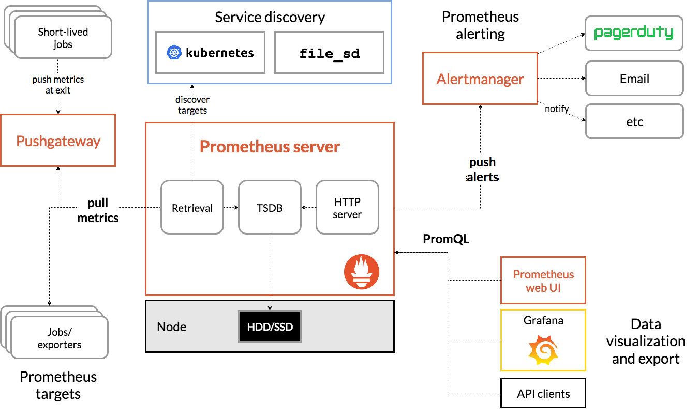
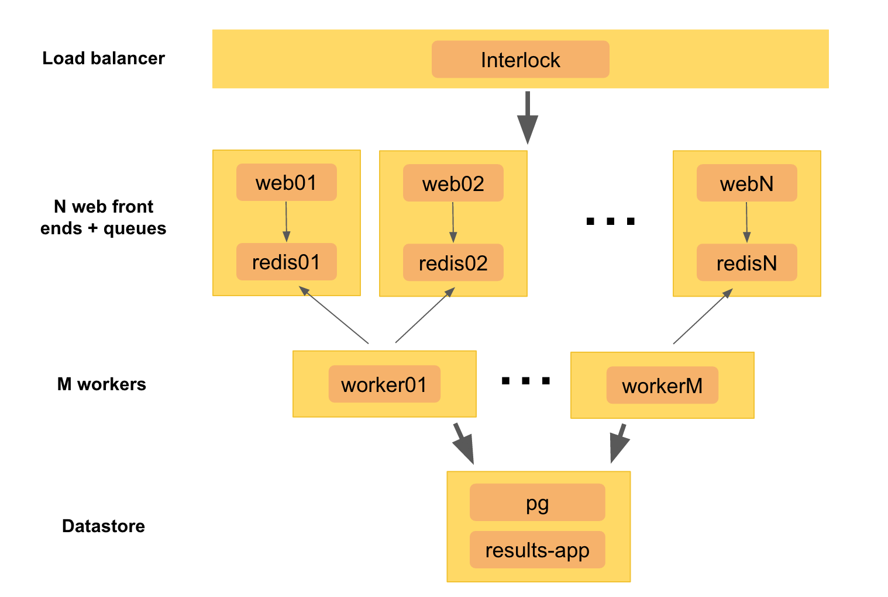

# Class 13 Monitoring

# Prometheus



## Concepts

Prometheus fundamentally stores all data as time series: streams of timestamped values belonging to the same metric and the same set of labeled dimensions. Besides stored time series, Prometheus may generate temporary derived time series as the result of queries.

Prometheus从根本上将所有数据存储为时间序列:带有时间戳的值流属于相同的度量标准和相同的标记维度集。除了存储的时间序列，Prometheus还可以生成临时的派生时间序列作为查询的结果。

## Metric names and labels

Every time series is uniquely identified by its metric name and optional key-value pairs called labels. 可以加很多具体标签，帮助identify这些metric的具体信息

The metric name specifies the general feature of a system that is measured (e.g. http_requests_total - the total number of HTTP requests received). It may contain ASCII letters and digits, as well as underscores and colons. It must match the regex [a-zA-Z_:][a-zA-Z0-9_:]*.

## Samples

Samples form the actual time series data. Each sample consists of:

- a float64 value 具体数值
- a millisecond-precision timestamp 时间戳

## Notation:

Given a metric name and a set of labels, time series are frequently identified using this notation:

```
<metric name>{<label name>=<label value>, ...}
```

For example, a time series with the metric name api_http_requests_total and the labels method="POST" and handler="/messages" could be written like this:

```
api_http_requests_total{method="POST", handler="/messages"}
```

Under the hood, the data is stored to [http://opentsdb.net/overview.html](http://opentsdb.net/overview.html)

一个数据必须至少有一个标签，每个时间序列的度量应该有相同数量的标签。不建议每个数据有超过6-7个tag，因为存储新数据点的相关成本将被超过该点的标记数量所控制。

### Configuring Prometheus：

```
global:
  scrape_interval:     15s
  evaluation_interval: 15s

rule_files:
  # - "first.rules"
  # - "second.rules"

scrape_configs:
  - job_name: prometheus
    static_configs:
      - targets: ['localhost:9090']
```

There are three blocks of configuration in the example configuration file: `global`, `rule_files`, and `scrape_configs`.

The `global` block controls the Prometheus server's global configuration. We have two options present.

- The first, `scrape_interval`, controls how often Prometheus will scrape targets. You can override this for individual targets. In this case the global setting is to scrape every 15 seconds.
- The `evaluation_interval` option controls how often Prometheus will evaluate rules. Prometheus uses rules to create new time series and to generate alerts.

The `rule_files` block specifies the location of any rules we want the Prometheus server to load. For now we've got no rules. Recording rules allow you to precompute frequently needed or computationally expensive expressions and save their result as a new set of time series. More to read: [https://prometheus.io/docs/prometheus/latest/configuration/recording_rules/](https://prometheus.io/docs/prometheus/latest/configuration/recording_rules/)

The last block, `scrape_configs`, controls what resources Prometheus monitors. Since Prometheus also exposes data about itself as an HTTP endpoint it can scrape and monitor its own health. In the default configuration there is a single job, called prometheus, which scrapes the time series data exposed by the Prometheus server. The job contains a single, statically configured, target, the localhost on port 9090. Prometheus expects metrics to be available on targets on a path of /metrics. So this default job is scraping via the URL: [http://localhost:9090/metrics](http://localhost:9090/metrics).

### **Hands on:**

[https://github.com/JiangRenDevOps/DevOpsLectureNotesV6/blob/master/WK7_Monitoring/docs/01.prometheus.md](https://github.com/JiangRenDevOps/DevOpsLectureNotesV6/blob/master/WK7_Monitoring/docs/01.prometheus.md)

# Metrics and metric types

[https://github.com/JiangRenDevOps/DevOpsLectureNotesV6/blob/master/WK7_Monitoring/docs/02.metrics.md](https://github.com/JiangRenDevOps/DevOpsLectureNotesV6/blob/master/WK7_Monitoring/docs/02.metrics.md)

# Statsd

[https://github.com/JiangRenDevOps/DevOpsLectureNotesV6/blob/master/WK7_Monitoring/docs/03.statsd.md](https://github.com/JiangRenDevOps/DevOpsLectureNotesV6/blob/master/WK7_Monitoring/docs/03.statsd.md)

# Grafana

[https://github.com/JiangRenDevOps/DevOpsLectureNotesV6/blob/master/WK7_Monitoring/docs/04.grafana.md](https://github.com/JiangRenDevOps/DevOpsLectureNotesV6/blob/master/WK7_Monitoring/docs/04.grafana.md)

**Note**: Prometheus是时间序列数据库，可以存储数据，记录数据，Grafana只是Display

# Monitoring Basics

Often, in SRE interviews, the interviewer may ask you about how would you monitor the following system and trouble shoot a latency issue?



If we break this question down, there are literally two questions:

- how do you design the monitoring systems? What metrics are you going to look at?
- are you able to troubleshooting the latency problem of this system?

Okay, before we answer the first question let us look at the monitoring from a top down approach

## What is monitoring?

Collecting, processing, aggregating, and displaying real-time quantitative data about a system, such as query counts and types, error counts and types, processing times, and server lifetimes.

## Monitoring Types

Black-box monitoring is symptom-oriented and represents active—not predicted—problems: "The system isn’t working correctly, right now."

White-box monitoring depends on the ability to inspect the innards of the system, such as logs or HTTP endpoints, with instrumentation. White-box monitoring therefore allows detection of imminent problems, failures masked by retries, and so forth.

### 1. White-box monitoring

Monitoring based on metrics exposed by the internals of the system, including logs, interfaces like the Java Virtual Machine Profiling Interface, or an HTTP handler that emits internal statistics. 基于系统内部公开的指标进行监视，包括日志、接口(如Java虚拟机分析接口)或发出内部统计信息的HTTP处理程序。

Metrics:

- Prometheus + Grafana
- Datadog (Commercial)
- SignalFx (Commercial)

Log Monitoring:

- Kibana (Open Source/Commercial)
- Splunk (Commercial)

### 2. Black-box monitoring

Testing externally visible behavior as a user would see it. 像用户看到的那样测试外部可见的行为。

Synthetic monitoring

- Selenium Webdriver
- Cypress
- New Relic (Commercial)

Load-testing

- Gatling
- Locust

## Why monitor?

- Analyzing long-term trends
    - How big is my database and how fast is it growing?
        - How quickly is my daily-active user count growing?
        - Are they caused by abusive, bug in the code or a real growth?
- Comparing over time or experiment groups
    - Are queries faster with Acme Bucket of Bytes 2.72 versus Ajax DB 3.14?
    - How much better is my memcache hit rate with an extra node?
    - Is my site slower than it was last week?
- Alerting
    - Something is broken, and somebody needs to fix it right now!
    - Or, something might break soon, so somebody should look soon.
- Building dashboards
    - Dashboards should answer basic questions about your service, and normally include some form of the four golden signals
- Debugging
    - Our latency just shot up; what else happened around the same time?

# SRE - 4 Golden Signals

## 1. Latency

The time it takes to serve a request.

**Visbility** 通过一个个排查locate到具体出问题的地方

Backend Latency: 

- The latency to serve an API (access log)
    - by web nodes
    - by log level
    - by method 例如post request
    - by user agent
    - by environment (dev, stg, prod)
    - by region (prod-east, prod-west) 可能有cross-region, 一些availability zone不工作
    - by customer* (be careful with cardinality) 一些具体的用户可能会有latency
    - by microservices (if there is any)
- DB time (application logging)
    - by logger
    - by log level

Frontend Latency: 

- Page/Component loading time
- TTI (Time to interaction)

### Should we look at the max or the average?

For latency, we shall look at it statistically with percentile e.g. p50 (median), p75 (~average), p90 (the majority)

Sometimes, we need to now about 99 percentile to make sure we are not missing some outliers.

### Error latency is also important

It’s important to distinguish between the latency of successful requests and the latency of failed requests. For example, an HTTP 500 error triggered due to loss of connection to a database or other critical backend might be served very quickly; however, as an HTTP 500 error indicates a failed request, factoring 500s into your overall latency might result in misleading calculations. On the other hand, a slow error is even worse than a fast error! Therefore, it’s important to track error latency, as opposed to just filtering out errors. 

### Trouble shooting

If it takes too long:

- Do we have network issue/connectivity issue?
- Was this reported by a single customer?
    - cross-region issue
    - other connectivity issue (if our application does not show a high latency) 可以查看aws status page
- Is our DNS or CDN having issue?
- Is there any function of our application not efficient?
- Is our DB under pressure?

## 2. Traffic

A measure of how much demand is being placed on your system. Eg，对比进去的和出来的throughput是不是一样，每个层级的throughput等等。

- Network In (Load Balancer, Application, Microservices, Cache and DB)
- Network Out (Load Balancer, Application, Microservices, Cache and DB)
- HTTP Request Rate (by region, by status_code, etc...)
- Transactions per second (Cache, Queue and DB)

For a web service, this measurement is usually HTTP requests per second, perhaps broken out by the nature of the requests (e.g. static versus dynamic content).

For a key-value storage system, this measurement might be transactions and retrievals per second.

## 3. Errors

非常重要！

The rate of requests that fail, either explicitly (e.g., HTTP 500s), implicitly (for example, an HTTP 200 success response, but coupled with the wrong content), or by policy (for example, "If you committed to one-second response times, any request over one second is an error").

- 计算方式：Error rate = Error/(Error+Success) (Sidecar, Microservice, API, DB etc...) （要分门别类的计算）
    - 5xx Error Rate (Application Error)
    - 4xx Error Rate (User generated Error)
- The size of Dead Letter Queue (Failed messages that are dumped into message queue) 信息越多代表错误越多

## 4. Saturation

How "full" your service is. 

A measure of your system fraction, emphasizing the resources that are most constrained (e.g., in a memory-constrained system, show memory; in an I/O-constrained system, show I/O). Note that many systems degrade in performance before they achieve 100% utilization 利用率 (typically 60%-80%), so having a utilization target is essential. 一般要控制在60%以下

System Level

- CPU Utilisation
- Memory Utilisation
- Disk Utilisation
- I/O Utilisation

Application Level

- Thread Pool Saturation
- Message Queue Saturation

The key here: try to understand the system constrain first by running some load testing or fundamental analysis.

# **Symptoms Versus Causes**

Your monitoring system should address two questions: what’s broken, and why?

The "what’s broken" indicates the symptom; the "why" indicates a (possibly intermediate) cause.

```jsx
Symptom	                               |    Cause                         
I’m serving HTTP 500s or 404s          |    Database servers are refusing connections
                                       |
My responses are slow                  |    CPUs are overloaded by a bogosort, or an Ethernet cable is crimped under a
                                       |    rack, visible as partial packet loss

Users in Antarctica aren’t 
receiving animated cat GIFs            |    Your Content Distribution Network hates scientists and felines, 
                                       |    and thus blacklisted some client IPs

Private content is world-readable      |    A new software push caused ACLs to be forgotten and allowed all requests
```

大部分情况下通过四个golden signal只能找到symptoms。

**There are three approaches that you could use:**

### **Problem Statement Approach**

1. What makes you think there is a performance problem?
2. Has this system ever performed well?
3. What has changed recently? (Software? Hardware? Load?)
4. Can the performance degradation be expressed in terms of latency or run time?
5. Does the problem affect other people or applications (or is it just you)?
6. What is the environment? Software, hardware, instance types? Versions? Configuration?

### Workload Characterization Approach

1. Who is causing the load? PID, UID, IP addr, ...
2. Why is the load called? code path, stack trace
3. What is the load? IOPS, tput, type, r/w
4. How is the load changing over time?

### The USE Approach

结合四个golden signal

1. Utilization: busy time
2. Saturation: queue length or queued time
3. Error: error logs

## Other Tips

- Choosing an Appropriate Resolution for Measurements
    
    Different aspects of a system should be measured with different levels of granularity. For example:
    
    - Observing CPU load over the time span of a minute won’t reveal even quite long-lived spikes that drive high tail latencies.
    - On the other hand, for a web service targeting no more than 9 hours aggregate downtime per year (99.9% annual uptime), probing for a 200 (success) status more than once or twice a minute is probably unnecessarily frequent.
    - Similarly, checking hard drive fullness for a service targeting 99.9% availability more than once every 1–2 minutes is probably unnecessary.
- Most of the alerts are caused by changes in the system; double check them.
    - Code release
    - Database upgrade
    - Configuration changes
    - Performance tuning
    - Hardware (AWS) maintenance
    - Traffic increase
- Logs are your best friend, but logs may not always help.
    - Use metrics as the indicator and use logs to locate the true problem.
    - Sometimes you may need to use performance profiler such as CodeGuru to get the heapdump, threaddump or flamechart
- Monitoring for the Long Term
    - (Homework) try to understand what are SLI, SLO and SLAs?
    - What are the trends/relations between e.g. CPU increase and MAU increase?
