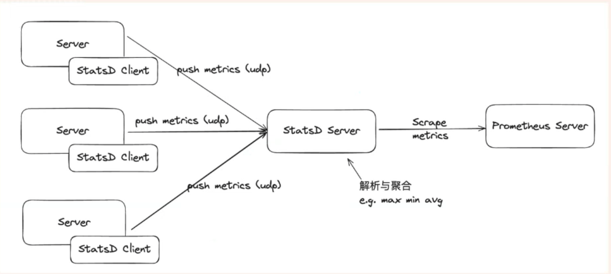

# Class 14 Monitoring
# Lecturer: Kewei Zhang

# 主要知识点
- [课前](#--)
- [Agenda](#agenda)
  * [L01](#l01)
  * [L02](#l02)
- [Monitoring](#monitoring)
  * [What is monitoring?](#what-is-monitoring-)
  * [监控的重要性](#------)
  * [什么是指标 (metrics)?](#-------metrics--)
- [Prometheus](#prometheus)
  * [What is Prometheus](#what-is-prometheus)
- [Components](#components)
  * [Metric names and labels](#metric-names-and-labels)
  * [Samples](#samples)
  * [Notation:](#notation-)
  * [Statsd Exporter](#statsd-exporter)
  * [Prometheus Config File](#prometheus-config-file)
  * [Prometheus 支持的指标类型](#prometheus--------)
    + [计数器（Counters）](#----counters-)
    + [仪表（Gauges）](#---gauges-)
    + [直方图（Histograms）](#----histograms-)
      - [百分位数 (Percentile)](#------percentile-)
    + [摘要（Summaries）](#---summaries-)
  * [指标名称和标签](#-------)
- [**Hands on:**](#--hands-on---)
  * [Metrics and metric types](#metrics-and-metric-types)
  * [Statsd](#statsd)
  * [Grafana](#grafana)
- [SRE - Golden Signals](#sre---golden-signals)
  * [1. Latency](#1-latency)
    + [Should we look at the max or the average?](#should-we-look-at-the-max-or-the-average-)
    + [Error latency is also important](#error-latency-is-also-important)
    + [Trouble shooting](#trouble-shooting)
  * [2. Traffic](#2-traffic)
  * [3. Errors](#3-errors)
  * [4. Saturation](#4-saturation)
- [Monitoring Types](#monitoring-types)
  * [Black-box monitoring](#black-box-monitoring)
  * [White-box monitoring](#white-box-monitoring)
  * [监控方法对比](#------)
- [Homework](#homework)
  * [Tech Scrum](#tech-scrum)


# 课前
- 数据产生
- 数据存储
- 数据处理， 用Dashboard展示，使用方差，平均值等分析
- 数据使用，使用量的监听，auto scaling

- developer关注的问题
    1. 如何统一和简化日志和指标的生成?
    2. 如何在不影响开发自由的情况下确保监控一致性？
    3. 如何修改和展示监控数据以更好地理解应用的健康状况和使用情况?
- DevOps关注的问题
    1. 如何利用监控指标维护应用和系统的健康？
    2. 如何通过自动发现功能从而简化日志和指标平台的接入？ - auto discovery
    3. 如何存储和索引监控数据以方便使用和维护？

- 在产品开发过程中或维护中，最重要的三个点和四个目标（面试和设计的时候可以参考）
    - 易用性
    - 有效性
    - 安全性
    1. 简化开发体验
    2. 保证监控符合标准
    3. 提高效率，可靠性，安全性
    4. 便于维护和扩展

# Agenda
## L01
- Metric监控的基本原理
- 不同类型的Metric及其用途
- Web App中的Metric配置
- 使用Prometheus收集和查询Metric
- 使用StatsD收集Metric
- Prometheus-client与

## L02
- 排查错误的方法与概念
- 在 Grafana 中创建和定制仪表板
- 使用 Terraform 管理 Grafana 仪表板
- 设置警报
- Grafana 与 Opsgenie 集成
- 配置 Locust Traffic Generator
- Incident Response 过程
- Metric 监控解决方案的扩展和故障排除
- 监控的基本概念与实践思路

# Monitoring
## What is monitoring?
Collecting, processing, aggregating, and displaying real-time quantitative data about a system, such as query counts and types, error counts and types, processing times, and server lifetimes.

## 监控的重要性
- 分析长期趋势
通过监控，可以识别系统性能和使用模式的长期变化，例如流量增长或资源利用率的变化，帮助制定未来的容量规划和优化策略。例如，观察到用户访问量在每年年底大幅增加，可以提前准备服务器扩容。
- 随时间或实验组进行比较
监控允许你在不同时间段或实验组之间进行对比，评估新功能或优化措施的影响。例如，可以比较软件更新前后的错误率，评估新版本的稳定性。
- 警报
设置监控警报可以在问题发生时立即通知相关人员，从而迅速采取行动，减少停机时间和损失。例如，当 CPU 使用率超过 90% 时，系统可以自动发送警报给运维团队。
- 构建仪表板
通过构建监控仪表板，实时展示关键指标，使团队能够一目了然地了解系统健康状况。例如，开发团队可以使用 Grafana 仪表板实时查看服务器性能和应用响应时间。
- 调试
监控数据可以帮助调试系统中的问题，提供详细的运行时信息和错误上下文，快速定位问题根源。例如，通过分析求日志和错误日志，开发者可以找出导致某个 API 调用失败的具体原因。

## 什么是指标 (metrics)?
- 指标 是数值测量。例如温度、心率、车流量、股票价格等都可称为指标。
- 时间序列 指的是随时间记录变化的数据。对于 web 服务器，这可能是请求时间；对于数据库，这可能是活跃连接数或活跃查询数，等等。

# Prometheus
## What is Prometheus
Prometheus fundamentally stores all data as time series: streams of timestamped values belonging to the same metric and the same set of labeled dimensions. Besides stored time series, Prometheus may generate temporary derived time series as the result of queries.

Prometheus从根本上将所有数据存储为时间序列:带有时间戳的值流属于相同的度量标准和相同的标记维度集。除了存储的时间序列，Prometheus还可以生成临时的派生时间序列作为查询的结果。

Prometheus 是一个开源的系统监控和告警工具包，发布于2012年。Prometheus 是云原生计算基金会（CNCF）的一部分，并于2016年被接受。

Prometheus 提供指标收集、存储和查询功能。它通常通过一个简单的**抓取**系统从主机拉取数据来收集指标。

Prometheus 数据库将这些数据存储为时间序列，可以使用 Prometheus 查询语言（PromQL）来查询这些数据。

https://github.com/prometheus/prometheus

# Components

- Prometheus server：用于抓取和存储时间序列数据。
- Client libraries：用于给应用代码添加监控的客户端库。
- Push gateway：支持短期作业（批处理作业）的推送网关。
- Exporters：为特定服务（如 StatsD、MySQL、MongoDB 等）提供的专用导出器。
- Alert Manager：用于处理告警的告警管理器。
- Support Tools：各种支持工具，如服务发现。

## Metric names and labels

Every time series is uniquely identified by its metric name and optional key-value pairs called labels. 可以加很多具体标签，帮助identify这些metric的具体信息

The metric name specifies the general feature of a system that is measured (e.g. http_requests_total - the total number of HTTP requests received). It may contain ASCII letters and digits, as well as underscores and colons. It must match the regex [a-zA-Z_:][a-zA-Z0-9_:]*.

## Samples
Samples form the actual time series data. Each sample consists of:
- a float64 value 具体数值
- a millisecond-precision timestamp 时间戳

## Notation:

Given a metric name and a set of labels, time series are frequently identified using this notation:

```
<metric name>{<label name>=<label value>, ...}
```

For example, a time series with the metric name api_http_requests_total and the labels method="POST" and handler="/messages" could be written like this:

```
api_http_requests_total{method="POST", handler="/messages"}
```

Under the hood, the data is stored to [http://opentsdb.net/overview.html](http://opentsdb.net/overview.html)

一个数据必须至少有一个标签，每个时间序列的度量应该有相同数量的标签。不建议每个数据有超过6-7个tag，因为存储新数据点的相关成本将被超过该点的标记数量所控制。

## Statsd Exporter

- StatsD 是一个轻量级的网络守护程序（daemon），用于统计、解析和聚合应用程序发送的指标数据。
- 应用程序通过 UDP 或 TCP 将指标数据发送到 StatsD 服务器。
- StatsD 提供简单的接口，使开发者可以轻松地在应用程序中添加性能监控代码。

## Prometheus Config File

```
global:
  scrape_interval:     15s  # 设置抓取目标的频率（默认15秒一次）
  evaluation_interval: 15s  # 设置评估规则的频率。

rule_files:
  # - "first.rules"  
  # - "second.rules"

scrape_configs:
  - job_name: prometheus
    static_configs:
      - targets: ['localhost:9090']
```

There are three blocks of configuration in the example configuration file: `global`, `rule_files`, and `scrape_configs`.

The `global` block controls the Prometheus server's global configuration. We have two options present.

- The first, `scrape_interval`, controls how often Prometheus will scrape targets. You can override this for individual targets. In this case the global setting is to scrape every 15 seconds.
- The `evaluation_interval` option controls how often Prometheus will evaluate rules. Prometheus uses rules to create new time series and to generate alerts.

The `rule_files` block specifies the location of any rules we want the Prometheus server to load. For now we've got no rules. Recording rules allow you to precompute frequently needed or computationally expensive expressions and save their result as a new set of time series. More to read: [https://prometheus.io/docs/prometheus/latest/configuration/recording_rules/](https://prometheus.io/docs/prometheus/latest/configuration/recording_rules/)

The last block, `scrape_configs`, controls what resources Prometheus monitors. Since Prometheus also exposes data about itself as an HTTP endpoint it can scrape and monitor its own health. In the default configuration there is a single job, called prometheus, which scrapes the time series data exposed by the Prometheus server. The job contains a single, statically configured, target, the localhost on port 9090. Prometheus expects metrics to be available on targets on a path of /metrics. So this default job is scraping via the URL: [http://localhost:9090/metrics](http://localhost:9090/metrics).

## Prometheus 支持的指标类型
 - Prometheus 支持以下四种指标类型：
        - 计数器（Counters）
        - 仪表（Gauges）
        - 直方图（Histograms）
        - 摘要（Summaries）。
 - 这些指标通过拉取模型（pull model）收集，即 Prometheus 会定期从软件的 HTTP 接口（endpoints）抓取数据。
 - 为了满足不同软件的指标需求，Prometheus 社区提供了数百个开源的导出器（exporters）。

- https://prometheus.io/docs/instrumenting/exporters/ 

### 计数器（Counters）
与 PromQL 的 rate 函数一起使用，以了解每秒的请求数。
```
rate(http_requests_total{api="add_product"}[5m])
```
要计算一段时间内的绝对变化，我们会使用一个 delta 函数，在 PromQL 中即为 increase() 函数。
```
increase(http_requests_total{api="add_product"}[5m])
```

### 仪表（Gauges）

### 直方图（Histograms）
总和（sum）和计数（count）可以用来计算一段时间内测量值的平均值。
```
rate(http_request_duration_seconds_sum{api="add_product", instance="host1.domain.com"}[5m]) /
rate(http_request_duration_seconds_count{api="add_product", instance="host1.domain.com"}[5m])
```

使用直方图，您可以在查询时计算百分位数。
```
histogram_quantile(0.99, rate(http_request_duration_seconds_bucket{api="add_product", instance="host1.domain.com"}[5m]))
```

#### 百分位数 (Percentile)
- 百分位数是将一组数据按升序排列后，将数据划分为 100 个相等部分的点。
- 如果某个数据位于第 90 百分位（P90 或者 90th percentile），这意味着该数据大于或等于这组数据中 90% 的值。
- 在计算响应时间时，百分位数可以帮助排除极端异常值对统计结果的影响，更准确地反映大多数用户的体验。

### 摘要（Summaries）
与直方图类似，摘要指标（summary metrics）也用于测量请求持续时间和响应大小。
~~~
# HELP http_request_duration_seconds Api requests response time in seconds
# TYPE http_request_duration_seconds summary
http_request_duration_seconds_sum{api="add_product", instance="host1.domain.com"} 8953.332
http_request_duration_seconds_count{api="add_product", instance="host1.domain.com"} 27892
http_request_duration_seconds{api="add_product", instance="host1.domain.com", quantile="0"} 0.232227334
http_request_duration_seconds{api="add_product", instance="host1.domain.com", quantile="0.5"} 0.821139321
http_request_duration_seconds{api="add_product", instance="host1.domain.com", quantile="0.90"} 1.528948804
http_request_duration_seconds{api="add_product", instance="host1.domain.com", quantile="0.95"} 2.829188272
http_request_duration_seconds{api="add_product", instance="host1.domain.com", quantile="0.99"} 3.483282929
http_request_duration_seconds{api="add_product", instance="host1.domain.com", quantile="1"} 3.721388292
~~~
摘要指标需要在客户端进行计算，这会**占用计算资源**。特别是在高并发环境下，计算百分位数等统计数据可能会影响系统性能。所以一些 exporter 或软件不提供摘要指标。

## 指标名称和标签
每个指标都包含：

- 一个指标名称
- 数据点收集时的时间戳
- 一个由数值表示的测量值
~~~
<metric name>{<label name>=<label value>, ...} <metrics value>
~~~

例如，一个具有指标名称 api_http_requests_total 和标签 method="POST" 以及 handler="/messages" 的时间序列可以这样写：
~~~
api_http_requests_total{method="POST", handler="/messages"} 78
~~~

# **Hands on:**
https://github.com/australiaitgroup/DevOpsNotes/blob/main/WK7_Monitoring/docs/hands_on/metrics_from_web_app.md

https://github.com/australiaitgroup/DevOpsNotes/blob/main/WK7_Monitoring/docs/01.prometheus.md


## Metrics and metric types

https://github.com/australiaitgroup/DevOpsNotes/blob/main/WK7_Monitoring/docs/02.metrics.md
## Statsd

https://github.com/australiaitgroup/DevOpsNotes/blob/main/WK7_Monitoring/docs/03.statsd.md

## Grafana

https://github.com/australiaitgroup/DevOpsNotes/blob/main/WK7_Monitoring/docs/04.grafana.md

**Note**: Prometheus是时间序列数据库，可以存储数据，记录数据，Grafana只是Display


# SRE - Golden Signals

## 1. Latency
- 延迟是指处理请求所需的时间。它可以分为两类：成功请求的延迟（e.g. 200）和失败请求的延迟（e.g. 500）。
- 延迟直接影响用户体验。即使系统能够处理大量请求，但如果处理每个请求的时间过长，用户可能仍会感到不满意。监控延迟有助于识别性能瓶颈，确保响应时间符合预期。

The time it takes to serve a request.

**Visbility** 通过一个个排查locate到具体出问题的地方

Backend Latency: 

- The latency to serve an API (access log)
    - by web nodes
    - by log level
    - by method 例如post request
    - by user agent
    - by environment (dev, stg, prod)
    - by region (prod-east, prod-west) 可能有cross-region, 一些availability zone不工作
    - by customer* (be careful with cardinality) 一些具体的用户可能会有latency
    - by microservices (if there is any)
- DB time (application logging)
    - by logger
    - by log level

Frontend Latency: 
- Page/Component loading time
- TTI (Time to interaction)

### Should we look at the max or the average?

For latency, we shall look at it statistically with percentile e.g. p50 (median), p75 (~average), p90 (the majority)

Sometimes, we need to now about 99 percentile to make sure we are not missing some outliers.

### Error latency is also important

It’s important to distinguish between the latency of successful requests and the latency of failed requests. For example, an HTTP 500 error triggered due to loss of connection to a database or other critical backend might be served very quickly; however, as an HTTP 500 error indicates a failed request, factoring 500s into your overall latency might result in misleading calculations. On the other hand, a slow error is even worse than a fast error! Therefore, it’s important to track error latency, as opposed to just filtering out errors. 

### Trouble shooting

If it takes too long:

- Do we have network issue/connectivity issue?
- Was this reported by a single customer?
    - cross-region issue
    - other connectivity issue (if our application does not show a high latency) 可以查看aws status page
- Is our DNS or CDN having issue?
- Is there any function of our application not efficient?
- Is our DB under pressure?

## 2. Traffic
- 流量衡量系统接收的请求量，这可以是 HTTP 请求、数据库事务或任何形式的入站连接。
- 流量的变化反映了系统的使用模式和负载情况。通过监控流量，团队可以了解系统的需求峰值，以及是否有必要扩展资源以处理增加的负载。

A measure of how much demand is being placed on your system. Eg，对比进去的和出来的throughput是不是一样，每个层级的throughput等等。

- Network In (Load Balancer, Application, Microservices, Cache and DB)
- Network Out (Load Balancer, Application, Microservices, Cache and DB)
- HTTP Request Rate (by region, by status_code, etc...)
- Transactions per second (Cache, Queue and DB)

For a web service, this measurement is usually HTTP requests per second, perhaps broken out by the nature of the requests (e.g. static versus dynamic content).

For a key-value storage system, this measurement might be transactions and retrievals per second.

## 3. Errors
- 错误指的是请求失败的比例，包括显式的错误（如 HTTP 500 错误）和隐式的错误（如 HTTP 200 响应，但返回的内容不正确）。
- 错误率是衡量用户体验的关键指标之一。高错误率可能表明后端服务器存在问题，需要立即解决。监控错误有助于及时发现并修复故障，减少对用户的影响。

**非常重要！**

The rate of requests that fail, either explicitly (e.g., HTTP 500s), implicitly (for example, an HTTP 200 success response, but coupled with the wrong content), or by policy (for example, "If you committed to one-second response times, any request over one second is an error").

- 计算方式：Error rate = Error/(Error+Success) (Sidecar, Microservice, API, DB etc...) （要分门别类的计算）
    - 5xx Error Rate (Application Error)
    - 4xx Error Rate (User generated Error)
- The size of Dead Letter Queue (Failed messages that are dumped into message queue) 信息越多代表错误越多

## 4. Saturation
- 饱和度是指系统的资源利用率，比如 CPU、内存、磁盘空间和网络带宽的使用情况。
- 饱和度高意味着系统接近或达到了其容量极限，可能会导致性能下降或服务不可用。通过监控饱和度，团队可以提前发现资源瓶颈，采取措施如扩容或优化，以避免系统过载。

How "full" your service is. 

A measure of your system fraction, emphasizing the resources that are most constrained (e.g., in a memory-constrained system, show memory; in an I/O-constrained system, show I/O). Note that many systems degrade in performance before they achieve 100% utilization 利用率 (typically 60%-80%), so having a utilization target is essential. 一般要控制在60%以下

System Level

- CPU Utilisation
- Memory Utilisation
- Disk Utilisation
- I/O Utilisation

Application Level

- Thread Pool Saturation
- Message Queue Saturation

The key here: try to understand the system constrain first by running some load testing or fundamental analysis.

# Monitoring Types
Black-box monitoring is symptom-oriented and represents active—not predicted—problems: "The system isn’t working correctly, right now."

White-box monitoring depends on the ability to inspect the innards of the system, such as logs or HTTP endpoints, with instrumentation. White-box monitoring therefore allows detection of imminent problems, failures masked by retries, and so forth.

## Black-box monitoring
- 黑盒监控是一种从最终用户的视角来观察和评估系统性能和可用性的监控方法。与黑盒测试类似，它不要求监控人员对系统的内部工作原理或结构有深入了解。黑盒监控主要关注系统的外在表现，如响应时间、服务可用性以及端到端的用户体验等。
- 黑盒监控的警报通常给予问题的症状（symptom），比如延迟，而不是具体的内部错误。

Testing externally visible behavior as a user would see it. 像用户看到的那样测试外部可见的行为。

Synthetic monitoring

- Selenium Webdriver
- Cypress
- New Relic (Commercial)

Load-testing

- Gatling
- Locust

## White-box monitoring
- 白盒监控是一种深入了解系统内部运作的监控方法，它依赖于对系统内部机制的理解。通过在操作系统或应用程序代码中加入监控点（instrumentation）。
- 白盒监控能够收集特定的度量指标（metrics），从而提供对系统性能深入的视角和细致的控制。
- 当系统出现问题时，白盒监控提供的详细信息可以帮助快速定位并解决问题。

Monitoring based on metrics exposed by the internals of the system, including logs, interfaces like the Java Virtual Machine Profiling Interface, or an HTTP handler that emits internal statistics. 基于系统内部公开的指标进行监视，包括日志、接口(如Java虚拟机分析接口)或发出内部统计信息的HTTP处理程序。

Metrics:

- Prometheus + Grafana
- Datadog (Commercial)
- SignalFx (Commercial)

Log Monitoring:

- Kibana (Open Source/Commercial)
- Splunk (Commercial)

## 监控方法对比

| 黑盒监控 vs 白盒监控      |                                                      |                                                      |
|---------------------------|------------------------------------------------------|------------------------------------------------------|
| **Focus and Scope of Monitoring** | 详细审查应用程序内部运作的测试与监控方法。               | 黑盒监控与测试对于确保系统满足SLA并提供良好的用户体验至关重要。 |
| **Responsibility and Ownership** | 开发人员和工程师通常负责白盒测试与监控。需要对软件的内部代码、架构和设计有深入的了解。 | 运维团队可能主要关注黑盒监控，确保系统从终端用户的角度满足其性能和可用性目标。 |
| **DevOps Lifecycle Integration** | 白盒测试与监控可以在开发过程的早期集成，提供关于代码错误、性能和潜在问题的即时反馈。 | 黑盒测试与监控成本较高，但对于满足用户体验，确保产品成功上线，持续运营至关重要。 |

# Homework
Your company is asking you to monitor its cloud application, could you come up with a Grafana dashboard draft to show what would you like to monitor?

Directions to consider:
- Where is the request coming from (region? IP? user-agent?)? Which host/container did the request land? (Hint ELB)
- What is the throughput of the requests?
- What is the response time of your service on a particular API?
- How long does it take for each API call and DB query to run?
- What is the error rate on every API? on every docker container? on every region?
- Any saturation (thread saturation? CPU saturation? memory Saturation) observed?
- How do you aggregate multiple hosts? APIs? status codes?
- Was there a deployment? Did it cause any errors?

Are the metrics we learnt today enough to answer those questions. (hint - tracing)

## Tech Scrum
IaC Enhancement for Frontend & Backend
- Optimize existing IaC scripts for frontend and backend.
- Add or modify resources based on project requirements.

Monitoring
- Select appropriate monitoring tools.
- Implement health checks for the frontend.
- Set up and configure cloud-based monitoring tools to monitor frontend CDN's performance and availability.
