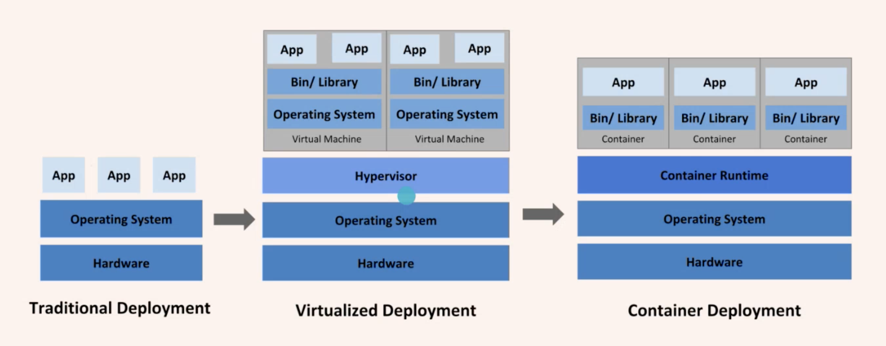
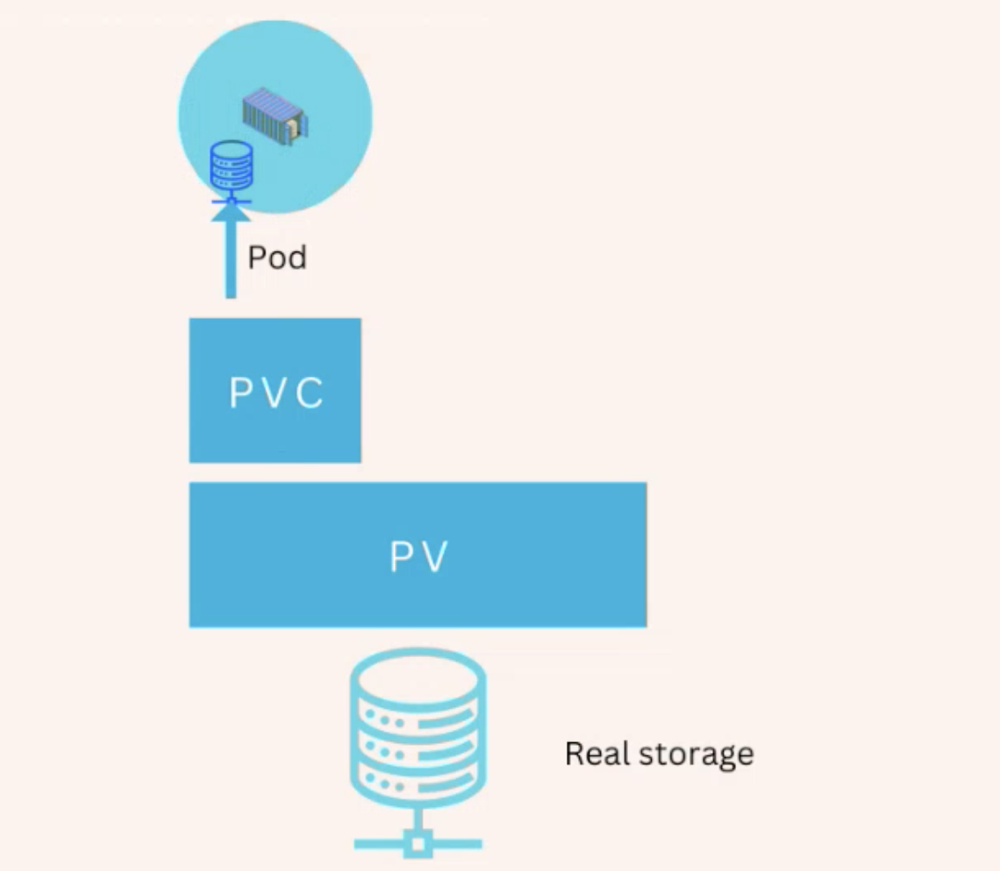

# **DevOps13-Class-16-Orchestration&Kubernetes**
# Lecturer: Liji Yu


- [History](#history)
- [Why you need Kubernetes and what it can do？](#why-you-need-kubernetes-and-what-it-can-do-)
- [What is Kubernetes (K8s) ?](#what-is-kubernetes--k8s---)
  * [Know the components](#know-the-components)
    + [Control Plane](#control-plane)
    + [**Node**](#--node--)
      - [kubelet](#kubelet)
      - [kube-proxy](#kube-proxy)
      - [Container runtime](#container-runtime)
    + [Architecture](#architecture)
    + [Cluster](#cluster)
  * [kubernetes learning roadmap](#kubernetes-learning-roadmap)
    + [Pod](#pod)
    + [Replica Set](#replica-set)
    + [Depolyment](#depolyment)
- [Hands on](#hands-on)
  * [minikube](#minikube)
  * [start minikube](#start-minikube)
  * [pod](#pod)
  * [deployment](#deployment)
  * [k8s networking](#k8s-networking)
  * [k8s的配置文件 - IaC](#k8s--------iac)
  * [Create everything from YAML file](#create-everything-from-yaml-file)
  * [change v1 to v2](#change-v1-to-v2)
  * [ConfigMap](#configmap)
  * [Secret](#secret)
  * [PV and PVC](#pv-and-pvc)
    + [Persistent Volume, Persistent, Volume Clainm](#persistent-volume--persistent--volume-clainm)


# History

* __Traditional deployment era__: Early on, organizations ran applications on physical servers. There was no way to 
  define resource boundaries for applications in a physical server, and this caused resource allocation issues.

* __Virtualized deployment era__: As a solution, virtualization was introduced. It allows you to run multiple Virtual 
  Machines (VMs) on a single physical server's CPU. Virtualization allows applications to be isolated between VMs 
  and provides a level of security as the information of one application cannot be freely accessed by another
  application.
  
* __Container deployment era__: Containers are similar to VMs, but they have relaxed isolation properties to share the 
  Operating System (OS) among the applications. Therefore, containers are considered lightweight.

 * 一个服务器跑一个container 用docker
 * 一个服务器跑多个container 用docker-compose
 * 多个服务器跑多个container 用K8s

希望用一个东西将底层的host和container隔离开，其中需要添加一个管理层。那么加减host不用考虑host其中跑的containers内容。中间层会自动启动和调度分布containers。

# Why you need Kubernetes and what it can do？
如果
Containers are a good way to bundle and run your applications. In a __production__ environment, you need to manage the
containers that run the applications and ensure that there is __no downtime__. For example, if a container goes down, 
another container needs to start. Wouldn't it be easier if this behavior was handled by a system?

Kubernetes provides you with a framework to run distributed systems __resiliently__.

Kubernetes provides:
* Service discovery and load balancing
  * Kubernetes can expose a container using the DNS name or using their own IP address. If traffic to a container is
    high, Kubernetes is able to load balance and distribute the network traffic so that the deployment is stable.
* **Storage orchestration** 
  * Kubernetes allows you to automatically mount a storage system of your choice, such as local storages, 
    public cloud providers, and more.
* Automated rollouts and rollbacks 
  * You can describe the desired state for your deployed containers using Kubernetes, and it can change the actual 
    state to the desired state at a controlled rate. For example, you can automate Kubernetes to create new containers
    for your deployment, remove existing containers and adopt all their resources to the new container.
* Automatic bin packing
  * You provide Kubernetes with a cluster of nodes that it can use to run containerized tasks. You tell Kubernetes how
    much CPU and memory (RAM) each container needs. Kubernetes can fit containers onto your nodes to make the best use
    of your resources.
* Self-healing
  * Kubernetes restarts containers that fail, replaces containers, kills containers that don't respond to your 
    user-defined health check, and doesn't advertise them to clients until they are ready to serve.
* **Secret and configuration management**
  * Kubernetes lets you store and manage sensitive information, such as passwords, OAuth tokens, and SSH keys. 
    You can deploy and update secrets and application configuration without rebuilding your container images, and
    without exposing secrets in your stack configuration.
* **network management**

# What is Kubernetes (K8s) ?
Kubernetes is a portable, extensible, open-source platform for managing containerized workloads and services, that
facilitates both declarative configuration and automation. It has a large, rapidly growing ecosystem. Kubernetes 
services, support, and tools are widely available.

## Know the components

  - Control plane
  - Pod
  - Node
  - kubelet
  - kube proxy
  - container runtime

### Control Plane

The control plane's components make global decisions about the cluster (for example, scheduling), as well as detecting
and responding to cluster events (for example, starting up a new pod when a deployment's replicas field is unsatisfied).

Control plane components can be run on any machine in the cluster. However, for simplicity, set up scripts typically 
start all control plane components on the same machine, and do not run user containers on this machine.

A set of proceses controls the whole k8s cluster

### **Node**

A **Pod always runs on a Node**. A Node is a worker machine in Kubernetes and may be either **a virtual or a physical machine**,
depending on the cluster.

Each Node is managed by the control plane. A Node can have multiple pods, and the Kubernetes control plane automatically
handles scheduling the pods across the Nodes in the cluster. The control plane's automatic scheduling takes into account
the available resources on each Node.

**Control plane schedule Pods to nodes**

Every Kubernetes Node runs at least:

* Kubelet, a process responsible for communication between the Kubernetes control plane and the Node; it manages the
  Pods and the containers running on a machine. 
* A container runtime (like Docker) responsible for pulling the container image from a registry, unpacking the 
  container, and running the application.

#### kubelet
An agent that runs on each node in the cluster. It makes sure that containers are running in a Pod.

#### kube-proxy
kube-proxy is a network proxy that runs on each node in your cluster. kube-proxy maintains network rules on nodes.

#### Container runtime
The container runtime is the software that is responsible for running containers.
Kubernetes supports several container runtimes: Docker, containerd, CRI-O, and any implementation of the Kubernetes
CRI (Container Runtime Interface).

### Architecture

- kube-apiserver
- etcd
- kube-scheduler
- kube-controller-manager
- cloud controller manager


### Cluster
A Kubernetes cluster consists of a set of worker machines, called nodes, that run containerized applications. 
Every cluster has at least one worker node.

The worker node(s) host the Pods that are the components of the application workload.

The control plane manages the worker nodes and the Pods in the cluster. 
* In production environments, the control plane usually 
  * runs across multiple computers and a cluster
  * usually runs multiple nodes
  
  providing fault-tolerance and high availability.

## kubernetes learning roadmap

(入门)
- Pod, ReplicaSet, Deployment
- Services
- ConfigMap

(进阶)
- Storage
- Secret，networking

try: kubectl api-resources

k8s运行无状态好一些，有状态的运行k8s有争议

### Pod

the smallest doployable units of computing that you can create and manage in Kubernetes.
- one or more containers
- share network and storage
一般建议一个pod只放一个container，可放辅助性的(sidecar) log-ingester,metrics/monitor 由于共享存储，可以直接读取log.txt并发送给总的monitor程序

A Pod is a Kubernetes abstraction that represents a group of one or more application containers (such as Docker), 
and some shared resources for those containers.

Those resources include:

- **Shared storage, as Volumes**
- **Networking, as a unique cluster IP address**
- Information about how to run each container, such as the container image version or specific ports to use

A Pod models an application-specific "logical host" and can contain different application containers which are 
relatively tightly coupled.

### Replica Set
To maintain a stable set of replica Pods running at any given time.

To guarantee the availability of a specified number of identical Pods.

### Depolyment
一般会直接创建deployment--->replica set

A Deployment provides declarative updates for Pods and ReplicaSets.

# Hands on

课程资料中下载k8s_handson.zip

## minikube

* https://minikube.sigs.k8s.io/docs/start/
* https://kubernetes.io/docs/tasks/tools/install-kubectl/

## start minikube
```
minikube start

minikube dashboard
```

```
kubectl cluster-info
```

You should see something similar to

```
Kubernetes control plane is running at https://127.0.0.1:58999
CoreDNS is running at https://127.0.0.1:58999/api/v1/namespaces/kube-system/services/kube-dns:dns/proxy

To further debug and diagnose cluster problems, use 'kubectl cluster-info dump'.
```

## pod

```
kubectl run greetings --image chrlwang/greetings:v1

# list pods
kubectl get pods
# or
kubectl get pods --output=wide

# get pod details
kubectl describe pod/greetings

# logs and login
kubectl exec -it <pod-name> -- /bin/bash
kubectl logs <pod-name>

# delete pod
kubectl delete pod/greetings
```
## deployment

```
kubectl create deployment greetings --image=chrlwang/greetings:v1

kubectl get deployments
kubectl get rs
kubectl get pods

# scale pods
kubectl scale --replicas=3 deployment/greetings

# try delete one pod and see how many pods we have

replicas会迅速启动一个相同的pod

# service

kubectl expose deployment greetings  --port=8080 --target-port=80

minikube service greetings

# 自动打开一个网页， or

kubectl port-forward svc/greetings 8080:8080

# deploy

kubectl set image deployment/greetings greetings=chrlwang/greetings:v2
kubectl rollout status deployment/greetings
kubectl rollout history deployment/greetings

# visist the website

kubectl rollout undo deployment/greetings
```


## k8s networking
container to container: pod 

pod to pod: k8s networking

pod to service: service

External to service: service

Container Network Interface


pod可以通过pod名字或者IP来访问，名字会随机生成，访问service即可找到pods

## k8s的配置文件 - IaC

```
# version控制
apiVersion: v1

# 资源类型
kind: Namespace

# 资源的名字和label
metadata:
  name: jiangren
```
## Create everything from YAML file

```
cd k8s/simple
kubectl apply -f namespace.yaml
kubectl apply -f .
```

## change v1 to v2

apply


## ConfigMap

```
cd config
kubectl apply -f .

# then visit the web site, check the name

# change config map
kubectl apply -f .
# then visit the web site, check the name again
```

## Secret

```
cd secrets
# follow readme file
```

## PV and PVC

```
cd pv
# follow the readme file
```

### Persistent Volume, Persistent, Volume Clainm
