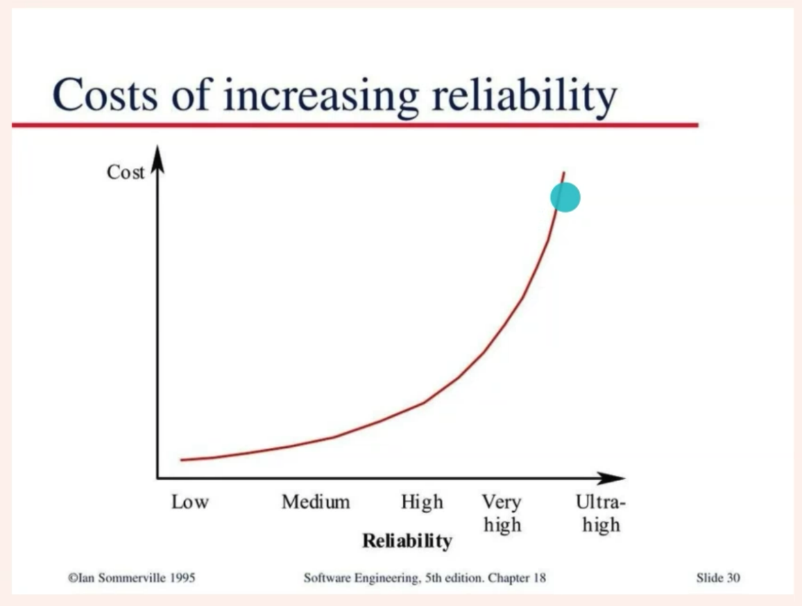
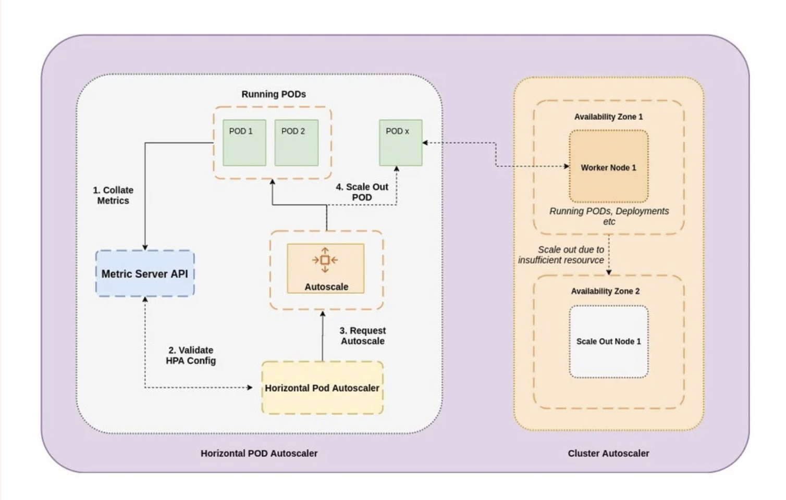
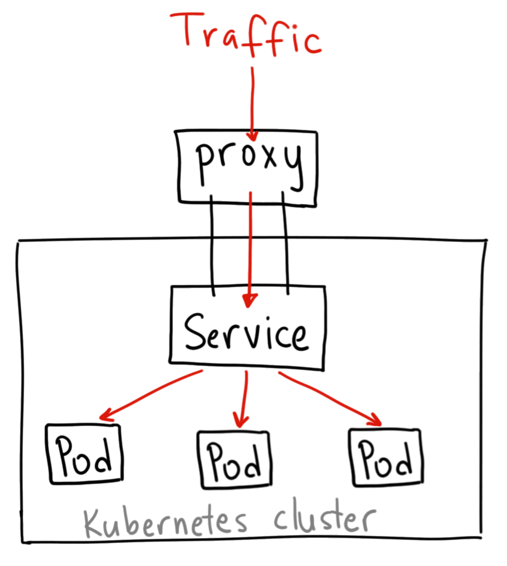

# Class-19-High_Availability_Kubernetes
# Lecturer: Liji Yu

# Agend
- [High Availability](#high-availability)
  * [Definition](#definition)
  * [Measuring Service Risk](#measuring-service-risk)
    + [Time-based availability](#time-based-availability)
    + [Aggregate availability](#aggregate-availability)
    + [How to measure availability?](#how-to-measure-availability-)
- [SRE fundamentals: SLIs, SLAs and SLOs](#sre-fundamentals--slis--slas-and-slos)
  * [Service-Level Objective (SLO)](#service-level-objective--slo-)
    + [Background](#background)
  * [Service-Level Agreement (SLA)](#service-level-agreement--sla-)
  * [Managing Cost](#managing-cost)
  * [Managing Risk](#managing-risk)
    + [The cost of redundant machine/compute resources](#the-cost-of-redundant-machine-compute-resources)
    + [The opportunity cost](#the-opportunity-cost)
- [Auto Scaling Basics](#auto-scaling-basics)
  * [What is auto scaling?](#what-is-auto-scaling-)
  * [Vertical vs Horizontal Scalability](#vertical-vs-horizontal-scalability)
  * [Benefits of Auto Scaling](#benefits-of-auto-scaling)
- [K8S High Availability & Auto Scaling](#k8s-high-availability---auto-scaling)
  * [HA: K8S Replica Set](#ha--k8s-replica-set)
  * [Kubernetes Autoscaling](#kubernetes-autoscaling)
    + [autoscaling methods for Kubernetes](#autoscaling-methods-for-kubernetes)
- [Hands on](#hands-on)
  * [Accessing local cluster with ingress controller (Load Balancer)](#accessing-local-cluster-with-ingress-controller--load-balancer-)
    + [ClusterIP](#clusterip)
    + [NodePort](#nodeport)
    + [Load Balancer](#load-balancer)
      - [When would you use this?](#when-would-you-use-this-)
    + [Ingress](#ingress)
      - [When would you use this?](#when-would-you-use-this--1)

# High Availability
## Definition
High availability is a quality of computing infrastructure that allows it to continue functioning, even when some of 
its components fail. This is important for mission-critical systems that cannot tolerate interruption in service, and
any downtime can cause damage or result in financial loss.

## Measuring Service Risk
As standard practice, we are often best served by identifying an objective metric to represent the property of a system we want to optimize. By setting a target, we can assess our current performance and track improvements or degradations over time. For service risk, it is not immediately clear how to reduce all of the potential factors into a single metric. Service failures can have many potential effects, including user dissatisfaction, harm, or loss of trust; direct or indirect revenue loss; brand or reputational impact; and undesirable press coverage. Clearly, some of these factors are very hard to measure. To make this problem tractable and consistent across many types of systems we run, we focus on unplanned downtime.

For most services, the most straightforward way of representing risk tolerance is in terms of the acceptable level of unplanned downtime. Unplanned downtime is captured by the desired level of service availability, usually expressed in terms of the number of "nines" we would like to provide: 99.9%, 99.99%, or 99.999% availability. Each additional nine corresponds to an order of magnitude improvement toward 100% availability. For serving systems, this metric is traditionally calculated based on the proportion of system uptime (see Time-based availability).

### Time-based availability

```
availability = uptime / ( uptime + downtime )
```

Using this formula over the period of a year, we can calculate the acceptable number of minutes of downtime to reach a given number of nines of availability. For example, a system with an availability target of 99.99% can be down for up to 52.56 minutes in a year and stay within its availability target; see Availability Table for a table.

A time-based metric for availability is usually not meaningful because we are looking across globally distributed services. Our approach to fault isolation makes it very likely that we are serving at least a subset of traffic for a given service somewhere in the world at any given time (i.e., we are at least partially "up" at all times). Therefore, instead of using metrics around uptime, we define availability in terms of the request success rate. Aggregate availability shows how this yield-based metric is calculated over a rolling window (i.e., proportion of successful requests over a one-day window).

### Aggregate availability

```
availability = successful requests / total requests
```
For example, a system that serves 2.5M requests in a day with a daily availability target of 99.99% can serve up to 250 errors and still hit its target for that given day.

In a typical application, not all requests are equal: failing a new user sign-up request is different from failing a request polling for new email in the background. In many cases, however, availability calculated as the request success rate over all requests is a reasonable approximation of unplanned downtime, as viewed from the end-user perspective.

Quantifying unplanned downtime as a request success rate also makes this availability metric more amenable for use in systems that do not typically serve end users directly. Most nonserving systems (e.g., batch, pipeline, storage, and transactional systems) have a well-defined notion of successful and unsuccessful units of work. Indeed, while the systems discussed in this chapter are primarily consumer and infrastructure serving systems, many of the same principles also apply to nonserving systems with minimal modification.

For example, a batch process that extracts, transforms, and inserts the contents of one of our customer databases into a data warehouse to enable further analysis may be set to run periodically. Using a request success rate defined in terms of records successfully and unsuccessfully processed, we can calculate a useful availability metric despite the fact that the batch system does not run constantly.

Most often, we set quarterly availability targets for a service and track our performance against those targets on a weekly, or even daily, basis. This strategy lets us manage the service to a high-level availability objective by looking for, tracking down, and fixing meaningful deviations as they inevitably arise. See Service Level Objectives for more details.

### How to measure availability?
commonly measured as a percentage of uptime.

Highly available systems guarantee a certain percentage of uptime—for example, a system that has 99.9% uptime will be
down only 0.1% of the time—0.365 days or 8.76 hours per year. The number of “nines” is commonly used to indicate the
degree of high availability. For example, “five nines” indicates a system that is up 99.999% of the time.

一般以月为单位计算

# SRE fundamentals: SLIs, SLAs and SLOs
要求上，SLO比SLA的要求更高（团队目标是999，对外承诺是99）
## Service-Level Objective (SLO)

### Background
SRE's goal: make sure our service is up and running 24/7 -> Key to success: make sure our availability is 24/7

`Availability`, in SRE terms, 
* defines whether a system is able to fulfill its intended function at a point in time. 
* In addition to being used as a reporting tool, the historical availability measurement can also describe the probability that your system will perform as expected in the future.

We need -> quantify/ set a numerical target for our availability. That target is called SLO.

## Service-Level Agreement (SLA)

An SLA normally involves a promise to someone using your service that its availability SLO should meet a certain level over a certain period, and if it fails to do so then some kind of penalty will be paid. This might be a partial refund of the service subscription fee paid by customers for that period, or additional subscription time added for free. The concept is that going out of SLO is going to hurt the service team, so they will push hard to stay within SLO.

Let us look at a few example

AWS: https://aws.amazon.com/compute/sla/
```
Monthly 
99.99% 
Unavailable 
EC2 no external connectivity 
Volume no I/O
```
Google Cloud: https://cloud.google.com/terms/sla/

```
Monthly 
99.95% 
"Downtime" 
More than a ten percent Error Rate. 
"Downtime Period" 
A period of five consecutive minutes of Downtime. 
Intermittent Downtime for a period of less than five minutes will not be counted towards any Downtime Periods.
```

Jira: https://www.atlassian.com/legal/sla/service-credits

## Managing Cost



**Can we achieve 100% availability?**

## Managing Risk 
Ref: https://landing.google.com/sre/sre-book/chapters/embracing-risk/

Unreliable systems can quickly erode users’ confidence, so we want to reduce the chance of system failure. However, experience shows that as we build systems, cost does not increase linearly as reliability increments—an incremental improvement in reliability may cost 100x more than the previous increment. The costliness has two dimensions:

### The cost of redundant machine/compute resources
The cost associated with redundant equipment that, for example, allows us to take systems offline for routine or unforeseen maintenance, or provides space for us to store parity code blocks that provide a minimum data durability guarantee.

### The opportunity cost
The cost borne by an organization when it allocates engineering resources to build systems or features that diminish risk instead of features that are directly visible to or usable by end users. These engineers no longer work on new features and products for end users.

In SRE, we manage service reliability largely by managing risk. We conceptualize risk as a continuum. We give equal importance to figuring out how to engineer greater reliability into Google systems and identifying the appropriate level of tolerance for the services we run. Doing so allows us to perform a cost/benefit analysis to determine, for example, where on the (nonlinear) risk continuum we should place Search, Ads, Gmail, or Photos. Our goal is to explicitly align the risk taken by a given service with the risk the business is willing to bear. We strive to make a service reliable enough, but no more reliable than it needs to be. That is, when we set an availability target of 99.99%,we want to exceed it, but not by much: that would waste opportunities to add features to the system, clean up technical debt, or reduce its operational costs. In a sense, we view the availability target as both a minimum and a maximum. The key advantage of this framing is that it unlocks explicit, thoughtful risktaking.

# Auto Scaling Basics

## What is auto scaling?
Auto Scaling helps you ensure that you have the correct number of resources available to handle the load for your application.

## Vertical vs Horizontal Scalability
Vertical: Increase size of instance

Horizontal: Add more instances

## Benefits of Auto Scaling
- **Elastic**: Automatically adapt capacity to demand
- **Reliable**: Counteract failures of instances or AZs
- **Customizable**: With bootstrapping & lifecycle hooks

# K8S High Availability & Auto Scaling
## HA: K8S Replica Set
保持高可用性的同时也可Scaling。node down后该节点上的Pod会失效，当节点不可用被检测到后，K8S会尝试在其他node上重建Pod。

## Kubernetes Autoscaling


### autoscaling methods for Kubernetes
* Horizontal Pod Autoscaler
  * Horizontal scaling, which is sometimes referred to as “scaling out,” allows Kubernetes administrators to 
    dynamically (i.e., automatically) increase or decrease the number of running pods as your application’s usage
    changes.
  * With a Horizontal Pod Autoscaler, a cluster operator declares their target usage for metrics, such as CPU or
    memory utilization, number of queued messages, as well their desired maximum and minimum desired number of replicas
* Vertical Pod Autoscaler 
  * “scaling up” sometimes refers to adding more resources (such as CPU or memory) to an existing machine.
  * While scaling horizontally is typically considered a best practice, there are some services that you may want to
    run in your cluster where this is either not possible or not ideal due to some constraint
* Cluster Autoscaler
  * “What happens when load is at a peak and the nodes in the cluster are getting too overloaded with all the newly
    scaled pods?”  
  * As the name indicates, it’s what allows for the autoscaling of the cluster itself, increasing and decreasing the
    number of nodes available for your pods to run on. (A node in Kubernetes lingo is a physical or virtual machine.)

# Hands on

Hands on: https://github.com/australiaitgroup/DevOpsNotes/tree/main/WK9_High_Availability_Scaling_K8S

Voting App：https://github.com/dockersamples/example-voting-app

ha_k8s_hands_on.zip

K8S不只是架构，还是一个标准，对于某些东西没有提供实现，但是提供了标准，要求第三方要按照其标准来实现。 Metrics-Server

K8S CPU units: https://kubernetes.io/docs/tasks/configure-pod-container/assign-cpu-resource/#cpu-units

## Accessing local cluster with ingress controller (Load Balancer)

### ClusterIP
A ClusterIP service is the default Kubernetes service. It gives you a service inside your cluster that other apps
inside your cluster can access. There is no external access.

Wait? what? How do I access the cluster from the internet then?



Well, you certainly can access your cluster by set up a proxy:
```
kubectl proxy --port=8080
```
and then you can access your cluster via the API

```
http://localhost:8080/api/v1/namespaces/<NAMESPACE>/services/<SERVICE-NAME>:<PORT-NAME>/proxy/
# for example the vote service on port 5000
http://localhost:8080/api/v1/namespaces/default/services/vote:5000/proxy/
```

However, there are a few scenarios that you would use this:
* Debugging your services, or connecting to them directly from your laptop for some reason

* Allowing internal traffic, displaying internal dashboards, etc.

__Note: You should NOT use this to expose your service to the internet or use it for production services, because it
requires you to run kubectl as an authenticated user.__

### NodePort
A NodePort service is the most primitive way to get external traffic directly to your service. NodePort,
as the name implies, opens a specific port on all the Nodes (the VMs), and any traffic that is sent to this port is
forwarded to the service.


Basically, a NodePort service has two differences from a normal “ClusterIP” service. First, the type is “NodePort.”
There is also an additional port called the nodePort that specifies which port to open on the nodes.

There are many downsides to this method:
* You can only have one service per port
* You can only use ports 30000–32767
* If your Node/VM IP address change, you need to deal with that

If you are running a service that doesn’t have to be always available, or you are very cost sensitive, this method
will work for you. But again, not recommended for prod.

### Load Balancer

A LoadBalancer service is the standard way to expose a service to the internet. On GKE, this will spin up a Network
Load Balancer that will give you a single IP address that will forward all traffic to your service.


#### When would you use this?
If you want to directly expose a service, this is the default method. All traffic on the port you specify will be
forwarded to the service. This means you can send almost any kind of traffic to
it, like HTTP, TCP, UDP, Websockets, gRPC, or whatever. https://cloud.google.com/compute/docs/load-balancing/network/

The big downside is that each service you expose with a LoadBalancer will get its own IP address, and you have to pay
for a LoadBalancer per exposed service, which can get expensive!

### Ingress
Unlike all the above examples, Ingress is actually NOT a type of service. Instead, it sits in front of multiple services
and act as a “smart router” or entrypoint into your cluster.

You can do a lot of different things with an Ingress, and there are many types of Ingress controllers that have
different capabilities.

The default GKE ingress controller will spin up an HTTP(S) Load Balancer for you.
https://cloud.google.com/load-balancing/docs/https
This will let you do both path based and subdomain based routing to backend services. For example, you can send
everything on foo.yourdomain.com to the foo service, and everything under the yourdomain.com/bar/ path to the bar
service.


#### When would you use this?
Ingress is probably the most powerful way to expose your services, but can also be the most complicated. There are many
types of Ingress controllers, from the Google Cloud Load Balancer, Nginx, Contour, Istio, and more. There are also
plugins for Ingress controllers, like the cert-manager, that can automatically provision SSL certificates for your
services.

Ingress is the most useful if you want to expose multiple services under the same IP address, and these services all use
the same L7 protocol (typically HTTP). You only pay for one load balancer if you are using the native GCP integration,
and because Ingress is “smart” you can get a lot of features out of the box (like SSL, Auth, Routing, etc)

Ref: https://medium.com/google-cloud/kubernetes-nodeport-vs-loadbalancer-vs-ingress-when-should-i-use-what-922f010849e0