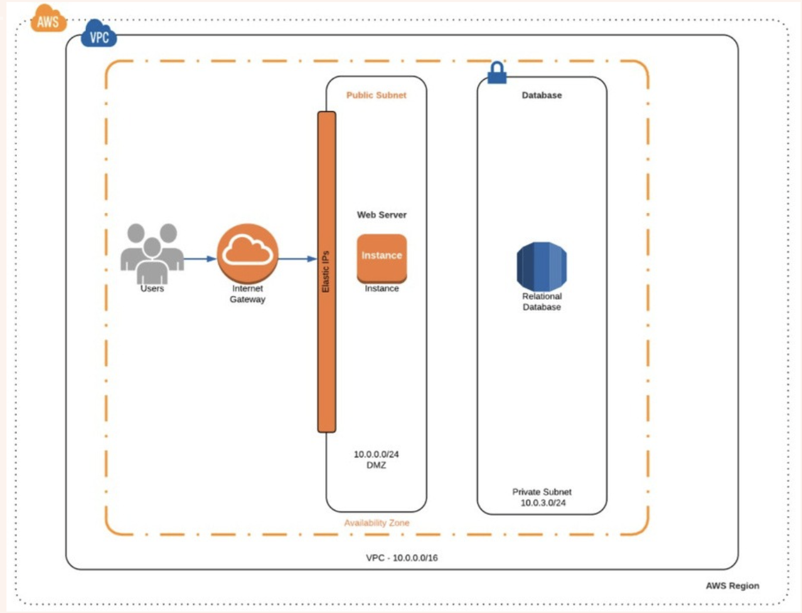
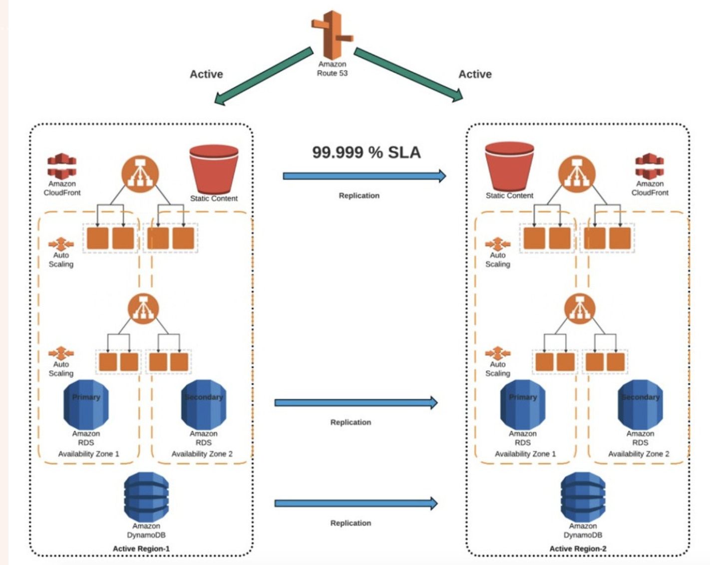
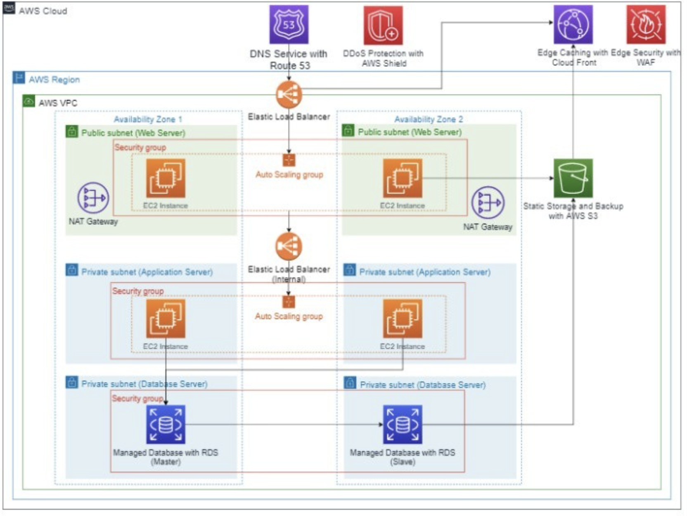

# Class-18-High Availability with AWS
# Lecturer: Liji Yu

# Agenda
- [课前复习](#----)
- [How should we set SLI](#how-should-we-set-sli)
- [How should we set SLO](#how-should-we-set-slo)
- [Document and communicate (SLO)](#document-and-communicate--slo-)
- [How should we set SLA](#how-should-we-set-sla)
- [A 5-step HA checklist](#a-5-step-ha-checklist)
  * [1. Availability metrics](#1-availability-metrics)
  * [2. Plan HA architecture](#2-plan-ha-architecture)
    + [Basic Elements of HA](#basic-elements-of-ha)
    + [Frontend HA components](#frontend-ha-components)
    + [Backend HA components](#backend-ha-components)
    + [How do we achieve the nines](#how-do-we-achieve-the-nines)
  * [3. Perform End to End Test](#3-perform-end-to-end-test)
  * [4. Deploy Applications Consistently](#4-deploy-applications-consistently)
  * [5. Monitor Application Health](#5-monitor-application-health)
- [Chaos Engineering](#chaos-engineering)
- [AWS High Availability & Auto Scaling](#aws-high-availability---auto-scaling)
  * [AWS High Availability](#aws-high-availability)
    + [AWS High Availability for EC2](#aws-high-availability-for-ec2)
    + [AWS High Availability for RDS](#aws-high-availability-for-rds)
    + [AWS High Availability for Storage](#aws-high-availability-for-storage)
    + [Amazon EFS（Elastic File System）](#amazon-efs-elastic-file-system-)
    + [Amazon EBS（Elastic Block Storage）](#amazon-ebs-elastic-block-storage-)
- [Hands - on](#hands---on)
- [Appendix](#appendix)
  * [Creating a Three-Tier Architecture in AWS](#creating-a-three-tier-architecture-in-aws)
    + [Introduction](#introduction)
  * [What we got from it?](#what-we-got-from-it-)
  * [Other References](#other-references)

# 课前复习
- How to set SLI, SLO, SLA
- AWS High Availability & Auto Scaling
- How to achieve high availability
- AWS 3-Tier Architecture Hands-on

# How should we set SLI

  - know your system
    - critical function
    - how user measure success
    - commonfailure mode and bottle necks
  - Identify key metics
    - Availability
    - Latency
    - Throughput
    - Error rate
  - Define measurement methods
    - **Data source:**
      - logs, monitoring, database
    - **Measurement interval**
    - **Calculation**
      - Average? Percentile?
      - Average latency should be under 300ms
      - 95th percentile latency should be under 300ms.

# How should we set SLO
- Set SLO targets
  - **Establish baseline**
    - Historical data and current performance levels
    - Identify trends and patterns
  - **Define SLO target**
    - Set target for each SLI
    - Challenging and achievable based on baseline and user expectation
  - **Consider business impact**
    - Align with business objects and priorities
    - Balance cost and benefit to users
  - **Create an SLO Document**
    - service name
    - SLI
    - target value
    - measurement method
    - evaluation period
    - Include
      - assumptions
      - constraints
      - rationale
- **Communicate SLOs to Stakeholders**
  - Understand what
  - And my role?

# Document and communicate (SLO)
- **Create an SLO Document**
  - service name
  - SLI
  - target value
  - measurement method
  - evaluation period
  - Include
    - assumptions
    - constraints
    - rationale

- **Communicate SLOs to Stakeholders**
  - Understand what
  - And my role?

- Monitoring and alerting
  - Set up monitoring and alerting

- Review and iterate
- **Review**
  - Access performance against SLO
  - Identify deviations and investigate root cause
- **Adjust**
  - Adjust SLO to meet user expectation and business priority
  - Improve measurement and monitoring practice

设置目标 - 写文档 - 沟通 - 回顾/迭代

# How should we set SLA

- Based on SLO
- Define penalty and remedies
  - Service credits, financial compensation
  - Define timeline for remedies and to restore SLA
- Need to work with legal and business team

是对外的业务，需要与市场和法务部门沟通合作。

某些情况也会根据SLA来定制SLO

# A 5-step HA checklist

1. Define Availability Requirements - 定义需求
2. Plane your HA architecture - 计划架构
3. Perform end to end testing - 端对端测试
4. Deploy Applications Consistently - 部署一致性
5. Monitor application health - 监控健康程度

## 1. Availability metrics
确定可靠度目标的时候常用到的指标

- Percentage of Uptime 
- Mean Time to Recovery (MTTR) 
- Mean Time between Failures (MTBR) 

- Recovery Time Objective (RTO) - 系统down了之后，恢复的时间
- Recovery Point Objective (RPO) - 针对存数据的系统，down之后会丢失多长时间的数据

## 2. Plan HA architecture

- Start with a Failure Mode Analysis (FMA)
  - Identify possible failure
  - How to recover
  - Avoid single point of failure
  - Load balance
- Consider cost
- Consider resiliency
  - Fail gracefully, recover without interruption
  - Consider asynchronous operation
- Document
  - Playbook, what to do when incident happens

### Basic Elements of HA

- Redundancy - 冗余
  - To avoid single point of failure
  - Multi web servers behind LB
  - DB Replica
- Failover - 故障切换
  - Switch to redundant component

### Frontend HA components

- DNS - global LB
  - Server health check
  - Only point to healthy servers
- CDN - 不同的URL
  - Primary, secondary origin servers
  - Serve static files when origin servers are down

### Backend HA components

- Load balancing
  - Blue/green depolyment
  - Canary deployment
- Clustering
- Data backup and recovery

db:master and db:replica

master 写， master and replica 分摊读取数据。

### How do we achieve the nines

- 99% Scenario

- 99.9% ~ 99.99% Scenario

- 99.999% Scenario

## 3. Perform End to End Test

- Load test - 压力测试
- Run disaster recovery exercises - 灾备测试/灾备演习
- Test monitoring system - 监控系统也有可能出现故障

## 4. Deploy Applications Consistently

- Any change can result in failure 
  - Have an  automated consistent deploymenet process

  尽量使用IaC，避免人为经验的操作，设备配置的一致性，减少错误的发生
- Consider availability in your release process 
  - Green/blue, canary（灰度部署）

- Plan for rollback 

## 5. Monitor Application Health

- Use probes and check functions to detect failure in time
- Watch degrading health metrics 
- Leverage logging and auditing 
- Know your limits 
  - Storage, Compute, Throughput 
  - Monitor them
  - Subscription limit

# Chaos Engineering
制造一些错误，如杀掉一个node，试一试系统能不能自动恢复

- Let’s create some failure 
- Test how the system respond to failure 
- Three steps 
  - A hypothesis about the system behavior in error. 
  - An experiment to test it in your system. 
  - Measure 

# AWS High Availability & Auto Scaling

## AWS High Availability

AWS helps achieve high availability in 3 dimensions: 
- 1.Compute 
- 2.Database 
- 3.Storage Services

### AWS High Availability for EC2
AWS provides built-in capabilities on EC2 to achieve high availability: 
- 1.ELB 
- 2.AZ
- 3.ASG 
- 4.VPC 
- 5.subnet

### AWS High Availability for RDS
RDS provides high availability using Multi-Availability Zone (Multi-AZ) deployments.

### AWS High Availability for Storage
Amazon S3
S3 guarantees 99.999999999% (twelve 9’s) durability, by redundantly storing objects on multiple devices across a minimum of three AZs in an Amazon S3 Region.

### Amazon EFS（Elastic File System）
EFS guarantees 99.9% availability, otherwise between 10-100% of the service fee is discounted. Every file system object is redundantly stored across multiple AZs.

### Amazon EBS（Elastic Block Storage）
To make a volume available outside the AZ, or to create redundancy, youcan create a snapshot and restore it in another AZ within the sameregion. You can also copy snapshots to other AWS regions, to createredundancy across Amazon data centers.

# Hands - on

# Appendix

## Creating a Three-Tier Architecture in AWS

### Introduction
A three-tier architecture is a software architecture pattern where the application is broken down into three logical tiers: the presentation layer, the business logic layer and the data storage layer.

This architecture is used in a client-server application such as a web application that has the frontend, the backend and the database. Each of these layers or tiers does a specific task and can be managed independently of each other.

This is a shift from the monolithic way of building an application where the frontend, the backend and the database are both sitting in one place.

## What we got from it?

- **Modularity**: The essence of having a three-tier architecture is to modularize our application such that each part can be managed independently of each other. With modularity, teams can focus on different tiers of the application and changes made as quickly as possible. Also, modularization helps us recover quickly from an unexpected disaster by focusing solely on the faulty part.

- **Scalability**: Each tier of the architecture can scale horizontally to support the traffic and request demand coming to it. This can easily be done by adding more EC2 instances to each tier and load balancing across them. For instance, assuming we have two EC2 instances serving our backend application and each of the EC2 instances is working at 80% CPU utilization, we can easily scale the backend tier by adding more EC2 instances to it so that the load can be distributed. We can also automatically reduce the number of the EC2 instances when the load is less.

- **High Availability**: With the traditional data centre, our application is sitting in one geographical location. If there is an earthquake, flooding or even power outage in that location where our application is hosted, our application will not be available. With AWS, we can design our infrastructure to be highly available by hosting our application in different locations known as the availability zones.

- **Fault Tolerant**: We want our infrastructure to comfortably adapt to any unexpected change both to traffic and fault. This is usually done by adding a redundant system that will account for such a hike in traffic when it does occur. So instead of having two EC2 instances working at 50% each, such that when one instance goes bad, the other instance will be working at 100% capacity until a new instance is brought up by our Auto Scaling Group, we have extra instance making it three instances working at approximately 35% each. This is usually a tradeoff made against the cost of setting up a redundant system.

- **Security**: We want to design an infrastructure that is highly secured and protected from the prying eyes of hackers. As much as possible, we want to avoid exposing our interactions within the application over the internet. This simply means that the application will communicate within themselves with a private IP. The presentation (frontend) tier of the infrastructure will be in a private subnet (the subnet with no public IP assigned to its instances) within the VPC. Users can only reach the frontend through the application load balancer. The backend and the database tier will also be in the private subnet because we do not want to expose them over the internet. We will set up the Bastion host for remote SSH and a NAT gateway for our private subnets to access the internet. The AWS security group helps us limit access to our infrastructure setup.

See more:

https://docs.aws.amazon.com/AmazonRDS/latest/UserGuide/USER_VPC.Scenarios.html

https://medium.com/@chamikakasun/an-aws-rds-db-instance-in-a-vpc-accessed-by-an-aws-ec2-instance-in-the-same-vpc-befa659b3dd8

## Other References
https://docs.aws.amazon.com/AWSEC2/latest/UserGuide/instancedata-data-retrieval.html#instance-metadata-ex-6

https://stackoverflow.com/questions/26706683/ec2-t2-micro-instance-has-no-public-dns

