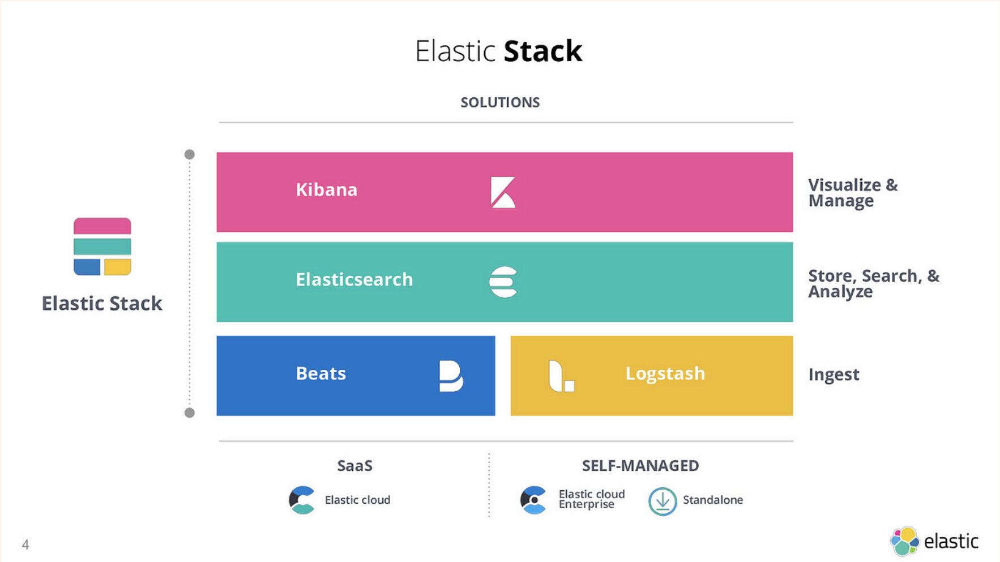
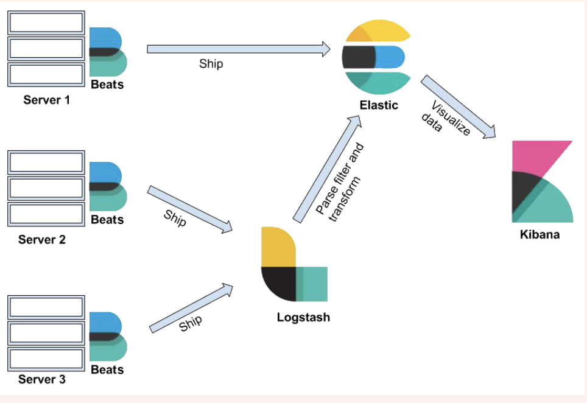

# Class-20_Logging
# Lecturer: Kewei Zhang

# 课程内容
- [Recap](#recap)
- [Logging 日志记录](#logging-----)
  * [Event Logs 事件日志](#event-logs-----)
    + [Linux](#linux)
    + [Mac](#mac)
  * [Transaction Logs 事务日志](#transaction-logs-----)
- [DevOps关注的Log](#devops---log)
  * [System Log 系统日志](#system-log-----)
  * [Application Log 应用程序日志](#application-log-------)
  * [Access Log](#access-log)
  * [Web Server Log](#web-server-log)
    + [Hands on - Nginx Access and Error log](#hands-on---nginx-access-and-error-log)
  * [Cache Log 缓存日志](#cache-log-----)
  * [DataBase Log 数据库日志](#database-log------)
  * [Broker Log - 消息队列服务器日志](#broker-log------------)
  * [标准日志记录 Standard Logging](#-------standard-logging)
  * [ELK stack - FILEBEAT (Installed on your webapp servers) + Logstash + Elastic Search + Kibana](#elk-stack---filebeat--installed-on-your-webapp-servers----logstash---elastic-search---kibana)
    + [**Filebeat**](#--filebeat--)
      - [Beat Family](#beat-family)
    + [**Logstash**](#--logstash--)
    + [**Elasticsearch**](#--elasticsearch--)
      - [Ekastic Search Cluster](#ekastic-search-cluster)
    + [**Kibana**](#--kibana--)
    + [Elastic Stack](#elastic-stack)
- [ELK Hands-on](#elk-hands-on)
- [Challenge](#challenge)
- [Appendix](#appendix)
  * [Why do we log?](#why-do-we-log-)
    + [Logging Purpose](#logging-purpose)
  * [What do we log?](#what-do-we-log-)
    + [System Logs vs Application Logs](#system-logs-vs-application-logs)
    + [System Logs](#system-logs)
      - [Generic system activity logs](#generic-system-activity-logs)
      - [Authentication events](#authentication-events)
      - [Initialisation Logs](#initialisation-logs)
      - [Device/driver messages](#device-driver-messages)
      - [Apache server logs](#apache-server-logs)
      - [Access Log](#access-log-1)
      - [Application Log](#application-log)
  * [How do we log?](#how-do-we-log-)
    + [Log Aggregation](#log-aggregation)
    + [Example:  Using Logstash to collect/aggregate logs](#example---using-logstash-to-collect-aggregate-logs)
      - [What is the persistent queue for? How does it improve the reliability or resiliency?](#what-is-the-persistent-queue-for--how-does-it-improve-the-reliability-or-resiliency-)
      - [Where is the log data kept?](#where-is-the-log-data-kept-)
      - [What if the server memory is not big enough?](#what-if-the-server-memory-is-not-big-enough-)
        * [Extra reading (https://blog.qburst.com/2020/01/a-deep-dive-into-log-monitoring-using-elastic-stack/)](#extra-reading--https---blogqburstcom-2020-01-a-deep-dive-into-log-monitoring-using-elastic-stack--)
      - [What is filters/outputs?](#what-is-filters-outputs-)
      - [Filters](#filters)
      - [Outputs](#outputs)
    + [Traditional logging](#traditional-logging)
      - [Linux/Unix](#linux-unix)
      - [Application](#application)
    + [Nginx logs](#nginx-logs)


# Recap
- 什么是 Tracing
  - 通过追踪请求从开始到结束的完整生命周期，可以获取到细粒度的性能数据
- Dashboard 仪表盘
  - 实时监控，性能分析，部署和运维，业务指标
- SLA, SLO, SLI
- Grafana 仪表盘
- 用 Terraform 来管理 Grafana 仪表盘
- 负载测试 Load Testing, 如何 setup locust traffic generator
- 面试题模拟

- 在on call team中，incident management    (Opsgenie)
    - 建立Group
    - Integration - Grafana (Contact points)
    - incident 的级别P1 - P3
    - Description 描述一些解决办法和参考文档
    - No blame


# Logging 日志记录
Logging 是记录操作系统或其他软件运行中发生的事件。Logging 是保持日志的行为。在最简单的情况下，消息会被写入到一个单一的日志文件中。

Logging 是一个关键的过程，用于捕捉和保存应用程序运行、系统操作、交易处理等方面的信息，这对于故障排查、系统监控、性能分析和安全审计等任务至关重要。

不同的国家对于log有要求，要保存数据记录5年，10年等。

- Visibility is key for your application

In computing, a log file is a file that records either events that occur in an operating system or other software runs, or messages between different users of a communication software. 
 
Logging is the act of keeping a log. In the simplest case, messages are written to a single log file.

## Event Logs 事件日志
事件日志记录系统中发生的各种事件，包括硬件和软件活动、错误和警告等。用于监控系统状态，排查问题，进行审计和安全分析。

比如，在 Linux 环境中，记录操作系统、应用程序和系统服务在运行时发生的各种事件。这些事件可能包括系统启动和关机、用户登录和登出、应用程序错误、系统错误、安全事件（如未授权访问尝试），以及其他重要的系统或应用程序活动。

Event logs record events taking place in the execution of a system in order to provide an __audit__ trail that can be used 
to understand the activity of the system and to diagnose problems. They are essential to understand the activities of 
complex systems or applications.

Keywords: record, events, audit, activities of the system or application

### Linux
- jouralctl
- Authentication events - /var/log/auth.log

### Mac
- log help
- /var/log/system.log

## Transaction Logs 事务日志
事务日志专门记录数据库中的所有事务操作，用于保证数据一致性和恢复。
这些日志记录存储数据的变化，确保数据库的ACID特性（原子性、一致性、隔离性、持久性），支持数据库的恢复和回滚操作。

举例，PostgreSQL 使用一种称为 Write-Ahead Logging (WAL) 的技术来保证数据库事务的持久性和恢复。通过 WAL，PostgreSQL 可以在发生故障时恢复其状态，同时还支持高效的数据库复制。

在操作之前，先写log再操作，方便回滚操作。

Most database systems maintain some kind of transaction log, which are not mainly intended as an audit trail for later 
analysis, and are not intended to be human-readable. These logs record changes to the stored data to allow the database 
to recover from crashes or other data errors and maintain the stored data in a consistent state. Thus, database systems 
usually have both general event logs and transaction logs

Keywords: transaction, database, human-unreadable

Today, we focus mainly on event logs. We have talked about to many concepts. Let us look at the big picture.
What do we use the logs for and what does the logs look like?


# DevOps关注的Log
## System Log 系统日志

  - 系统日志记录操作系统及其组件的运行状态和行为，包括内核消息、设备驱动程序消息和系统服务等。
  - 用于诊断和调试操作系统级别的问题，监控系统性能和稳定性。
  - Linux/Unix/Windows/Docker 日志

## Application Log 应用程序日志
  - 应用日志记录应用程序运行过程中生成的各种日志信息。
  - 用于调试、监控和审计应用程序的运行情况，帮助开发人员和运维人员排查应用问题。
  - 访问日志 Access Log（例如 Apache 日志/Nginx 日志）
  - Web 服务器日志 Web Server Log（例如 Python 日志文件，Log4j）
  - 缓存日志（May Contain PII or UGC）
  - 数据库日志（May Contain PII or UGC）
  - 消息队列服务器日志（例如 Python 日志文件，Log4j）

## Access Log
访问日志记录了对Web服务器的所有请求，包括客户端的请求信息和服务器的响应信息。
- 客户端IP地址: 发出请求的客户端的IP地址。
- 时间戳: 请求到达服务器的时间。
- HTTP方法: 请求使用的HTTP方法（如GET、POST）。
- 请求的URL: 客户端请求的URL。
- 状态码: 服务器返回的HTTP状态码（如200、404）。
- 用户代理: 客户端使用的浏览器或工具的信息。

主要用于监控和分析，分析网站流量、用户行为和请求模式以及检测异常访问行为和潜在的攻击等。

## Web Server Log
Web服务器日志记录了Web服务器的运行情况，包括服务器的启动和停止、错误和警告等信息。

- 时间戳: 事件发生的时间。
- 日志级别: 日志的严重性级别（如INFO、WARNING、ERROR）。
- 消息: 详细的事件描述信息。

主要用于

- 调试和排错: 帮助开发人员和运维人员诊断和修复问题。
- 性能监控: 监控服务器性能和资源使用情况。

### Hands on - Nginx Access and Error log
Q: Docker command:
```sh
# Run nginx server in docker
  docker run --rm --name my-nginx -p 8080:80 -d nginx

# Check docker stderr and stdout logs
docker logs my-nginx -f

# Use a new terminal to access nginx server
curl http://localhost:8080
curl http://localhost:8080/asdf

# Use a new terminal to check log file in docker
docker exec -it my-nginx /bin/sh
cat /var/log/nginx/access.log
cat /var/log/nginx/error.log

# Why are logs file empty?
ls -lsrt /var/log/nginx

# Where are the logs?
# Check docker root dir
docker info

# Docker Root Dir: /var/lib/docker
# Grab nginx container id
docker ps
docker run -it -v /var/lib/docker:/var/lib/docker alpine sh
ls /var/lib/docker/containers

# You will find the container-id-json.log file
```

## Cache Log 缓存日志
缓存日志记录了缓存系统的运行情况和缓存操作，如缓存命中和缓存失效。

- 时间戳: 事件发生的时间。
- 操作类型: 缓存操作类型（如GET、SET、EXPIRE）。
- 缓存键: 被操作的缓存键。
- 结果: 操作的结果（如命中、未命中）。

主要用于
- 性能监控: 分析缓存性能，优化缓存策略。
- 安全和审计: 监控缓存系统的安全性，进行审计。

## DataBase Log 数据库日志
数据库日志记录了数据库的操作和事件，包括查询执行、事务处理和错误信息。

- 时间戳: 事件发生的时间。
- 操作类型: 数据库操作类型（如INSERT、UPDATE、DELETE）。
- 查询语句: 被执行的SQL查询语句。
- 用户信息: 执行操作的数据库用户。

主要用于
- 调试和优化: 帮助开发人员调试和优化数据库查询。
- 安全和合规: 监控数据库安全性，满足合规要求。

## Broker Log - 消息队列服务器日志
消息代理日志记录了消息代理服务器的运行状态、消息传递操作以及与客户端的交互情况。

- 时间戳: 事件发生的时间。
- 操作类型: 消息队列操作类型（如PUBLISH、SUBSCRIBE）。
- 队列名/主题名: 被操作的队列名或主题名。
- 消息ID: 被传递的消息ID。
- 结果: 操作的结果（如成功、失败）。

主要用于
- 监控和分析: 监控消息队列的运行情况，分析消息传递性能。
- 调试和排错: 帮助开发人员诊断和修复消息队列问题。

## 标准日志记录 Standard Logging
stdout和stderr是两个标准的数据流，用于输出程序的正常信息和错误信息。

- stdout: 标准输出，用于输出程序的正常信息，如运行结果、状态消息等。
- stderr: 标准错误输出，用于输出程序的错误信息和警告。

应用程序应当对日志存放的位置了解得尽可能少。stdout 和stderr让软件日志输出变得很简答

 - Keep it simple

## ELK stack - FILEBEAT (Installed on your webapp servers) + Logstash + Elastic Search + Kibana



### **Filebeat** 
Filebeat is a lightweight shipper for forwarding and centralizing log data. Installed as an agent on your servers, Filebeat monitors the log files or locations that you specify, collects log events, and forwards them either to Elasticsearch or Logstash for indexing.

Filebeat 是 Elastic Stack（以前称为 ELK Stack）的一部分，是一个轻量级的日志文件采集器。它专门设计用来监控日志文件、收集日志信息，并将这些信息转发到 Logstash、Elasticsearch 或其他的存储/分析工具中进行进一步处理。Filebeat 通过监控指定的日志文件或位置，自动地捕获日志数据变动，然后基于预定义的配置将日志数据发送到指定的目的地。

- **模块(module)** 是 Filebeat 的预配置包，用于收集、解析和可视化特定服务的日志数据
- **autodiscover** 用于配置 Filebeat 自动发现和采集日志的设置
- **处理器(processor)** 用于在导出数据之前对数据进行处理
- **output** 定义了数据的输出目的地，这里是 Elasticsearch

#### Beat Family
Beat 家族是 Elastic Stack 的一部分，是一组轻量级的单一用途数据采集器。每个 Beat 工具都专注于采集特定类型的数据。

- **Metricbeat**: 用于收集机器和系统的指标数据，如 CPU 使用率、内存、文件系统、网络使用情况等。
- **Packetbeat**: 用于捕获网络数据包，并解析网络流量信息，帮助用户监控、分析网络数据。
- **Winlogbeat**: 专为 Windows 系统设计，用于收集 Windows 事件日志。
- **Auditbeat**: 用于收集 Linux 审计框架数据，帮助监控文件系统变化和检测内核事件。
- **Heartbeat**: 用于监控服务的可用性，通过执行定期检查来监测服务是否在线。
- **Functionbeat**: 用于在无服务器环境（如 AWS Lambda）中监听和采集事件数据。


### **Logstash** 
Logstash is a free and open server-side data processing pipeline that ingests data from a multitude of sources, transforms it, and then sends it to your favorite "stash." 

Logstash 是 Elastic Stack 的核心组件之一，是一个强大的数据处理管道（pipeline），主要用于实时日志处理和事件分析。它可以从多个来源并行收集数据，转换数据，并将数据发送到您选择的“存储库”中，如 Elasticsearch。

Logstash 广泛用于日志收集、解析和转发，支持多种输入（Input）、过滤器（Filter）和输出（Output）插件。

Logstash 的数据处理流程通常遵循“输入 → 过滤器 → 输出”模型：

1. 输入：定义数据的来源，可以是日志文件、系统消息、数据库等。
2. 过滤器：对输入的数据进行处理，如解析文本、转换数据格式、添加或删除字段等。
3. 输出：指定处理后的数据应该发送到哪里，如 Elasticsearch、文件、数据库等。


  
### **Elasticsearch** 
Elasticsearch is a distributed, free and open search and analytics engine for all types of data, including textual, numerical, geospatial, structured, and unstructured. Elasticsearch is built on Apache Lucene and was first released in 2010 by Elasticsearch N.V. (now known as Elastic). Known for its simple REST APIs, distributed nature, speed, and scalability, Elasticsearch is the central component of the Elastic Stack, a set of free and open tools for data ingestion, enrichment, storage, analysis, and visualization.

Elasticsearch 是一个强大的开源搜索和分析引擎，它允许你以近乎实时的方式存储、搜索和分析大量数据。它通常被用作应用程序的底层引擎/技术，以支持复杂的搜索功能、数据分析和聚合。

#### Ekastic Search Cluster
在Production， Elastic Search 通常以Cluster的形式存在从而实现高性能，高拓展型，高可用性和高可靠性。Elastic Search 利用Map reduce来实现数据聚合。

### **Kibana** 
Kibana is a free and open frontend application that sits on top of the Elastic Stack, providing search and data visualization capabilities for data indexed in Elasticsearch. Commonly known as the charting tool for the Elastic Stack (previously referred to as the ELK Stack after Elasticsearch, Logstash, and Kibana), Kibana also acts as the user interface for monitoring, managing, and securing an Elastic Stack cluster — as well as the centralized hub for built-in solutions developed on the Elastic Stack.

Kibana 是 Elastic Stack 的一个关键组件，是一个开源的数据分析和可视化平台，专为 Elasticsearch 设计。Kibana 允许用户以图形化的方式展示 Elasticsearch 查询的结果，使得数据分析和监控变得直观和简单。通过 Kibana，用户可以创建丰富的仪表板（Dashboards）、图表、地图和报表，来展现和分析数据。

### Elastic Stack



# ELK Hands-on
https://github.com/australiaitgroup/DevOpsNotes/blob/main/WK10_Logging_Basics/01.elk_hands_on.md 

# Challenge

1. **Deploy ELK in Kubernetes**
   - [ELK Deployment Instructions](https://github.com/elastic/cloud-on-k8s/tree/main/deploy/eck-stack)

2. **Deploy Filebeat as Daemonset with Kubernetes Autodiscovery**

3. **Deploy Flask-App onto the Cluster**
   - a. Use load balancer service and use AWS NLB to expose our endpoints with a public IP
   - b. Call the endpoint from local

4. **See Flask-App Logs in Kibana Picking Up Automatically**


# Appendix
- 日志安全与审计

    1. 尽量避免在日志中记录敏感信息
    2. 正确配置日志级别
    3. 保护日志数据的安全
    4. 根据法律、法规和业务需求制定日志保留策略
    5. 定期审计日志记录和管理过程
    6. 确保日志的可用性和完整性，对数据进行加密防止日志数据被篡改
    7. 了解并遵守适用的数据保护和隐私法规
    8. 确保在数据丢失或系统故障的情况下可以迅速恢复日志数据。

- **欧盟的一般数据保护条例（GDPR）**：要求企业处理欧盟公民数据时必须保证数据的安全，并在数据泄露时通知相关个人和监管机构。
- **美国的健康保险携带与责任法案（HIPAA）**：在医疗行业中，要求保护患者的健康信息，包括通过日志管理来监控和记录对敏感数据的访问。
- **支付卡行业数据安全标准（PCI DSS）**：要求任何处理、存储或传输信用卡数据的组织都必须保护这些数据的安全，其中包括通过日志监控来检测和预防数据泄露的措施。

- **澳大利亚信息专员办公室（OAIC）**
  - OAIC是监管隐私和自由信息权利的主要机构。它执行《隐私法案1988》（Privacy Act 1988），这是澳大利亚最重要的数据保护法律，规定了处理个人信息的原则——澳大利亚隐私原则（APPs）。这些原则涵盖了个人信息的收集、处理、存储、披露和访问。

- **澳大利亚网络安全中心（ACSC）**
  - ACSC提供了网络安全指导、信息和支持给澳大利亚公众和私营部门。它发布了一系列的安全准则和建议，旨在帮助保护澳大利亚免受网络威胁。

## Why do we log?
### Logging Purpose
Debugging/Incident Analysis/Optimisation
  * err stack
  * src/dst/request rate
  * http info
  * request info
  * thread name
  * process id
  * avoid cross region requests 
 
Incident Detection
  * request rate/error rate
  * error threshold
  * capture NPE/runtime exception automatically

   
Health monitoring
  * request counts
  * request rate/error rate
  * request duration
  * request size
  * request method
  * healthcheck status
  
Auditing
  * time
  * user id
  * action name 
  * method
  
Rollback
  * transaction log only
 
  
## What do we log?
### System Logs vs Application Logs
```
* System Logs 
    * Linux/Unix/Windows/Docker Logs
* Application Logs
    * Access Logs (e.g. Apache Logs/Nginx Logs)
    * Web Server Logs (e.g. Python Logfile, Log4j)
    * Cache Logs (May Contain PII or UGC)
    * Database Logs (May Contain PII or UGC)
    * Message Queue Server Logs (e.g. Python Logfile, Log4j)
```

### System Logs

#### Generic system activity logs
```
cat /var/log/messages # Ubuntu
```
or 
```
cat /var/log/syslog # Debian
```
* informational 
* non-critical system messages.

#### Authentication events
```
cat /var/log/auth.log # Ubuntu/Debian
```
or 
```
cat /var/log/secure # CentOS
```
* authentication
* authorisation

#### Initialisation Logs
```
cat /var/log/boot.log
```
* The system initialization script

#### Device/driver messages
* Kernel ring buffer messages
* Hardware devices and their drivers

#Application Logs
#### Apache server logs
```
cat var/log/httpd/
```
* logs recorded by the Apache server.
* error log and access log.

Error Log - the web server encountered when processing requests
```
[Thu Mar 13 19:04:13 2014] [error] [client 50.0.134.125] File does not exist: /var/www/favicon.ico
```

Access Log - requests coming in to the web server
```
10.185.248.71 - - [09/Jan/2015:19:12:06 +0000] 808840 "GET /inventoryService/inventory/purchaseItem?userId=20253471&itemId=23434300 HTTP/1.1" 500 17 "-" "Apache-HttpClient/4.2.6 (java 1.5)"
```

#### Access Log
- HTTP Request passing through the load balancer/apache server
    * Time
    * Status Code
    * Url Path
    * Remote IP or Host
    * Request Time Seconds
    * Request ID
    * User Agent
    * Region Info
    * Thread Name
    * Process Id
    * Trace Id
    
#### Application Log    
- HTTP Request passing through the application
    * Server info (EC2 ID, IP, Version etc..)
    * Deployment info (Deployment Id or Tag)
    * Log Level
    * Logger Name (Class)
    * Error Message
    * Request ID
    * Url Path
    * Region Info
    * (Optional) Tenant Url
    * (Optional) Shard Info
    
## How do we log?
Modern logging system contains three parts:

1) Logging Aggregator/Forwarder
    * Collect/Aggregate logs
    * Forward Logs
    * Process the log format

2) Search 
    * Indexing by default/customisation

3) Visualisation 
    * UI Search bar
    * Timeline
    * Pie/Bar/Other Charts

The most common ones: 
- ELK stack- FILEBEAT + Logstash + Elastic Search + Kibana
- Splunk stack - Fluentd + Splunk

### Log Aggregation
https://sematext.com/blog/log-aggregation/
* File Replication
  - copy your log files to a central location such as rsync and cron. 
  
    However, although it does bring together all of your logs, this option is not really the same as an aggregation, 
    but more of a “co-location.” 
    
    Furthermore, since you need to follow a cron schedule, in the long-term, file replication is not a good solution
    as you don’t get real-time access to your log data.
    
* Forwarder(e.g. Syslog) 
  - They allow processes to send log entries to them that they’ll then redirect to a central location.
    
    You need to set up a central syslog daemon on your network as well as the clients. 
    The client logging daemons will forward these messages to the daemons.
                                                                                     
    Syslog is also a simple method to aggregate your logs since you have already installed it and you
    only have to configure it. The catch is to make sure the central syslog server is available and 
    figure out how to scale it.
    https://en.wikipedia.org/wiki/Syslog
    
    
### Example:  Using Logstash to collect/aggregate logs    

Logstash is a plugin-based data collection and processing engine. It comes with a wide range of plugins that makes it 
possible to easily configre it to collect, process and forward data in many different architectures.

Processing is organized into one or more pipelines. In each pipeline, one or more input plugins 
https://www.elastic.co/guide/en/logstash/current/input-plugins.html receive or collect data
that is then placed on an internal queue. This is by default small and held in memory, but can be configured to be 
larger and persisted https://www.elastic.co/guide/en/logstash/6.2/persistent-queues.html on disk in order to improve
 reliability and resiliency.
 
#### What is the persistent queue for? How does it improve the reliability or resiliency?
There are chances that logstash can fail/crash with errors such as filter errors or cluster unavailability. This can
lead to data loss in the log monitoring system. To guard against such data loss, Logstash provides data resilience 
mechanisms such as persistent queues and dead letter queues.

#### Where is the log data kept?
Answer: Disk

In the default configuration, Logstash keeps the log data in in-memory queues. The size of these in-memory queues is 
fixed and not configurable. As the primary memory is volatile, in case of machine failures, the data in the memory 
queue will be lost. If we enable the persistent queue mechanism in Logstash, the message queue will be stored in 
the disk. Enabling this feature helps in removing additional architectural modification by adding some buffering layer 
before Logstash pipelines. Also, this assures log delivery even in the case of system shutdown, restart, or temporary 
failure.


Persistent queue works in between the input and filter section of Logstash. To configure persistent queue-enabled 
Logstash, we need to update the logstash.yml.

```
queue.type: persisted
path.queue: "path/to/data/queue" 
queue.max_bytes: 4gb
```

In addition to persistent queue, we can use dead letter queue to store write failed events, process them, 
and place them back in the Elasticsearch index. This feature works only in the Elasticsearch output option. 
For configuring this change, we need to add the following configuration settings in the logstash.yml file. 
Also, we can define the size of the dead letter queue by setting dead_letter_queue.max_bytes. The default value is 1gb.
 Logstash has the dead_letter_queue input plugin to handle the dead letter queue pipeline.
 
```
dead_letter_queue.enable: true
path.dead_letter_queue: "path/to/data/dead_letter_queue"
dead_letter_queue.max_bytes: 2gb
```

#### What if the server memory is not big enough?

We can ensure data resilience by using Logstash persistent queuing mechanism in small environments with a low volume of
logs. But in the case of log monitoring systems that handle a large volume of logs, we need to add some message
queueing mechanism in between Beats and Logstash. Three commonly used tools for message queueing are Apache Kafka, 
Redis, and RabbitMQ.


##### Extra reading (https://blog.qburst.com/2020/01/a-deep-dive-into-log-monitoring-using-elastic-stack/)
* Apache Kafka: Apache Kafka is a distributed streaming platform that can publish and subscribe to streams of records. 
The components that generate streams (here logs) and send them to Kafka are the publishers (here it is Beats) and the
components that pull logs from Kafka are the subscribers (here it is Logstash). Kafka stores data in different topics.
Each topic has a unique name across the Kafka cluster. The publisher can write messages to Kafka-topics and consumers
can consume data from the Kafka-topics.

* Redis: Redis is an open-source, in-memory data store that can be used as a message broker. 
It stores data as key-value pairs. Redis is really fast as it uses in-memory data store. 
On the other hand, it becomes a weakness when memory is full. Log data will be dropped when the Redis queue is full.
Redis also offers disk-based data persistence to avoid data loss, but the performance will be reduced due to disk
latency.

* RabbitMQ: RabbitMQ is an open-source enterprise message queueing system based on Advanced Message Queueing Protocol
(AMQP) written in Erlang. In RabbitMQ, we have brokers, producers, and consumers. Brokers are responsible for tracking
which messages are delivered to which consumers. RabbitMQ is a good choice when you have less than thousands of logs
per second.

#### What is filters/outputs?
Processing threads read data from the queue in micro-batches and process these through any configured filter plugins
in sequence. Logstash out-of-the-box comes with a large number of plugins targeting specific types of processing, and
this is how data is parsed, processed and enriched.
 
Once the data has been processed, the processing threads send the data to the appropriate output plugins, which
are responsible for formatting and sending data onwards, e.g. to Elasticsearch.
 
Input and output plugins can also have a codec plugin configured. This allows parsing and/or formatting of data
before it is put onto the internal queue or sent to an output plugin.


#### Filters
Filters are intermediary processing devices in the Logstash pipeline. You can combine filters with conditionals to perform an action on an event if it meets certain criteria. Some useful filters include:

* grok: parse and structure arbitrary text. Grok is currently the best way in Logstash to parse unstructured log data into something structured and queryable. With 120 patterns built-in to Logstash, it’s more than likely you’ll find one that meets your needs!
mutate: perform general transformations on event fields. You can rename, remove, replace, and modify fields in your events.
* drop: drop an event completely, for example, debug events.
* clone: make a copy of an event, possibly adding or removing fields.
* geoip: add information about geographical location of IP addresses (also displays amazing charts in Kibana!)
For more information about the available filters, see Filter Plugins https://www.elastic.co/guide/en/logstash/6.2/filter-plugins.html.

#### Outputs

Outputs are the final phase of the Logstash pipeline. An event can pass through multiple outputs, but once all output
processing is complete, the event has finished its execution. Some commonly used outputs include:

* elasticsearch: send event data to Elasticsearch. If you’re planning to save your data in an efficient, convenient, and easily queryable format…​Elasticsearch is the way to go. Period. Yes, we’re biased :)
* file: write event data to a file on disk.
* graphite: send event data to graphite, a popular open source tool for storing and graphing metrics. http://graphite.readthedocs.io/en/latest/
* statsd: send event data to statsd, a service that "listens for statistics, like counters and timers, sent over UDP and sends aggregates to one or more pluggable backend services". If you’re already using statsd, this could be useful for you!
For more information about the available outputs, see Output Plugins.


Let us look at some examples in "parsing the logs", "filters" and "transforming logs"
https://www.tutorialspoint.com/logstash/logstash_parsing_the_logs.htm

Extra Reading: 
https://www.elastic.co/guide/en/logstash/current/config-examples.html
https://sematext.com/blog/getting-started-with-logstash/


### Traditional logging 
#### Linux/Unix
One of the most important logs contained within /var/log is syslog. This particular log file logs everything except auth-related messages. Say you want to view the contents of that particular log file. To do that, you could quickly issue the command less /var/log/syslog. This command will open the syslog log file to the top. You can then use the arrow keys to scroll down one line at a time, the spacebar to scroll down one page at a time, or the mouse wheel to easily scroll through the file.

```
/var/log
```
or

```
tail -f  /var/log/syslog
```

The dmesg command prints the kernel ring buffer. By default, the command will display all messages from the kernel ring buffer. From the terminal window, issue the command dmesg and the entire kernel ring buffer will print out.
```
dmesg | less
```

#### Application


##Why log?
Analyse business metrics (e.g. DAU, MAU, SLI, Customer Behavior etc)

Identify security threats (e.g. to find out and block the attacker's source IP and user agent)

Trouble shooting
* Identify bugs and errors (e.g. application bugs/errors vs system bugs/errors)
* Incident Investigation 

##Challenges
Tens of thousands of lines are generated per minute for a software like us. The traditional logs exploring is not gonna work.


##Logging as a service

__Logging as a service (LaaS)__ is an IT architectural model for centrally ingesting and collecting any type of log files coming from any given source or location; such as servers, applications, devices etc. The files are "normalized" or filtered for reformatting and forwarding to other dependent systems to be processed as “native” data, which can then be managed, displayed and ultimately disposed of according to a predesignated retention schedule based on any number of criteria.

In an enterprise situation, the IT datacenter becomes the hub for all log files and normalization. In a managed service provider (MSP) environment, the log sources would be coming from applications outside the enterprise but still hosted and managed by the MSP as needed.

Under this model, the IT datacenter acts as the "private cloud" under the concept of cloud computing to provision the logs to various stakeholders within the organization for future forensics or analysis to identify risks, patterns of activity or predict behaviors based on the data collected within the logs. Just as IT becomes the "hub" of the service, the stakeholders become the beneficiaries of the centralized data in the form of alerts, reports or any periphery applications for predictive analysis or insight from big data through graphical display.


### Nginx logs

Let us firstly create a folder and two files for logging
```
sudo mkdir /usr/share/nginx/logs
sudo touch /usr/share/nginx/logs/error.log
sudo touch /usr/share/nginx/logs/access.log
```
My default folder is under `/usr/share/nginx/`, you can check yours by running
```
nginx -V
```
and see what is under `--prefix`

Now, Let us check what is the new in nginx.conf

Let us replace the nginx.conf 
```
cp nginx.conf /etc/nginx/nginx.conf
```

Restart nginx
```
sudo systemctl reload nginx 
```


Try access now; 

```
localhost:8081
```

You should see a 502 error, because we haven't set up the app yet

```
cd ../WK4_WebApp_Basics
python3 app.py
```
try access few endpoints now
```
localhost:8081/abc
localhost:8081/upload
localhost:8081/signin
localhost:8081/signup
localhost:8081/login
```
Now let us check the logs
```
less /usr/share/nginx/logs/error.log
less /usr/share/nginx/logs/access.log
```
oh, by the way, don't forget to check
```
tail -f  /var/log/syslog
```
